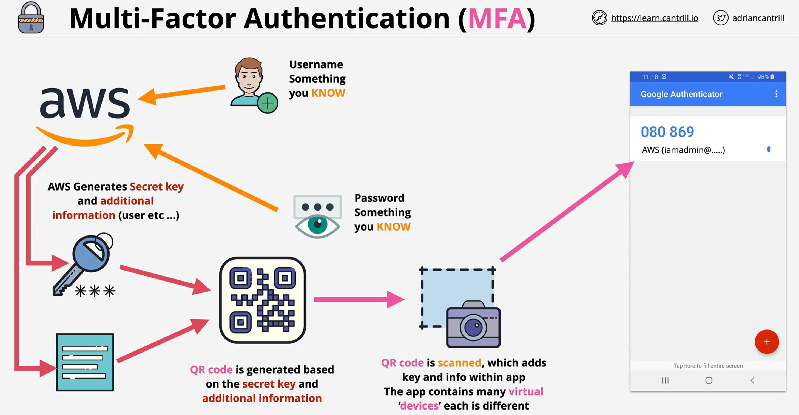
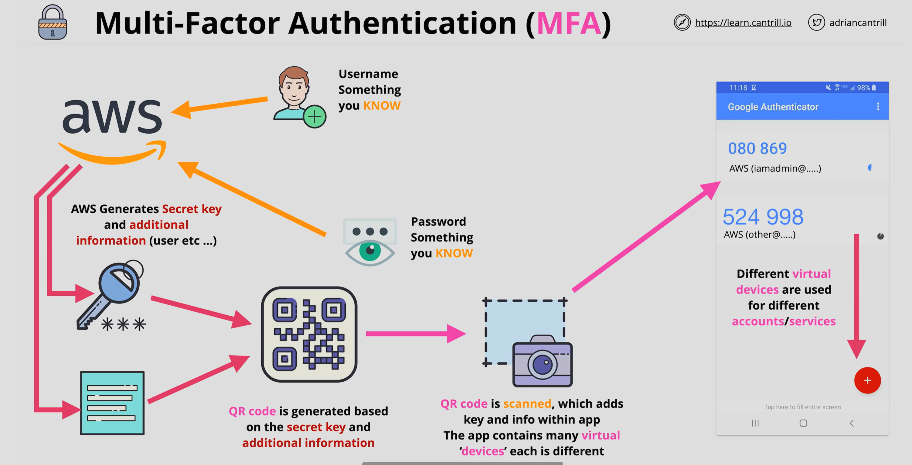

# Multi-Factor Authentication (MFA)

---

## Why MFA Is Needed

- Logging into web applications typically relies on **usernames and passwords**.
- If both are leaked (human error, malware, etc.), **anyone can impersonate you**.
- MFA adds additional layers of evidence to prove your identity beyond just what you know.

---

## Authentication Factors

A **factor** is a piece of evidence that proves identity. There are four common types:

| Factor | Description | Examples |
|---|---|---|
| **Knowledge** | Something you **know** | Username, password, PIN |
| **Possession** | Something you **have** | Bank card, physical MFA key fob, virtual MFA app |
| **Inherence** | Something you **are** | Fingerprint, face scan, voice ID, iris scan |
| **Location** | Somewhere you **are** | GPS coordinates, corporate network, home Wi-Fi |

> [!NOTE]
> - **Single-factor authentication** = using only **one** type of factor (e.g., password alone).
> - **Multi-factor authentication** = using **two or more** different types of factors.

### ATM Example (Two-Factor Auth)

1. Insert your **bank card** → possession factor (something you *have*)
2. Enter your **PIN** → knowledge factor (something you *know*)

> [!TIP]
> More factors = more security, but also less convenience. In practice, we aim for a **balance** between security and usability.

---

## How MFA Works in AWS

### Default: Single-Factor Authentication

- By default, you log into an AWS account with a **username** and **password**.
- Both are *knowledge* factors → this is **single-factor** authentication.
- If both leak, a bad actor can log in as you.

### Adding a Second Factor

MFA introduces a **possession** factor. AWS supports two types of MFA devices:

| Type | Description |
|---|---|
| **Physical MFA device** | A hardware key fob that generates ever-changing codes |
| **Virtual MFA device** | An entry in an MFA app (e.g., Google Authenticator) on your phone |

> [!NOTE]
> Virtual MFA apps can store **many** virtual MFA devices — one per identity/account/service (AWS, Google, Azure, GCP, etc.).

### MFA Setup Process (Step by Step)

1. **Activate MFA** for a specific identity (e.g., account root user).
2. **AWS generates a secret key** + additional metadata (linked username, service name).
3. AWS combines this into a **QR code** encoding all the information.
4. **Scan the QR code** with your MFA app (e.g., Google Authenticator).
5. The app creates a **virtual MFA device** entry that generates **periodically rotating codes**.

### Login Flow with MFA Enabled

1. Enter **username + password** → knowledge factor.
2. Enter the **current MFA code** from your authenticator app → possession factor.
3. Must be the **current code** for the **correct virtual MFA** on **your specific device**.

> [!IMPORTANT]
> All three are required to log in: **username + password + MFA code**. Leaking only the username/password is not enough — the attacker also needs your physical device with the MFA app.

### Multiple Virtual MFA Devices

- Each AWS identity (or service) gets its own **virtual MFA device** entry inside your authenticator app.
- Example: two AWS users = two separate virtual MFA entries, each with independent rotating codes.
- The same app can hold MFA entries for AWS, Google, Azure, GCP, or any other service.

---

## Defense in Depth

Modern phones add **additional layers** of protection around the MFA app itself:

- **PIN / passcode** to unlock the device → knowledge
- **Fingerprint / facial scan** to access the MFA app → inherence

> Even if a bad actor obtains your MFA device, they still need to bypass the phone's own authentication to reach your codes.

---

## Key Takeaways

- MFA requires **multiple types** of factors — not just multiple pieces of the *same* type.
- AWS MFA uses **knowledge** (username + password) + **possession** (MFA device/app code).
- A **virtual MFA app** (e.g., Google Authenticator) can hold many devices for many services.
- The MFA code is **time-based** and **ever-changing** — a leaked code expires quickly.
- MFA is used **constantly** in AWS — for the root user, IAM users, and across services.