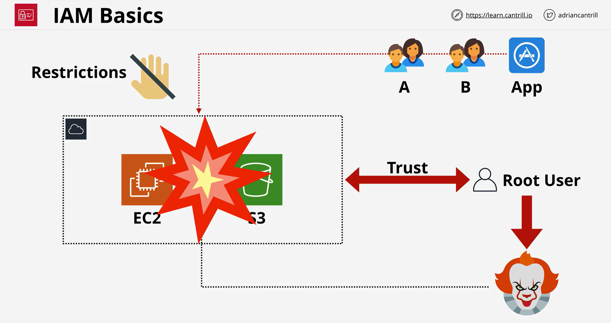
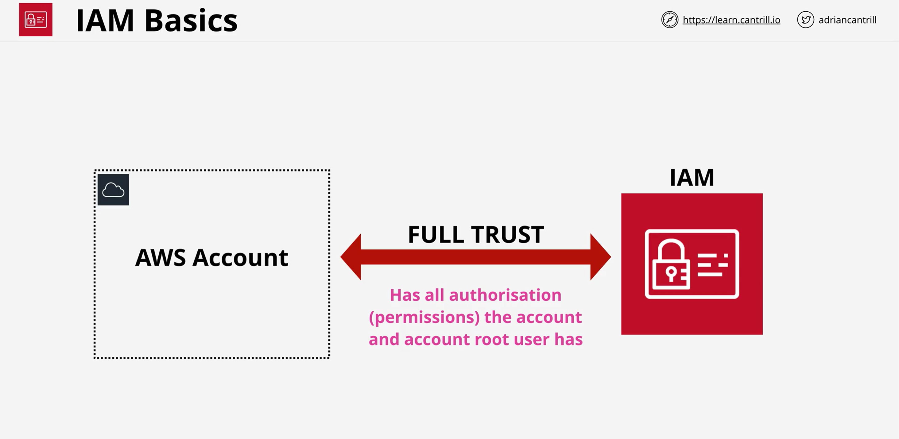
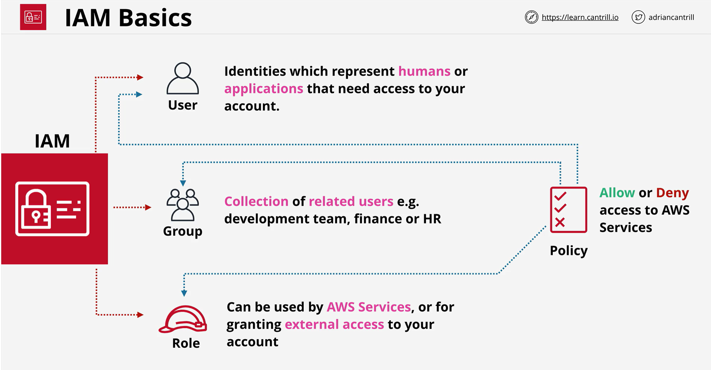
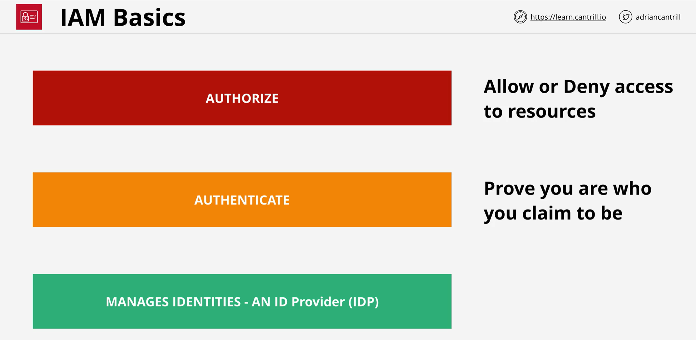
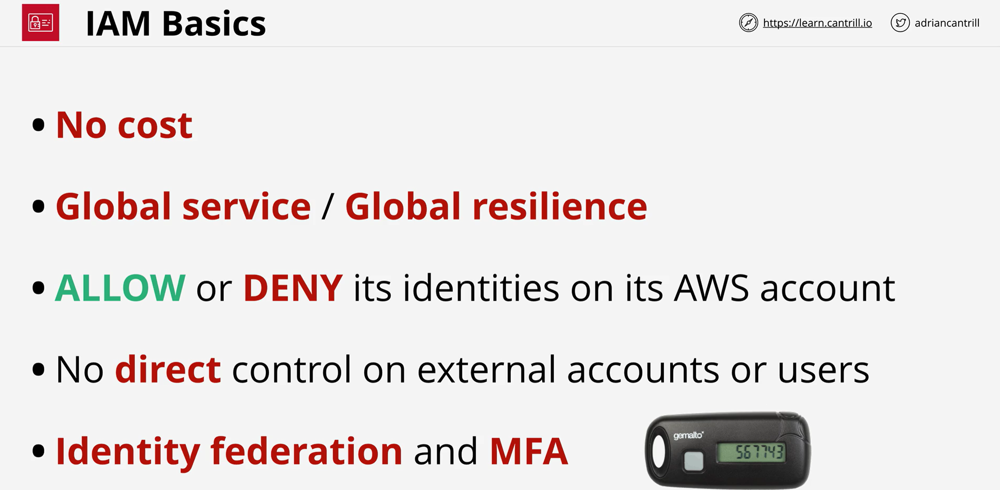

# Identity and Access Management (IAM) Basics

---

## Why IAM Exists — The Root User Problem

Every AWS account is created with a single **Account Root User** that the account trusts fully.

- The root user has **unrestricted access** to every service in every region — this cannot be limited.
- If root user credentials are leaked, **the entire account is at risk** (all regions, all services).
- You need to grant access to other **people, groups, and applications**, each with only the permissions they need.
- Best practice: **least privileged access** — only give the permissions required to do a job or task.

> [!CAUTION]
> The account root user **cannot be restricted**. If its credentials are compromised, an attacker gets full access to everything. This is why you should stop using the root user after initial setup.

---

## What Is IAM?

IAM (Identity and Access Management) solves the root user problem by letting you create **multiple identities** with **controlled permissions**.

- Every AWS account comes with its own **dedicated instance of IAM** (its own database).
- Your AWS account **fully trusts** your IAM instance — IAM can do as much as the account root user operationally.
  - Minor exceptions: some billing controls and account closure actions remain root-only.
- If IAM allows one of its identities to do something, the **account automatically trusts** that identity.

> [!IMPORTANT]
> **IAM is a globally resilient service.** It has one global database per account, and data is always secure across all AWS regions. It can cope with the failure of large sections of AWS infrastructure. *(Exam favourite!)*

---

## IAM Identity Types

IAM lets you create three types of identity objects. **Policies** are attached to them to grant permissions.

### IAM Users

- Represent **humans** or **applications** that need access to your account.
- Use when you can **identify the individual thing** that will log in.
- **Examples:**
  - Bob from accounting needs AWS billing access → create an IAM user for Bob.
  - Jane from infrastructure needs to create/terminate EC2 instances → create an IAM user for Jane.
  - A backup application needs to log in and perform backups → create an IAM user for the application.

### IAM Groups

- **Collections of related users** for easier permission management.
- **Examples:**
  - `DevelopmentTeam` group — all developer IAM users.
  - `Finance` group, `HR` group, etc.

### IAM Roles

- Used by **AWS services** or for granting **external access** to your account.
- Use when the **number of entities is uncertain** or when services need to act on your behalf.
- **Examples:**
  - Grant all EC2 instances in your account access to S3 → create a role that allows S3 access, then allow instances to assume that role.
  - Grant users in an external AWS account access to an S3 bucket → use a role.
  - Allow AWS services themselves to interact on your behalf → use a role.

> [!TIP]
> **When to pick Users vs Roles:**
> - **Users** → you can identify the **specific individual** (person or application).
> - **Roles** → the number of things is **uncertain**, or it's an **AWS service** or **external entity** needing access.

---

## IAM Policies

- **Policy documents** define **Allow** or **Deny** rules for AWS services.
- Policies **do nothing on their own** — they only take effect when **attached** to Users, Groups, or Roles.
- A single policy can be attached to multiple identities.

---

## IAM's Three Main Jobs

| Function | What It Does |
|---|---|
| **Identity Provider (IDP)** | Create, modify, and delete identities (users, roles) |
| **Authentication** | Verify you are who you claim to be (e.g., username + password) |
| **Authorization** | Allow or deny access to AWS resources based on attached policies |

### How the flow works:

1. A **security principal** (anyone making a request to AWS) claims an identity — e.g., "I am IAM user Adrian".
2. **Authentication** — IAM challenges you to prove it (username/password, access keys, etc.).
3. Once authenticated, you become an **authenticated identity**.
4. **Authorization** — IAM evaluates the policies attached to your identity and allows or denies the requested action.

---

## Key Facts to Remember

| Fact | Detail |
|---|---|
| **No cost** | IAM is free — no charges for creating users, groups, or roles |
| **Global service / Global resilience** | One global database per account; data replicated across all regions |
| **Allow or Deny its own identities** | IAM controls only the identities it manages (users, groups, roles) |
| **No direct external control** | Cannot control what users in *other* AWS accounts can do |
| **Identity Federation** | Use existing identities (Active Directory, Facebook, Google, etc.) to indirectly access AWS resources |
| **MFA support** | Multi-factor authentication can be added to any IAM identity |
| **Limits exist** | There are limits on how many users, groups, and roles you can create — some matter for exams and real-world usage |

> [!NOTE]
> **Identity Federation** lets you re-use existing corporate or web identities (Active Directory, Google, Facebook, Twitter, etc.) to access AWS without creating separate IAM users. This is covered in depth later in the course.

---

## Best Practice — Stop Using Root After Setup

1. Create an **IAM Admin user** with full permissions (functions like the root user, but via IAM).
2. Stop using the account root user for day-to-day operations.
3. Use the IAM Admin user to create **additional identities** with only the permissions needed for specific tasks (**least privileged access**).

> [!IMPORTANT]
> The root user should **only** be used for initial account setup. Afterwards, all work should be done through IAM users with appropriately scoped permissions.
