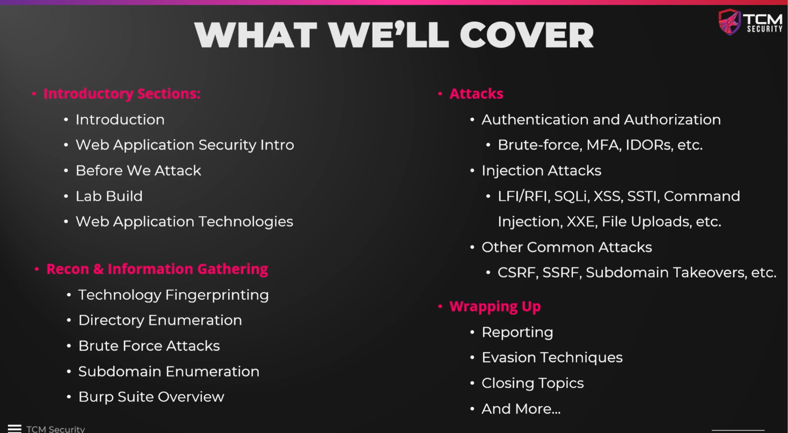

# Course Introduction

---

## Instructors

### 1. Heath Adams

- Former accountant turned cybersecurity professional
- **CEO of TCM Security** — focuses on offensive security & education
- **Co-founder of Breach Point** — focuses on blue team & defense
- Creator of multiple TCM Academy courses:
    - Practical Ethical Hacking
    - Open Source Intelligence (OSINT)
    - External Pentest Playbook
    - Windows & Linux Privilege Escalation
    - Rust 101

### 2. Alex Olson

- Covers the majority of **web application hacking** content
- **Built all the labs** for this course
- Background in **application security** and **penetration testing**
- Author of the **Practical API Hacking** course on TCM Academy
- Former **Application Security Engineer** at Rackington

### 3. Jonah Burgess

- Hacker & content creator at **Integrity**
- Holds a **PhD in Cyber Security**
- Active community contributor (YouTube, LinkedIn)

---

## Course Partnership — Integrity

> [!tip] What is Integrity?
> **Integrity** is a global crowdsource security platform that matches organizations with cybersecurity professionals to identify and resolve real-world vulnerabilities.

**Services provided by Integrity:**
- Coordinated Vulnerability Disclosure
- Bug Bounty programs
- Penetration Testing as a Service (PTaaS)

**Notable customers:** Intel, Yahoo, Red Bull, and more.

---

## Course Structure Overview

The course is organized into the following phases:

### Phase 1 — Foundations

| Section | Topics |
| --- | --- |
| Web Application Security | What is web app security, why it matters |
| Before We Attack | Scope, ethics, code of conduct |
| Lab Build | VM setup, Linux install, lab environment |
| Web Application Technologies | HTTP, DNS, core web technologies |

### Phase 2 — Reconnaissance

| Section | Topics |
| --- | --- |
| Reconnaissance & Info Gathering | Technology fingerprinting, directory brute forcing, subdomain enumeration, Burp Suite |

### Phase 3 — Attacks

| Section | Topics |
| --- | --- |
| Authentication & Authorization | Brute force, MFA attacks, IDOR, broken access control |
| Injection Attacks | SQLi, XSS, SSTI, XXE, file uploads, LFI/RFI, command injection |
| Other Common Vulnerabilities | CSRF, SSRF, subdomain takeovers, open redirects |

### Phase 4 — Wrap-Up

| Section | Topics |
| --- | --- |
| Reporting | Writing pentest & bug bounty reports, CVSS scoring |
| Evasion Techniques | WAF bypass, input validation bypass |
| Closing | Picking programs, next steps, PWPA certification |

> [!note]
> The course is a living resource — new content will be added based on community feedback.

---

## Special Benefit — Integrity Private Programs

> [!important] Exclusive Perk for Course Completers
> After completing this course:
> 1. **Sign up** for an Integrity account
> 2. **Upload** your certificate of completion to your Integrity profile
> 3. You'll be **automatically added to a candidate list** for invite-only private bug bounty programs

### Why Private Programs Matter

| | Public Programs | Private Programs |
| --- | --- | --- |
| **Access** | Open to everyone | Invite-only |
| **Competition** | High — many hunters | Low — limited participants |
| **Payout odds** | Lower (more competition) | Higher (fewer eyes on targets) |

> [!warning]
> Being added to the list is **not a guarantee** of an invite, but it significantly increases your chances of being selected for private programs.

---

## Course Support

- **24/7 support** is available
- Refer to the dedicated **Course Support** section for details on how to receive help

---

## Key Takeaways

- This course has **3 instructors** (Heath Adams, Alex Olson, Jonah Burgess) each bringing different expertise
- The course covers the **full bug bounty lifecycle**: foundations → recon → attacks → reporting
- **All labs are built-in** — hands-on practice is a core part of the course
- Completing the course + signing up on **Integrity** can unlock access to **private bug bounty programs**
- Course content will **grow over time** based on community feedback