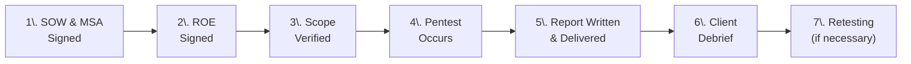
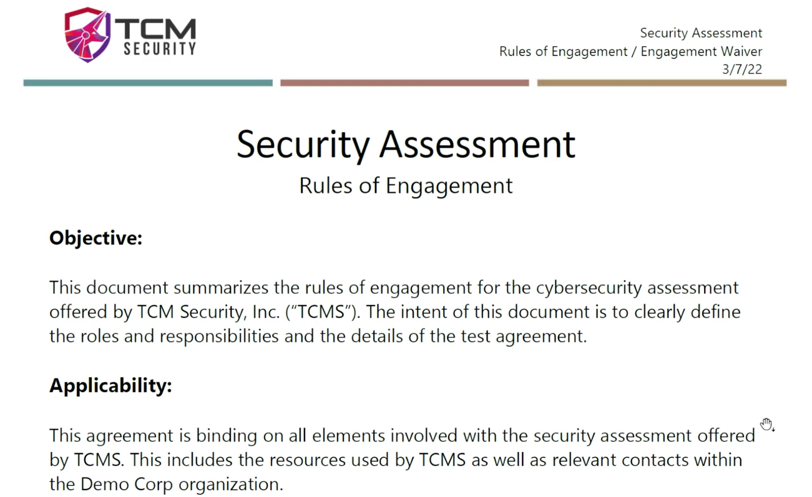
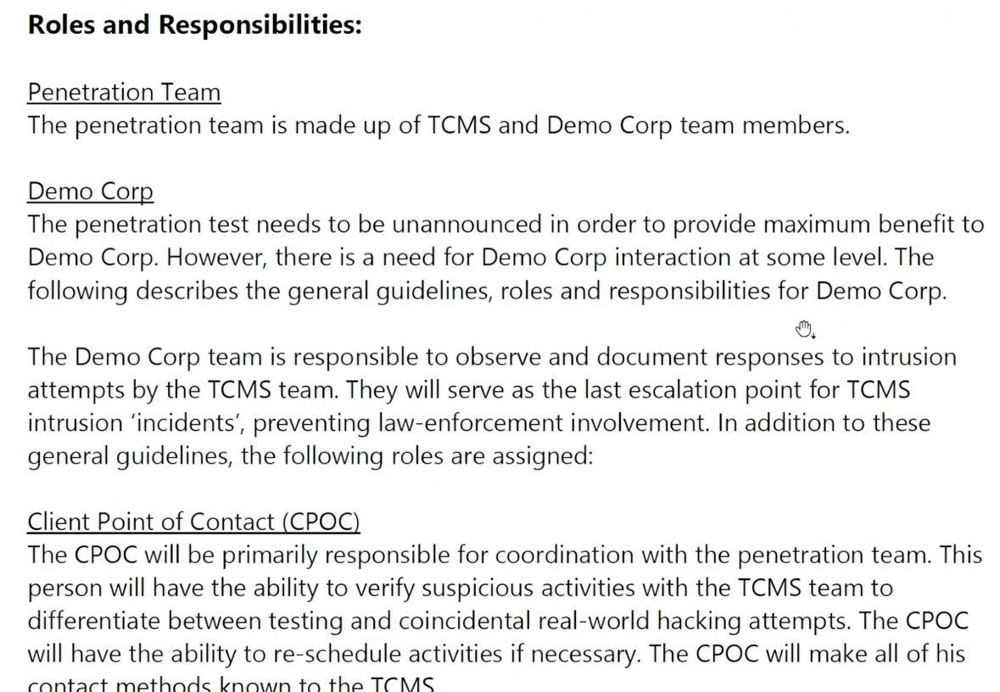
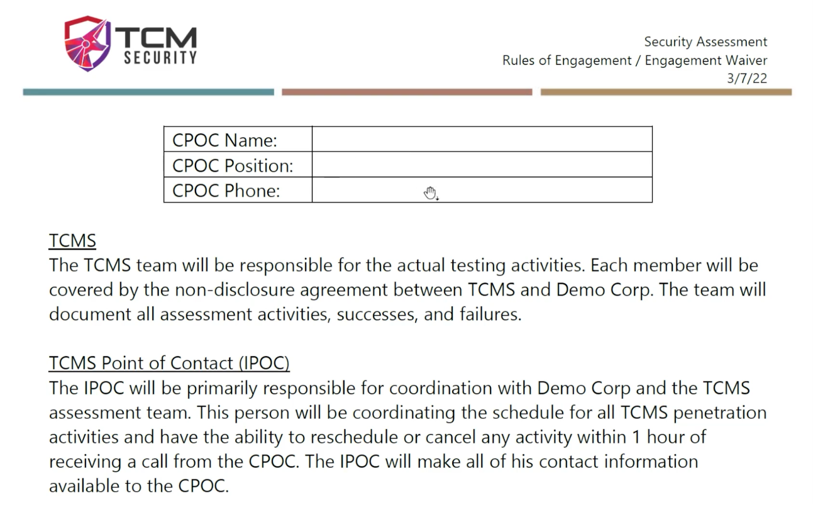
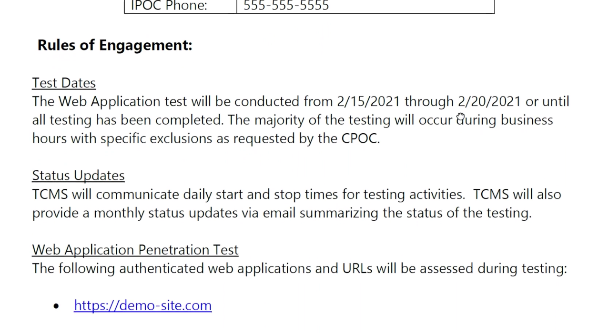
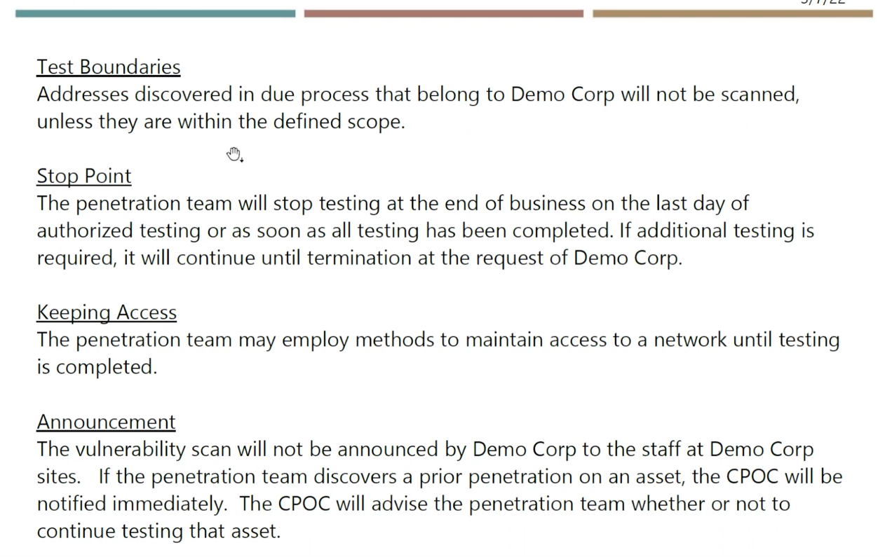
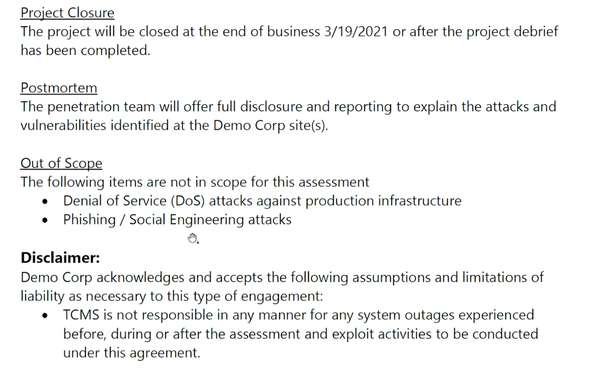
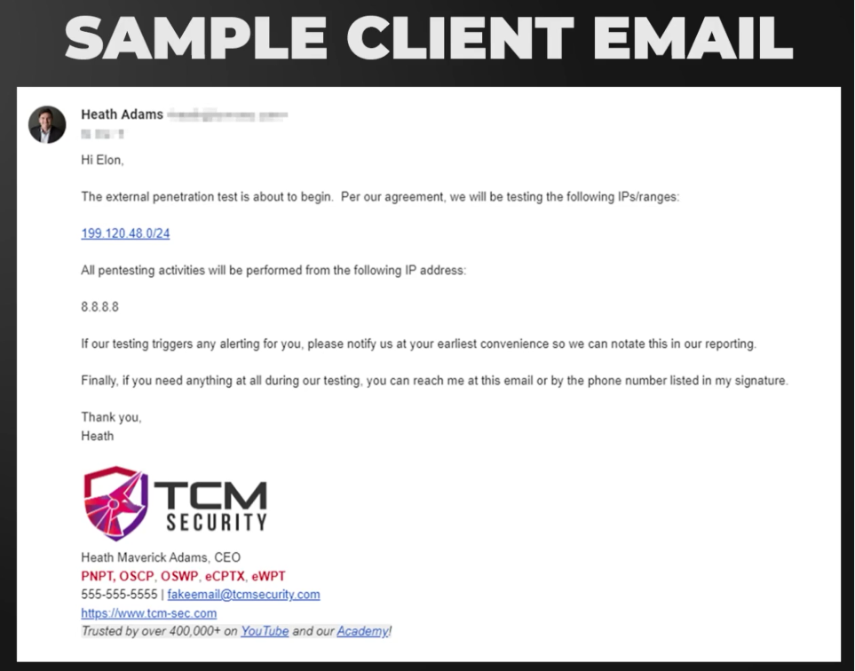
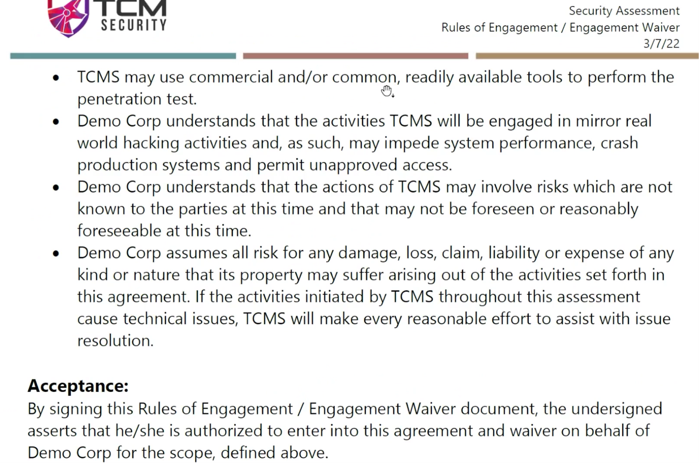
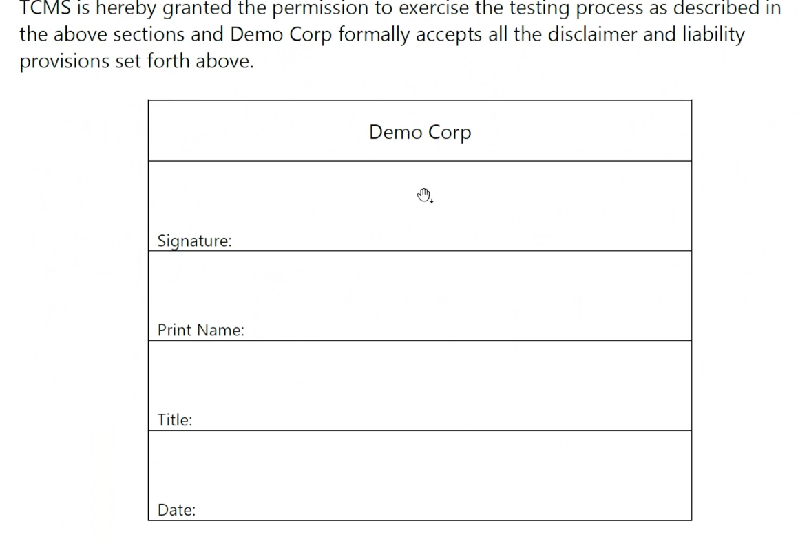

# Phases of a Web Application Penetration Test

---

## Engagement Steps Overview

---

## Phase 1: SOW & MSA Signed

### Statement of Work (SOW)

A longer version of a quote that defines:

- **What work** will be performed
- **Scope** of the work:
    - Which website(s) to test
    - How many roles on the website
    - How many pages on the website
- **Payment terms** — how much everything costs

### Master Service Agreement (MSA)

Legal rules for the vendor-client relationship:

| Clause | Purpose |
| --- | --- |
| **Liability** | Who is liable if something goes wrong (negligence vs. gross negligence) |
| **Non-compete** | Don't poach each other's employees |
| **Jurisdiction** | Which state/country handles legal disputes |
| **Arbitration** | Whether disputes go to arbitrator before court |

> [!important] Negligence vs. Gross Negligence
> - **Negligence**: *"I accidentally took down a system because the architecture was old and we weren't informed"* — protected by MSA
> - **Gross Negligence**: *"I wildly ran tools against the server with no idea what I was doing and it went down"* — **NOT protected**

Both SOW and MSA must be signed **before any other phase can begin**.

---

## Phase 2: Rules of Engagement (ROE) Signed

The ROE defines **what you can and cannot do** during the engagement.

### Key ROE Components

#### Objectives & Roles

- Clearly define roles and responsibilities
- **Pentesting team** = your team + the client (working together)
- **Client responsibility**: Do NOT announce the pentest to employees — we want normal behavior to establish a realistic baseline

#### Points of Contact

| Role | Purpose |
| --- | --- |
| **Client POC** | Name + phone number — who we contact if anything happens |
| **Internal POC** | Our point of contact — who the client reaches out to on our side |

#### Test Parameters

| Parameter | Details |
| --- | --- |
| **Test dates** | Start and end dates — no testing outside this window |
| **Status updates** | Daily updates via communication channel (Slack/Teams) or email |
| **Test type** | e.g., Web Application Penetration Test |
| **In-scope targets** | Specific URL(s) only — e.g., `demosite.com` (no subdomains unless specified) |

#### Test Boundaries

- Anything **not explicitly listed in scope** is off-limits
- If the client asks *"Why didn't you test this other site?"* → it wasn't in the signed ROE
- Protects **both sides**: client knows you won't go rogue, you know you won't be blamed for testing out-of-scope

#### Out of Scope (Common)

- ❌ **Denial of Service (DoS)** — almost always out of scope
- ❌ **Phishing / Social Engineering** — usually out of scope (sometimes in scope)

#### Maintaining Access

- You may create accounts (e.g., admin accounts) to maintain access during testing
- **Critical rule**: Undo everything when done — delete any accounts you created
    - Production systems: **always** clean up
    - Development/staging: less critical (they can wipe the server)

> [!warning] The environment must look exactly the same as you found it when you're done.

#### Liability Disclaimer

- Client understands activities will mimic real-world hacking
- Tools used may crash systems, cause unapproved access, etc.
- Risks may not be known or foreseeable at time of signing
- Client assumes all risk — **but this does NOT protect pentesters from gross negligence**

> [!important] You CANNOT Begin Testing Until the ROE is Signed
> Even if you're scheduled to start Monday 8:00 AM and the ROE isn't signed — **do not start**. Period. It doesn't matter if the client delays. No ROE = no testing.

### Sample Start Email

A typical engagement start notification includes:

- Confirmation that testing is about to begin
- **Website/IP** being tested
- **Source IP address** of the pentester — so the client can distinguish pentest traffic from real attacks
- Request: *"If our testing triggers any alerting, please notify us"*

> [!tip] Real-World Heads Up
> Be prepared: clients **will** blame you for incidents that aren't you. *"Someone's attacking us from country X — is that you?"* Check against the source IP you provided. Usually it's not you.

---

## Phase 3: Scope Verified

- Verify the client gave you the **correct website**
- Confirm the website/domain is **actually tied to the client**
- Watch for typos — if something doesn't look right, **verify with the client** before attacking
- For web apps: generally straightforward (domain is associated with the client)

---

## Phase 4: Pentest Occurs

- **Typical duration** for a web application pentest: **~1 week**
- Web apps have many things to check — need enough time to leave no stone unturned
- Small websites: may reduce by 1–2 days
- Large websites: longer than a week, or **multiple pentesters** on the same project

---

## Phase 5: Report Written & Delivered

- Compile **all findings** into a professional report
- Present the report to the client

---

## Phase 6: Client Debrief

A meeting (typically **30 min to 1 hour**) where you walk through:

- ✅ What the client **did well**
- ❌ What they **didn't do well**
- 🔧 **How to fix** the issues found

### Common Client Discussions During Debrief

| Client Request | Your Response |
| --- | --- |
| *"This should be High, not Critical"* | Discuss — but **you** have the final say |
| *"This was in dev, not production — remove it"* | Consider context, but don't delete history |
| *"Can you bump this up to Critical?"* (wink-wink) | Sometimes clients want higher severity to justify budget for fixes |

> [!note] The "Wink-Wink Nudge-Nudge"
> Sometimes clients **want** you to rate findings more critically — because they need the pentest report to justify budget for a fix that management is dragging their feet on.
>
> **Example**: A physical pentest where the goal was to break into a server room. The client wanted to prove their drives needed encryption. The report saying *"we broke in — unencrypted drives are a critical risk"* got the encryption budget approved.

> [!warning] Ethical Duty
> - You have the **final decision** on your report — your name is on it
> - Don't remove a finding just because the client wants it removed
> - Don't inflate/deflate severity without logical justification
> - The report should reflect **reality** as you observed it

---

## Phase 7: Retesting

- Client gets a retest window: **30, 60, or 90 days** (varies by engagement)
- Client fixes the vulnerabilities from the report
- You **retest** to confirm the fixes are effective
- If fixed → update the report: *"This was a problem. It has been remediated."*

> [!important]
> You **never delete** a finding from the report. The history must remain. You only update status to show it's been remediated.

---

## Summary — Your Role as a Pentester

| Step | What You Do |
| --- | --- |
| SOW & MSA | Wait for signatures (usually not your task) |
| ROE | Wait for ROE to be signed — **do not start without it** |
| Scope Verification | Confirm targets are correct and belong to the client |
| Pentest | Execute testing within the defined scope and timeframe |
| Report | Write and deliver a professional report |
| Debrief | Walk the client through findings (30–60 min) |
| Retest | Verify fixes within the retest window |
