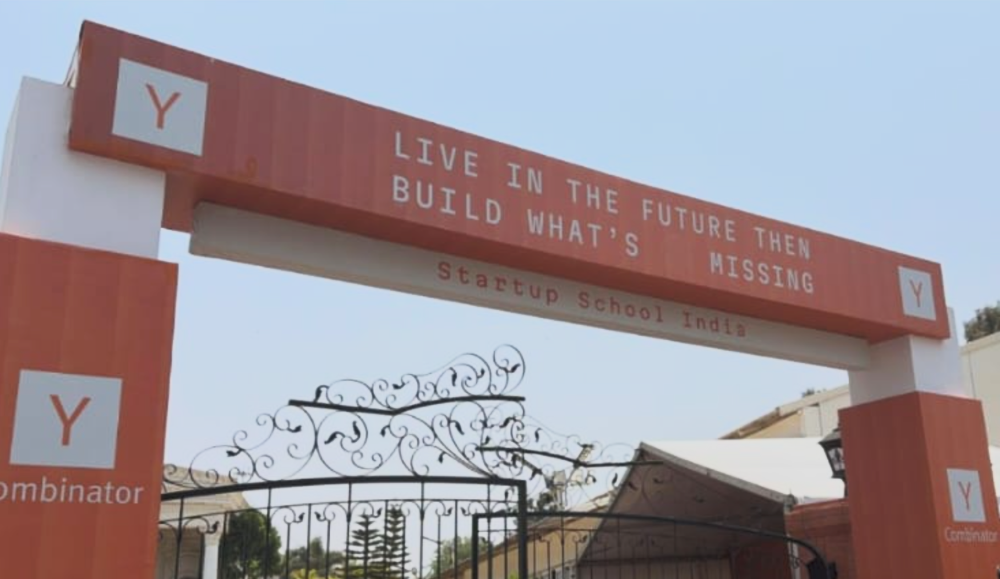

LIVE IN THE FUTURE THEN 
BUILD WHAT'S                   MISSING

---

From Google :
whatever you build has to be 10 times better, cheaper, or faster than the competition.

---

The “2 Shareholder” Secret in Private Companies 
  
You might see just one founder pitching on Shark Tank.  
But legally, a private company cannot have just one shareholder.  
  
There must be at least 2 shareholders.  
  
Often, one person is the beneficial owner (the real owner of the shares) and the other is the registered owner on paper.  
  
And the law requires disclosure.  
  
Which is why companies file Form MGT-6 to declare beneficial ownership.

---

how to actually increase sales on your website. Everyone is focused on whether they should lower their prices or if they need better images, but the real reason people don't buy from you is because **they don't trust you**. Ask yourself: how often do you shop from new, unknown brands?

Here are some solutions to tackle this problem:

1. **Use UGC Videos:** Fill your website or store with "User Generated Content." These are videos that your actual customers record of your products.
2. **Prioritize Reviews:** Reviews are incredibly important. After looking at product photos, customers go straight to the reviews. You should aim to have **at least 15 reviews** for your products. To get reviews in the beginning, try offering discounts to customers in exchange for their feedback.

---

Ek startup shuru karne ke liye sabse zaroori kya hai?  
  
Idea: NO  
Unlimited Resources: NO  
Funding: NO  
  
Execution: YES

believed in the same idea:  
  
“GET TO THE GROUND AND BUILD IT.”  
  
It was just EXECUTION jo humare liye work kiya.  
  
To tell you everyone, you don’t need a perfect name or a full-fledged idea to start your startup, because when we talk about India’s startups like OLA, Lenskart, OYO, Sugar, and others, these are also inspired and adapted ideas from global models and not completely original concepts.  
  
But the only reason these startups are now well-established businesses in India is that they just EXECUTED it perfectly.  
  
Remember, market me ideas ki kami nahi hai..kami hai executors ki aur jo execute karlete hain, wo ye race jeet jate hain…

----

Other official resources:
1) Tweet by Jared(one of the YC partners on the panel): https://x.com/snowmaker/status/2045506195415535872?s=20

Zepto - Aadit Palicha
Started in pandemic when grocery procurement was hard 
How did you decide not to go to Stanford: They took a gap year due to covid so wasn't really a hard decision. They had 60-70 cr gmv runway at the time of final decision.
Initially didn’t have PMF, then they understood customers care about Speed quality selection and price. And then switched to the 10 minute model.
First dark store is KV's apartment 
It was not about who(competitors) was doing what, but about what the customers want. 
The starting point of any business has to be the customer 
Started with what is the most extreme that customers want and work from there.
Same law as what Airbnb founder Brian chesky did which is of you were to leave out all laws of physics and limits of what is possible, then what is the customer experience that can be delivered: 10 minute delivery. 

Far more throughout and far more volume in darkstores.

They were one of the worst companies in the batch, weren’t able to get much tasks done.
Singular focus on 30-40 customers by removing all noise is what actually mattered (instead of reading blog posts and way to create startup), they create an environment where it was only them and the customers and nobody else.
Instead of getting a 1000 users unhappy users, make 30 users love your product) 

Aadit doesn’t see Zepto as a consumer app company, but as a logistics supply chain company. Every ruppee saved in the supply chain is money that’s saved for the customer, or money that can be invested in the last mile. 

Long term plans for Zepto: urban grocery infrastructure for the country. Do the best in 40-50 cities in the best way. Be a homegrown Amazon. Has become a platform for other consumers brands to grow their business.  

Huge jump in the ad business over the last 2 years. 
Importance of hiring, people with 10 years of experience who still vave the hunger to build. Surrounding yourself with people smarter than you makes you want to learn much every single day. Learn from them shamelessly. 

Razorpay: Harshil Mathur

Initially didn’t have any idea of finance, just wanted to code. 
Started as a social crowd funding platform. Initially assumed solving for payments would be easy. Went to Facebook groups to realize everyone is having the same problem. 
Initially fees payments were collected in physical platform. They got into YC with the same idea of converting payment infrastructure digitally. But they didn’t want to pay 1% of their payment to Razorpay. Quickly pivoted to startups once they realized it was easier. Got the insights by talking to customers and watching their behaviour. 

They did not make a single sale during their YC batch because of regulations and approvals that they didn’t get. 

Every month the cofounder would say why are we doing this and why are we still doing this while we could be doing something else.  The thing that kept going is that they realized this is a solution that people wanted. Customers gave them the energy to keep going. 

Neardeath moments where the banks refused to continue with them. They decided to call every single customer and talk to them on what is happening. Even though they were getting scolding and kept going. 

How did you have conviction to keep going when people where asking to buy them out. They started getting acquisition offers even while they were in the batch.  Initially had put in his YC apps that India is a 60 million dollar market and now Razorpay in itself does 180 million dollar. When solving for India you have to think long term and on the way India will grow. Global partners were not going to understand this anyway and it didn’t make sense for them to get acquired by them, as a worry about what will happen two years down the lane. 

B2B unlike B2C is a very logical business. In B2B you have get a large customer and the customer pays you. B2C you have to burn to get people to engage with your product. 

Most payment banks in India didn’t incorporate UPI till demonetisation. Till demonetisation they were small and they focused on building along with SMSEs. They took a bet on UPI taking off, and when demonetisation happened, all major players like Zomato signed up with Razorpay and they took off. Their bet on UPI taking off paid off. 

If I were to start razor pay today what would it look like with AI.  They behaved like a startup and not like an incumbent. They redid a major part and there was a good traction on their platform after. 

If you build responding to what happens in the market you’re already dead. You have to predict where the market will go and build for it. 

When the company grows, the founder changes for the better. Going manager mode is the worst mistake to do. 

Advice to founders: entrepreneurship is not going to get easier because of AI. You still have to get to the depths of the problem and think if it’s something you can spend the next 10 years to build. 

Giga: Varun Vummadi
Cusotmer service agents.  
They worked on a lot of ideas that don’t make revenue for a long time. It’s easy to generate ideas, but will people pay for them is a question. 
Cost of building has become so low so everybody should start building. 

Vidit Aatrey:
Growing 30 percent yoy, 1 million sellers, 250 million buyers. Both cofounders grew up in small cities. They wanted to capitalise on mobile internet boom. They saw everyone buy things online in Bangalore but the same behaviour wasn’t in Meerut and smaller towns. That’s why they started, they wanted to bring everyone in India online. 

They called their first version as fash nearby which  they shut down in 3 months. Because they spoke to businesses but never to customers.  Their fashion offerings didn’t have touch and feel of the mall or other offerings. 

All the shops which were saying they weren’t online still were online because there was a WhatsApp group they maintained where they will post their new offerings. So they thought WhatsApp is the next big thing.

They were having a software that ran through WhatsApp that were used by 100,000 businesses that used their software but they were short of money. Even though they were huge, not all of them were most active. 

They tried to figure out who were using it most and figured that they were the ones that didn’t have a physical platform but were fully onlines. Online native sellers were their power users. Resellers and dropshippers.

They went to their houses to figure out what was the requirements. And they figured that they were small people who didn’t want any upfront cost on the products. 

They launched their new app called Meesho supply. And for 10 months they didn’t spend anything on marketing and they grew massively. Which is when they realized PMF. Anyone could become a dropshipper here. 

They went from a toolkit for sellers to becoming a platform for sellers. 

What happened at Covid:

In 2020 they had 10 million sellers, 10 million WhatsApp groups that were operating. 

With jio cost of data went to zero, and people were learning how to buy online. Data being cheaper was a threat to their business. 

The second you do as an experiment of selling yourself, you’re going to lose your dropshippers trust. They had the right team and right investors who took a long term stance.  They had to kill their existing business and restart. 

Two barriers:
1.⁠ ⁠acessbility: make the friction lesser. WhatsApp initially. Now they’re trying content as a menthol of sales.
2. The future looks like where the app talks to people for sales. To reduce the overwhelming nature of the product in tier 3 cities where people are afraid a wrong button would deduct money from their account. 

Reimagine tech for India. 

Mukund Jha: Emergent
Started as a research lab and topped SWE benchmarks. Wanted to democratise programming for everyone. 

Lessons from dunzo: hard part was last mile.  Customer love creation with immediate responses to feedback. 
Post dunzo experimented and tinkered with the upcoming AI models. 
Took the view that AI growth will be huge and automating software engineering would eventually possible. 
Term at YC “Living in the edge” in which things are not quite possible yet. 
Emergent rewrote their system 3 times based on how models were evolving. 

Think global from day 1. Building for India is as hard as building globally. Starting with the harder problem is always a good idea. The bigger you think the higher the probability of your success. 

Groww: Lalit Keshere
Groww started as a roboadvisor. Most people asked the question “why one product and not the other” which led them to the insight of “selection”. 

Indian customers care about choice and transparency. Initial 600 customers in first month and they doubled downed on the features that the customers loved. They iterated based on what they liked. In consumer businesses, there will always be question marks and it’s good to reduce it to one question mark (which for Groww was about Monetization) customers are not going to voice out their actual concerns, it’s your job to do the important things like make payments frictional less. 
Early choices: always playing in the regulated zone. 
High retention, low cac, 
One of there commandments: obsess over design.
Be the power user of your own app. 
When they launch a new product if users like their product or hate their product, both are fine. But if they are indifferent then it’s a problem. 
In consumer world: the more you deal with competition, the more you move away from customers. 
Cofounders: 4 cofounders, how did you deal. There will always be changes in the product, but the only things that don’t change are the value systems. Very clear ownership is also important. Everyone does everything in a startup, but there should be one person who owns things. It’s important you enjoy their company. 
One advice: never listen to older folks, their ecosystem was a lot different than yours.
Yet one advice: do something that is fun. when someone asked about difficulties he felt while building groww, he mentioned he had no idea because everyday was fun for him (+ his cofounders made it worthwhile too)

YC observations and advice: 
Arnav peak XV/  Puneet superdaily founder nexus
The current success is about who is in front of the wave. Are you building at the edge of technology? Get rid of notions that you need warm connects, companies are completely open to good products and cold mailing might work. 
A lot of jobs might change dramatically in the way they function and safe paths might just no longer be the safe path. 
Their big idea was not their first idea for most of the people today. It’s because arriving at a good startup idea is hard, and the way to reach there is to tinker fast. 
Second mover advantage: because of AI, it’s possible to take something that kinda works and make it better with AI.
Token maxxing. 

What does YC look for? 
YC doesn’t require that you have any revenue for you to get in. 
Clarity is most important in your application. 
We are not investing in ideas, we are investing in founders. 
Insights that are obtained from talking to customers
Agency: you will become a more “relentlessly resourceful”
Rate of learning matters a lot.
The qualities of good founder has been the same throughout.

---

## 13 Rules for Startups

- **#1** Build fast
    
- **#2** Rejection is data
    
- **#3** Marketing is differentiation
    
- **#4** Speed kills competition
    
- **#5** Distribution beats products
    
- **#6** Use Twitter
    
- **#7** Use LinkedIn
    
- **#8** Iterate fast
    
- **#9** Kill ideas fast
    
- **#10** Free users lie
    
- **#11** Watch PostHog sessions
    
- **#12** Forget color schemes
    
- **#13** Spam UGC (User Generated Content)

---

# Startup Failure Notes (Harvard Study)

## Stage 1 — Validation

### 42% of startups fail here

### Main Mistake

Building a product without talking to customers.

### Why They Fail

- Founders assume they already know the problem.
- They build based on ideas, not real demand.
- No market validation before development.

### Key Lesson

Talk to real people before building.

### Action Step

- Speak to at least **20 people** who face the problem.
- Understand:
    - Their pain points
    - Current solutions
    - Willingness to pay
    - Frequency of the problem

### Goal

Validate the problem before creating the solution.

---

# Stage 2 — Early Traction

### “The Speed Trap”

### Main Mistake

Scaling too early.

### Common Problems

- Hiring too fast
- Spending heavily on ads
- Expanding before understanding what works
- Chasing growth without a repeatable system

### Why It Happens

Founders panic after getting initial customers and try to grow aggressively.

### Key Lesson

Stay small until customer acquisition becomes repeatable.

### Action Step

Find:

- One repeatable marketing channel
- One reliable acquisition method
- One proven customer journey

Then scale slowly.

### Goal

Build a stable, repeatable growth engine first.

---

# Stage 3 — Scaling

### 65% fail because of leadership, not the market

### Main Mistake

Losing customer obsession after success starts.

### What Happens

- Focus shifts to:
    - Money
    - Expansion
    - Competition
    - Internal politics
- Founders become disconnected from users.

### Why Companies Collapse

Not because the product stopped working —  
because leadership stopped listening to customers.

### Key Lesson

Stay close to the customer even while scaling.

### Action Step

- Keep customer feedback loops active
- Maintain simplicity
- Avoid unnecessary complexity
- Build strong leadership culture

### Goal

Scale without losing the original mission and customer focus.

---

# Overall Core Message

Most startups fail because:

1. No validation
2. Scaling too early
3. Weak leadership during growth

## The Winning Formula

- Validate first
- Scale slowly
- Stay customer obsessed
- Keep systems simple
- Grow only after repeatability is proven

