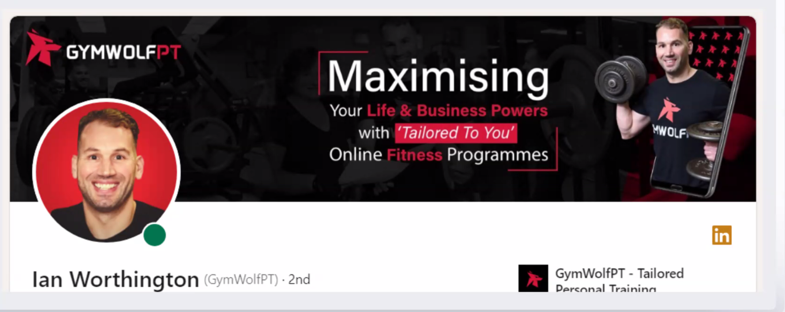

# Banner : 

|Rank|Posting Method|Confidence|
|---|---|---|
|1|Manual post published while you're active and engaging|High|
|2|Scheduled post (native LinkedIn scheduler) while you're active when it goes live|Medium-High|
|3|Edited draft then manually published|Medium|
|4|Native LinkedIn scheduled post that auto-publishes|Medium|
|5|Edited scheduled post that auto-publishes|Low-Medium|
|6|Third-party scheduled post (Buffer, Hootsuite, etc.)|Low-Medium|
