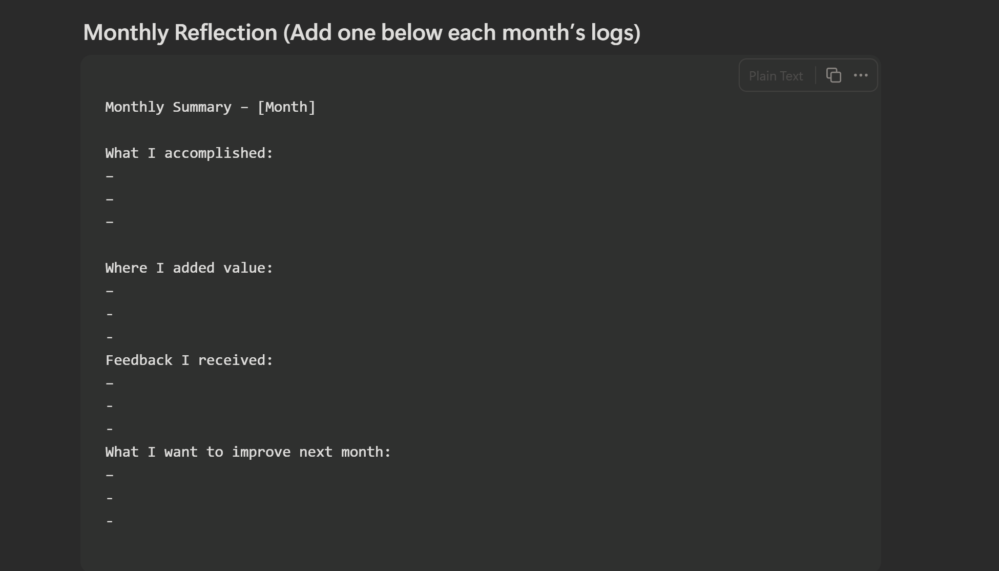

# Work Logging

---

## Why Document Your Work

Your manager won't remember everything you did this year.
HR won't track your contributions. Neither will leadership.
But if you document it, you control the narrative.

### Keep a "Brag Sheet" of Every Win

Every project delivered. Every problem solved. Every metric improved.
Date it. Quantify it. Save it in a running doc.
When performance review comes, you have receipts.
Your manager has a vague memory. You have data.

### Save Important Emails and Messages

Praise from clients. Positive feedback from teammates. Approvals from leadership.
Screenshot Slack messages. Forward emails to a personal folder.

When someone questions your contributions, you have proof.
Memory fades. Documentation doesn't.

### Track Conversations with Your Manager

After every 1:1, send a quick recap email:

> "Thanks for discussing X. Just to confirm, we agreed on Y. Let me know if I missed anything."

This creates a paper trail.
If priorities shift or blame starts flying, you're protected.

### Document Goals at the Start of the Year

Write down what your manager expects. Get it in writing.
When review time comes, you can say:

> "Here's what we agreed on in January. Here's how I delivered."

No ambiguity. No moving goalposts.

---

## My Simple Tracking System

For a long time, I thought doing good work was enough.
But I realised this — if you don't track your work, people forget it. Even you forget it.

I wasn't bad at my job. I was just invisible.
Especially during 1:1s and appraisals.
So I started tracking everything in a quiet, simple way.

Here's what I do:

### 1. Weekly Work Log

Every Friday, I write down:

- What I did
- What I solved
- What changed because of it

### 2. Outcome Over Effort

Not "Created dashboard"

But **"Created dashboard → reduced reporting time by 3 hours a week"**

### 3. Save Feedback

Any Slack message, email, or meeting praise — I save it. These are the things that help you tell your story later.

### 4. Monthly Reflection

At the end of every month, I write a short summary for myself. Sometimes I share it with my manager, sometimes I don't. But it's always ready when I need it.

### 5. Keep the Language Clear

No fancy words. Just:

- "I helped…"
- "I improved…"
- "I took ownership…"

This isn't about bragging.
It's about not being forgotten.
If you're serious about growth — start tracking your work.
It will change how people see you. And how you see yourself.

---

## Step-by-Step Guide — For Beginners

**(For someone who has never done it before!)**

### Step 1 — Pick One Place to Keep Everything

Stop splitting your notes between Post-its, Slack DMs, and your memory.

Choose one:

- **Notion** → best overall. Free, flexible, searchable
- **Google Docs** → easiest if you already live in Google Workspace
- **Obsidian** → good if you want it private and offline
- **Apple Notes / OneNote** → totally fine. Just pick one.

Name the doc "Work Log 202x" and leave it open every day.

### Step 2 — Spend 10 Minutes Every Friday Logging Your Week

Use this exact template:

- 📅 **Week of** _______
- ✅ **What I worked on:**
- 📊 **Results or outcomes:**
- 💬 **Feedback I received:**
- 🔢 **Numbers I can attach:**

One entry. Every Friday. That's the whole system.

### Step 3 — Always Try to Attach a Number

Vague is forgettable. Numbers stick.

Instead of this → write this:

- "Managed emails" → **"Handled 60+ stakeholder queries per week"**
- "Led a meeting" → **"Facilitated weekly sync for 12-person team"**
- "Fixed a problem" → **"Resolved billing error that saved $8K"**
- "Saved time" → **"Automated report, cutting 3hrs of manual work weekly"**

No number available? Describe the scale or the stakes.

### Step 4 — Save Praise the Moment It Happens

Don't trust your memory. Capture it in real time.

- **Slack** → star the message or forward it to yourself
- **Gmail** → create a "Wins" label, apply it as emails arrive
- **Outlook** → flag it, move it to a "Recognition" folder
- **Teams** → bookmark the message, paste it into your log weekly
- **Jira / Asana / Monday** → screenshot completed tasks with your name on them

10 seconds now. Hours saved at review time.

### Step 5 — Log Your Learning, Not Just Your Doing

- Finished a LinkedIn Learning or Coursera course? Write it down.
- Got hard feedback and acted on it? That's worth documenting.
- Learned a tool no one else on your team knows? That's a skill.

Growth is career currency. It only counts if you can prove it.

### Step 6 — Do a Quarterly Audit

Every 3 months, open your log and find your 5 biggest wins.

The professionals who always seem ready? They've been logging all along.
