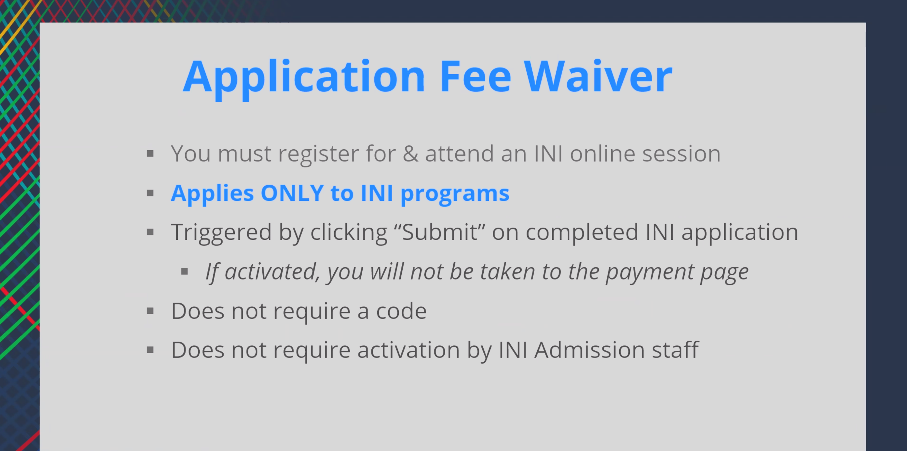
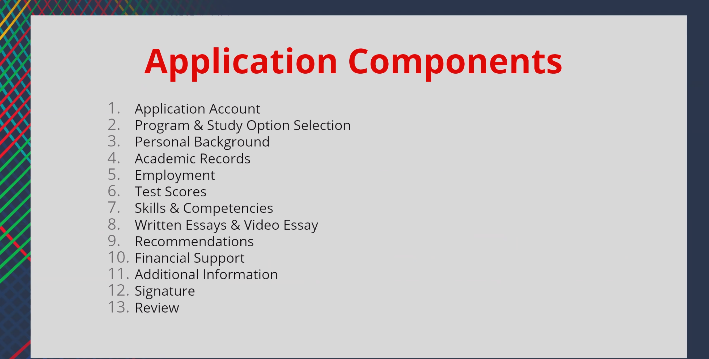
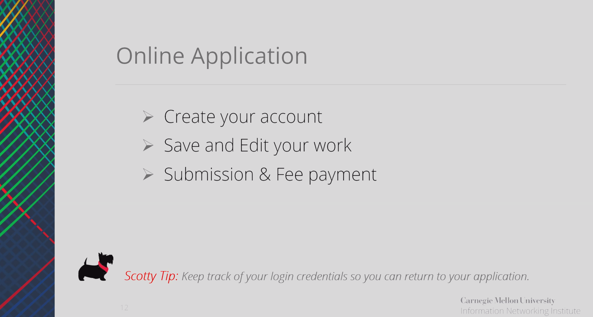
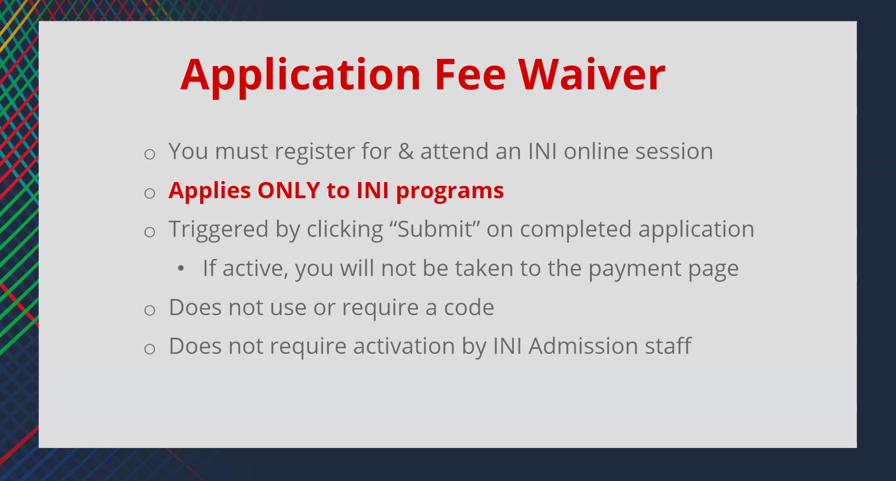

### Semester Options

- **3 Semesters:** Fall → Spring → Fall
    
- **4 Semesters:** Fall → Spring → Fall → Spring
    
### Program Pace

- **Advanced Track:** Goes through **2 summers**
    
- **Standard Track:** Goes through **1 summer**
    
### Internship Considerations

- Internship opportunities are typically available during **1 summer**.
    
- If an internship is important to you, consider how the semester structure affects your eligibility and timing.
    
### CPT Benefit

- CPT can be beneficial if gaining internship experience is a priority.
    
### Important Note About Spring Intake

- If you choose a **Spring** start, you may not earn enough credits for internship eligibility until the following **Summer**.
    
- Because of this, it may be better to:
    
    - Choose the **4-semester option**, or
        
    - Start in **Fall** instead of Spring.

Select **2 programs from the 5 available options**.
in priority order

If you have only one name:

- Enter your name in the **Last Name / Family Name** field.
- Enter **"."** (a period) in the **First Name / Given Name** field.

English can be either official or native ; if its official language not native then you have to an the test 

### Previous Applications

- If you have applied before, let them know.
- They may be able to **merge your previous applications and records**.

### Application Tips

- The more relevant points, achievements, experiences, and details you provide, the stronger your application will be.
- Try to include internships, projects, certifications, leadership roles, competitions, and other accomplishments.

### C Language Requirement

- Complete the **Learn C Language** module/course.

no high school document need to submitted 
only undergraduate degree
nothing from high schools no data from that time 
### Discussing Your Proficiency

- If you have listed any courses, be prepared to discuss them in your application.
- For subjects such as **Mathematics** (e.g., Probability, Statistics, Linear Algebra, Calculus), explain:
    - Where you studied the subject.
    - Which courses you completed.
    - What topics you learned.
    - How the knowledge has benefited you academically, professionally, or in projects.

they will see your GitHub 

### Essays Instead of SOP

- The application does not require a traditional **Statement of Purpose (SOP)**.
    
- Instead, it includes several **essay questions**.
- 300 words limit for essay 
    
### Common Essay Topics

1. **Why are you a strong candidate?**
    
    - Highlight your academic background, projects, internships, research, work experience, leadership, certifications, and achievements.
        
2. **What are your interests?**
    
    - Explain your academic, professional, and personal interests.
        
    - Connect them to your chosen program and future goals.
        
3. **Program Fit / Goals**
    
    - Discuss why you are interested in the program and how it aligns with your career objectives.
        
4. **Optional Essay**
    
    - Use this section to explain anything that may need additional context.
        
    - For example:
        
        - Low GPA or poor academic performance in a particular semester.
            
        - Personal, medical, financial, or family circumstances.
            
        - Gaps in education or employment.
            
        - Any aspect of your application that would benefit from further explanation.
            
### Optional Essay Tip

- If you have a low GPA, do not make excuses.
    
- Briefly explain the reason, what you learned from the experience, and how you improved afterward.
    
- Focus on growth, resilience, and evidence of your current capabilities.

### Video Essay

- The application includes a **video essay/interview** component.

#### Format

- **30 seconds** to prepare after the question is shown.
- **3 minutes** to record your response.
- Questions may be presented in a **random/jumbled order**.
- Once the recording starts:
    - You **cannot pause**.
    - You **cannot stop midway**.
    - You **cannot restart or re-record** your answer.
    - Your response must be completed in a single attempt.

#### Preparation Tips

- Practice answering common questions within **2–3 minutes**.
- Use the 30-second preparation time to quickly structure your answer:
    - Main point
    - Supporting examples
    - Conclusion
- Speak clearly and confidently.
- Avoid memorized scripts; focus on communicating your thoughts naturally.
- Ensure your camera, microphone, lighting, and internet connection are working properly before starting.

### Recommender Information

There is a section to add your recommenders.

For each recommender, provide:

- Full name
- Professional title/designation
- Organization or institution
- Relationship to you (Professor, Research Supervisor, Manager, Mentor, etc.)
- Number of years they have known you
- Recommender's email address

### Recommendation Submission Process

- After you enter the recommender's email address, an invitation will be sent to them.
- The recommender must submit/upload the recommendation themselves.
- Make sure you inform your recommenders in advance and confirm that they are willing to provide a recommendation before adding their details.

### Funding Application

- You can apply for funding/scholarship support during the application process.
    
- The funding application is reviewed separately from the admission application.
    

### Important Notes

- Funding decisions do **not** affect admission decisions.
    
- Applying for funding will **not** hurt your chances of admission.
    
- Your admission application is reviewed first.
    
- Funding applications are typically reviewed only after you have been selected or admitted to the program.
    
- If you need financial assistance, it is generally recommended to apply for funding.

### Cohort Size

- The program admits approximately **160–180 students per year**.
    
- Only about **20 students are admitted for the Spring intake**.
    
- The majority of students are admitted during the **Fall intake**.
    

### What This Means

- Fall is the primary intake and has significantly more seats available.
    
- Spring is a smaller intake with fewer available spots.
    
- Admission may be more competitive for Spring because of the limited number of seats.
    
- Students starting in Spring become part of the same overall program but begin their studies one semester later than Fall students.

