# DEMO — Adding MFA to the General Account Root User

> [!NOTE]
> **Goal:** Secure the account root user so that login requires **email + password + MFA code**.

---

## Prerequisites

You need an **authenticator app** installed on your phone or device. Compatible options include:

- Google Authenticator
- Duo Mobile
- Authy
- 1Password (MFA feature)
- Proton Pass (MFA feature)

> [!TIP]
> Click **"See a list of compatible applications"** on the AWS setup page to verify your app is supported.

---

## Step 1 — Navigate to Security Credentials

1. From the **AWS Console Home**, click the **Account ID dropdown** (top-right corner).

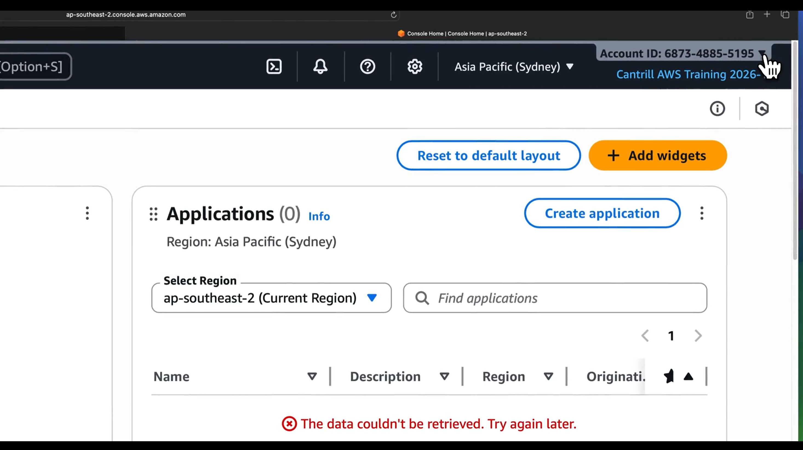

2. Click **Security credentials**.

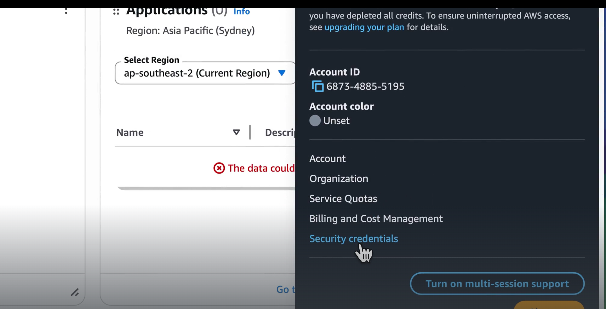

3. The page confirms you are logged in as the **Root user**. A warning banner shows: **"You don't have MFA assigned"**.

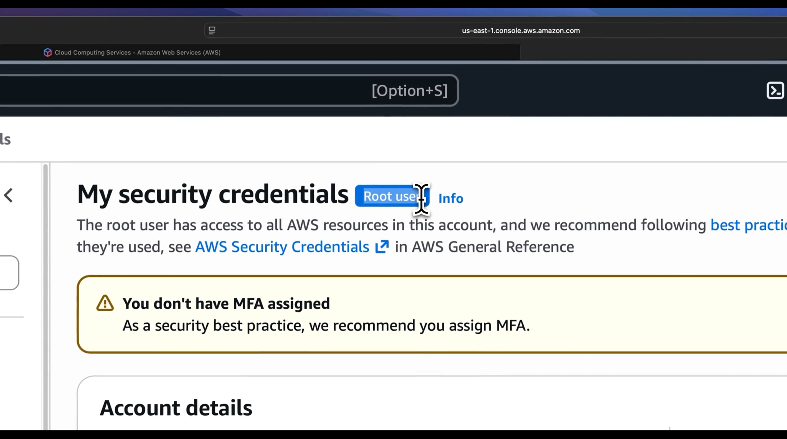

---

## Step 2 — Assign an MFA Device

1. Click the **Assign MFA** button.

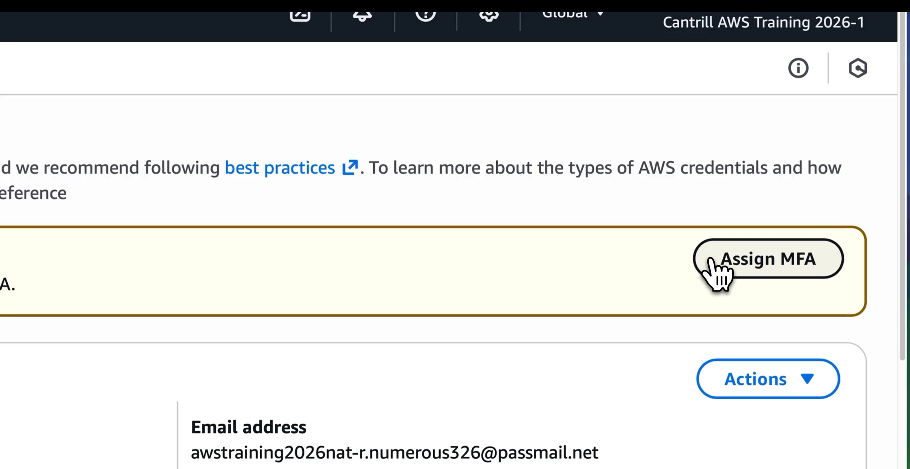

2. You see three MFA device types:
   - **Passkey or security key** — fingerprint, face, or FIDO2 hardware key
   - **Authenticator app** — time-based code from a mobile/desktop app
   - **Hardware TOTP token** — dedicated hardware code generator

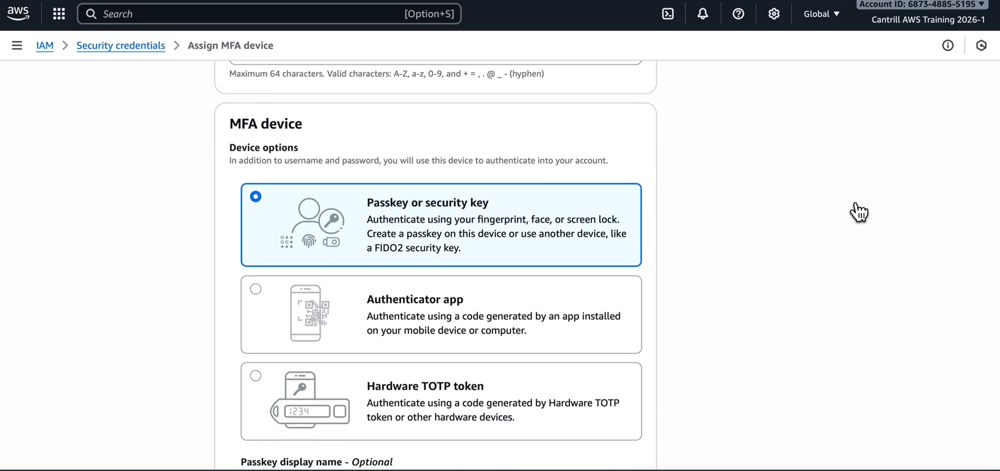

3. **Give the device a descriptive name** (e.g., `YourName-Proton` or `YourName-GoogleAuth`) so you can identify it later.

4. Select **Authenticator app** → click **Next**.

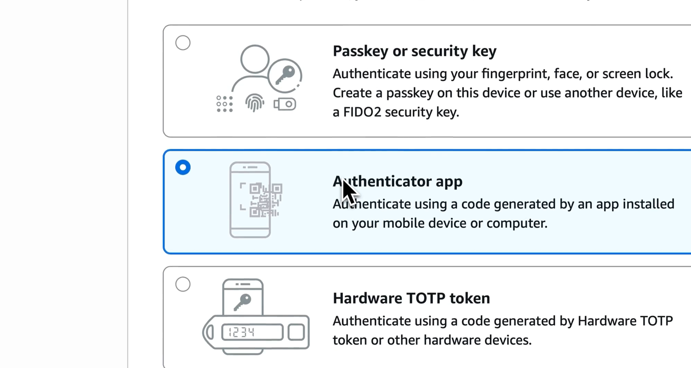

---

## Step 3 — Scan the QR Code and Enter Codes

1. Click **Show QR code** and scan it with your authenticator app. The app will create a new entry and start generating rotating codes.

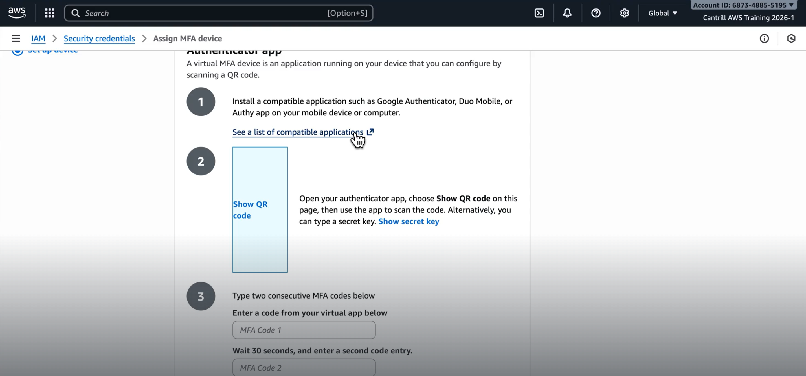

2. Enter **two consecutive MFA codes** from your authenticator app:
   - **MFA Code 1** — the current code
   - **MFA Code 2** — wait ~30 seconds for the next code

3. Click **Add MFA**.

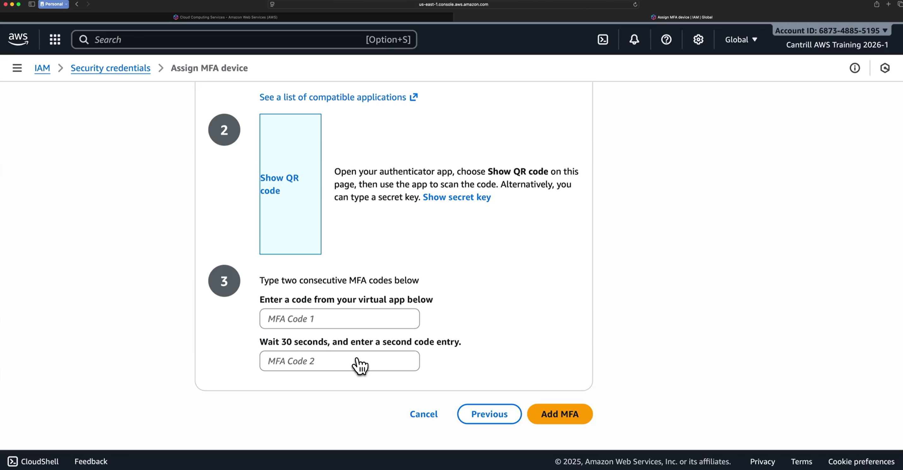

---

## Step 4 — Verify MFA Is Assigned

After clicking Add MFA, the **Security credentials** page now shows:

- ✅ **"MFA device assigned"** success banner
- **Multi-factor authentication (MFA) (1)** section listing your virtual MFA device
- The device ARN format: `arn:aws:iam::<account-id>:mfa/<DeviceName>`

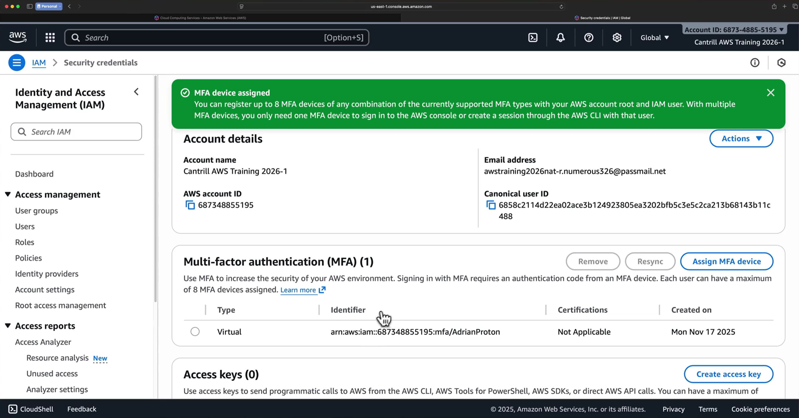

> [!IMPORTANT]
> You can register up to **8 MFA devices** of any combination of supported types per root user or IAM user.

---

## Step 5 — Test MFA Login

1. **Sign out**: click the Account dropdown → **Sign out**.

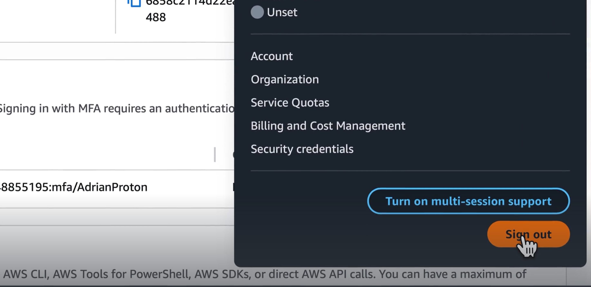

2. At the sign-in screen, click **Sign in using root user email** (since no IAM user has been created yet).

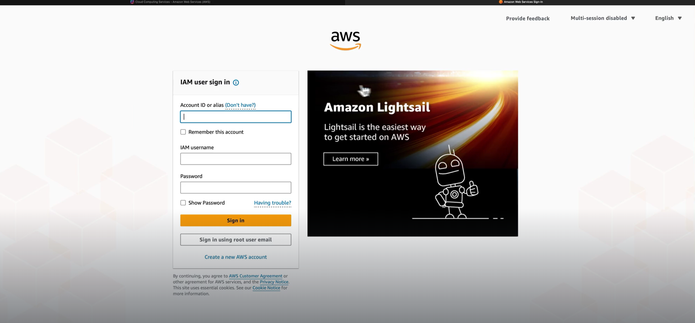

3. Select **Root user**, enter the **email address**, click **Next**, then enter the **password**.

4. AWS now shows **"Additional verification required"** — your account is protected with MFA. Enter the **current MFA code** from your authenticator app → click **Sign in**.

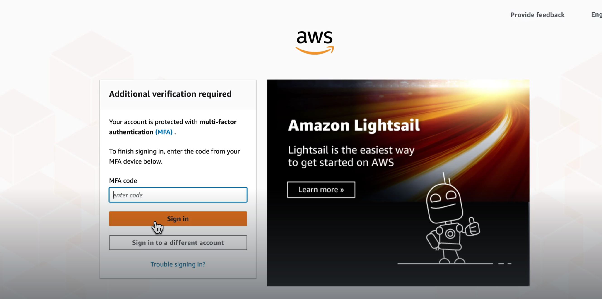

5. You are logged into the **Console Home** — MFA is working.

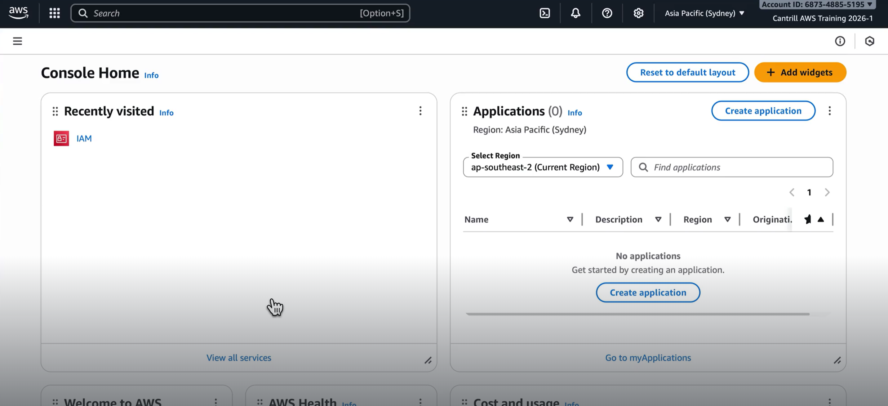

---

## Key Takeaways

- After MFA is enabled, logging in requires **all three**: email + password + MFA code.
- Even if username and password are leaked, the account is **still protected** — an attacker also needs the MFA code.
- MFA codes **rotate every ~30 seconds**, so even a leaked code expires almost immediately.
- The MFA device name should be **descriptive** (e.g., your name + app name) for easy identification.
