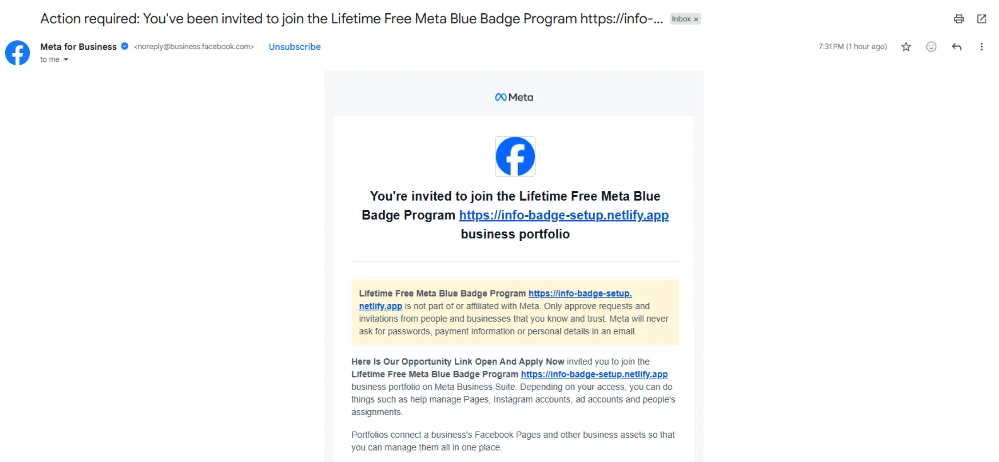

### Case Study Question

**Question:**

A user receives an email notification from Facebook inviting them to collaborate on a page called:

> "Get Lifetime Free Blue Tick Certification"

The email passes SPF, DKIM, and DMARC checks. Email headers show that it originated from Facebook's infrastructure, and ChatGPT/email analysis tools confirm that the email was sent from Facebook servers. Therefore, traditional email spoofing is ruled out.

How could such an email still be malicious or part of a phishing campaign? List all possible explanations and identify the most likely root cause.

---

### Possible Explanations

#### 1. Traditional Email Spoofing

- Attacker forged the sender address.
- SPF/DKIM/DMARC would usually fail.
- Since all records pass, this is unlikely.

**Status:** Ruled Out

---

#### 2. Compromised Facebook Mail Server

- Attacker gained access to Facebook's email infrastructure.
- Could send arbitrary emails appearing legitimate.

**Status:** Extremely unlikely due to Facebook's security controls.

---

#### 3. Compromised Facebook Employee Account

- An internal employee account was abused to send invitations.

**Status:** Possible but rare.

---

#### 4. Vulnerability in Facebook's Invitation System

- Attacker discovered a flaw allowing creation of misleading page names.
- Facebook's system then automatically generated legitimate invitation emails.

Example:

Attacker creates a page named:

> "Get Lifetime Free Blue Tick Certification"

and invites users.

Facebook sends:

> "You are invited to follow Get Lifetime Free Blue Tick Certification."

The email itself is legitimate, but the content is deceptive.

**Status:** Highly Possible

---

#### 5. Abuse of Legitimate Collaboration Features

- No vulnerability required.
- Facebook allows anyone to create a page.
- Attacker creates a deceptive page.
- Uses Facebook's normal invite functionality.

The email originates from Facebook because Facebook actually sent it.

**Status:** Most Likely

---

#### 6. Business Manager / Page Collaboration Abuse

- Attacker creates a page, group, or Business Manager asset.
- Invites targets as editors, moderators, or collaborators.
- Facebook automatically sends notification emails.

Again, the email is genuine but used for social engineering.

**Status:** Very Likely

---

#### 7. Account Takeover of a Legitimate Page

- Attacker compromises an existing page.
- Renames it to something deceptive.
- Sends invitations.

Email remains legitimate because Facebook sends it.

**Status:** Possible

---

#### 8. Open Redirect or Malicious Landing Page

- Email itself is genuine.
- Clicking leads to a Facebook page containing:
    - External phishing links
    - Fake verification forms
    - Scam offers

**Status:** Possible

---

### Investigation Steps

1. Verify SPF, DKIM, and DMARC.
2. Check Return-Path and Received headers.
3. Confirm sending IP belongs to Facebook.
4. Inspect page ID, not just page name.
5. Determine who created the page.
6. Review page creation date.
7. Check page history and previous names.
8. Investigate linked websites and external URLs.
9. Determine whether Facebook's invite feature was abused.

---

### Answer

The email was **not spoofed** because it originated from Facebook's legitimate infrastructure and passed SPF, DKIM, and DMARC validation.

The most likely explanation is that an attacker **abused Facebook's legitimate page invitation feature** by creating or controlling a page with a deceptive name such as "Get Lifetime Free Blue Tick Certification." Facebook then automatically generated and delivered the invitation email, making it appear completely legitimate even though the underlying page was intended for phishing, scams, or social engineering.

**Key Lesson:**  
A genuine email from a trusted service does **not** automatically mean the content or intent is trustworthy. Attackers often abuse legitimate platforms to make phishing campaigns appear authentic.