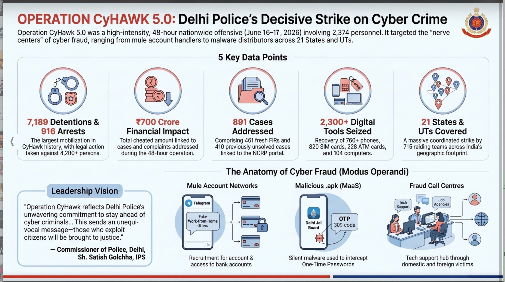

Stable Diffusion (tool)
Stable Diffusion is a powerful, open-source deep learning model developed by Stability AI that generates highly detailed, photorealistic images from text prompts. It is widely used for text-to-image, image-to-image generation, and photo editing.

---

**GreyHatWarfare** is an OSINT (Open Source Intelligence) search platform that helps identify **publicly accessible cloud storage buckets and files** that are exposed on the internet.

It is commonly used by:
- Security researchers
- Penetration testers (with authorization)
- Incident responders
- Digital forensics investigators
- OSINT analysts

Its purpose is to locate **publicly indexed cloud storage**, not to bypass authentication.

---

---

Ant man 

Course on quantum computing 

Qubits 

Like ai is new
Next is quantum computing 

Qpi quantum computers 

How are qubits actually formed 

Ecc
Rsa
Broken 

Only aes256 is left 

Entanglement 
Indernece 
Suoerposritok 

Watch ant man 

Course on quantum computing 

Chinna
Accepted that all huaview all routers they have taken all data 
Harvest now decrypt later 

Iso 27001

