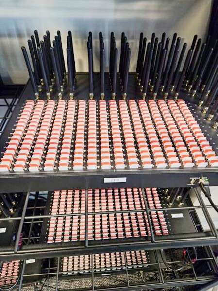

# Case Study: International VoIP Spy Racket Targeting Indian Army Units

## Overview

In 2017, the Uttar Pradesh Anti-Terrorism Squad (UP ATS) uncovered an international spying operation that enabled individuals located in Pakistan, Nepal, UAE, and Bangladesh to contact Indian Army personnel while concealing their true identities. The attackers used Voice over Internet Protocol (VoIP), SIM boxes, caller ID spoofing, and social engineering techniques to gather sensitive military information.

Unlike traditional cyberattacks that target computer systems, this operation primarily exploited telecommunications infrastructure and human trust. The attackers made their calls appear as if they originated from legitimate Indian mobile numbers, increasing the likelihood that military personnel would trust the callers.

---

# Stage 1 – Initial Suspicious Calls

Military personnel posted at sensitive locations in Jammu & Kashmir began receiving calls from individuals claiming to be senior Army officers.

The callers requested information regarding:

- Troop deployment
    
- Military operations
    
- Installations
    
- Operational activities
    

Because the calls appeared legitimate and seemed to originate from trusted military contacts, some personnel shared information with the callers.

---

# Stage 2 – Detection of Anomaly

Military Intelligence noticed suspicious behavior.

When personnel attempted to call the numbers back:

- The numbers could not be reached.
    
- Some numbers appeared invalid.
    
- The communication pattern seemed unusual.
    

This raised concerns that the callers were not genuine Army officers.

---

# Stage 3 – Military Intelligence Alert

The Military Intelligence Unit in Jammu & Kashmir collected approximately two dozen suspicious call logs.

These logs were forwarded to UP ATS for further investigation and technical analysis.

---

# Stage 4 – Technical Investigation

Investigators discovered that:

- The calls were not ordinary telecom calls.
    
- They originated as internet-based VoIP communications.
    
- The traffic was being converted into local Indian mobile calls before reaching the recipients.
    

This explained why the calls appeared trustworthy despite originating from foreign locations.

---

# Stage 5 – Understanding Interconnect Bypass Fraud

The attackers used a technique known as:

## Interconnect Bypass Fraud

Interconnect bypass fraud occurs when international calls avoid authorized telecom gateways and are illegally routed through internet connections and SIM boxes.

### Normal Process

Foreign Caller  
↓  
International Gateway  
↓  
Indian Telecom Network  
↓  
Recipient

In this process:

- Telecom operators know the call originated internationally.
    
- Proper records are maintained.
    
- International termination charges are paid.
    
- Lawful interception and monitoring mechanisms remain effective.
    

### Illegal Process

Foreign Caller  
↓  
Internet (VoIP)  
↓  
SIM Box  
↓  
Indian Mobile Network  
↓  
Recipient

In this process:

- The call enters India through the internet.
    
- A SIM box converts the internet call into a local mobile call.
    
- The recipient sees what appears to be a domestic number.
    
- International routing records are bypassed.
    

### Result

- Call appears local.
    
- Real origin is hidden.
    
- International call charges are bypassed.
    
- Caller identity becomes difficult to trace.
    
- Telecom monitoring becomes more challenging.
    

---

# Stage 6 – SIM Boxes Explained in Detail

## What Is a SIM Box?

A SIM box is a telecommunications device that acts as a gateway between IP-based voice traffic (VoIP) and a cellular network such as GSM, 3G, or 4G.

It is sometimes referred to as:

- GSM Gateway
    
- VoIP Gateway
    
- SIM Gateway
    

A SIM box contains multiple SIM cards and radio modules. Each radio module behaves like an independent mobile phone connected to a cellular network.

A typical SIM box may contain:

- 8, 16, 32, 64, or hundreds of SIM cards
    
- GSM/3G/4G radio modules
    
- Antennas
    
- Ethernet interfaces
    
- Embedded operating system
    
- VoIP software
    
- Call-routing software
    

From the perspective of the mobile operator, each SIM inside the SIM box appears to be an ordinary subscriber device.

---

## What Does a SIM Box Do?

The primary function of a SIM box is to convert internet voice traffic into a standard cellular call.

For example:

A caller located in Pakistan places a VoIP call using a softphone or VoIP application.

Instead of sending the call through an authorized international telecom gateway, the call is sent through the internet to a SIM box located inside India.

The SIM box then:

1. Receives the VoIP call packets.
    
2. Decodes the digital voice stream.
    
3. Selects an available SIM card.
    
4. Uses its radio module to dial the target number through the cellular network.
    
5. Bridges both call legs together.
    

As a result:

- The recipient receives a normal mobile call.
    
- The foreign origin is concealed.
    
- Telecom records may show only a domestic mobile connection.
    

---

# How Conversion to a Cellular Call Happens (Technical Explanation)

This is the most important technical step in the entire process.

Many people ask:

**How does an internet VoIP call become a normal GSM mobile call?**

The answer lies in the SIM box acting as a translator between two completely different communication systems.

---

## Two Different Networks Are Involved

### Network 1 – VoIP Network

VoIP calls travel over IP networks.

Voice is converted into digital packets using codecs such as:

- G.711
    
- G.729
    
- Opus
    
- AMR
    

The voice packets are transported using protocols such as:

- SIP (Session Initiation Protocol)
    
- RTP (Real-Time Transport Protocol)
    

Example:

Caller in Pakistan  
→ Internet  
→ VoIP Server  
→ SIM Box

At this stage there is no cellular network involved.

The communication exists only as IP packets.

---

### Network 2 – Cellular Network

Mobile networks operate differently.

A GSM/3G/4G call requires:

- SIM authentication
    
- Radio communication
    
- Cellular signaling
    
- Voice channels
    

Example:

SIM Box  
→ Cellular Tower  
→ Mobile Switching Center (MSC)  
→ Recipient Mobile Phone

The cellular network expects a device that behaves like a mobile phone.

The SIM box provides exactly that functionality.

---

## Step-by-Step Conversion Process

### Step 1 – Voice Is Digitized

The caller speaks into a microphone.

Example:

"Hello, this is Colonel XYZ."

The VoIP application converts the analog voice into digital data.

The voice is compressed using a codec.

Example:

Voice  
→ Codec  
→ Digital Voice Frames

---

### Step 2 – Voice Packets Travel Across the Internet

The digital voice frames are placed into RTP packets.

Example:

Voice  
→ RTP Packet  
→ IP Packet  
→ Internet

Thousands of packets travel from the caller to the VoIP server and then to the SIM box.

---

### Step 3 – SIM Box Receives IP Packets

The SIM box receives the incoming packets through its Ethernet or internet connection.

Internally it performs:

- SIP session handling
    
- RTP packet reception
    
- Packet buffering
    
- Jitter correction
    

At this point the SIM box has reconstructed the original voice stream.

---

### Step 4 – VoIP Decoder Reconstructs Audio

The SIM box decodes the codec stream.

Example:

RTP Packets  
→ Codec Decoder  
→ Digital Audio Stream

The compressed voice is converted back into audio samples.

The SIM box now has the caller's voice available in real time.

---

### Step 5 – SIM Box Selects a SIM Card

The call-routing software chooses an available SIM.

Example:

SIM 1 Busy  
SIM 2 Busy  
SIM 3 Available

The system selects SIM 3.

The selected SIM is attached to a radio module.

---

### Step 6 – SIM Authenticates with Cellular Network

Before making a call, the SIM must authenticate.

The SIM box communicates with the nearest cellular tower.

Authentication involves:

- IMSI (International Mobile Subscriber Identity)
    
- Authentication keys stored in the SIM
    
- Challenge-response verification
    

The mobile operator verifies that the SIM is a valid subscriber.

Once authenticated, the SIM box is treated like a normal mobile phone.

---

### Step 7 – SIM Box Dials the Target Number

The SIM box sends cellular signaling messages.

For GSM networks this involves signaling procedures similar to those used by ordinary phones.

The SIM box requests:

"Create a voice call to this destination number."

The cellular network establishes the call.

Example:

SIM Box  
→ Cell Tower  
→ MSC  
→ Recipient Phone

The recipient's phone begins ringing.

---

### Step 8 – Real-Time Audio Bridging

Once the recipient answers:

Two separate call legs now exist.

#### Leg A

Caller Abroad  
↔ VoIP Server  
↔ SIM Box

#### Leg B

SIM Box  
↔ Cellular Network  
↔ Recipient

The SIM box bridges both legs together.

Internally:

Incoming RTP Voice  
→ Decode  
→ Audio Processing  
→ Radio Module  
→ GSM Voice Channel

And in the reverse direction:

Recipient Voice  
→ GSM Voice Channel  
→ Audio Processing  
→ RTP Encoding  
→ Internet  
→ Caller

This happens continuously many times per second.

---

### Step 9 – Full Duplex Conversation

Both parties can now speak simultaneously.

The SIM box continuously performs:

- Packet reception
    
- Voice decoding
    
- Audio conversion
    
- Cellular transmission
    
- Cellular reception
    
- Voice encoding
    
- Packet transmission
    

All of this occurs in milliseconds.

To both users it feels like a normal phone call.

---

## Simplified Diagram

### Before Conversion

Foreign Caller

↓

VoIP Application

↓

Internet

↓

VoIP Packets

↓

SIM Box

---

### Inside SIM Box

VoIP Packets

↓

RTP Decoder

↓

Audio Stream

↓

GSM Radio Module

↓

SIM Card

---

### After Conversion

SIM Card

↓

Cell Tower

↓

Mobile Network

↓

Recipient Phone

---

## Why the Mobile Network Thinks It Is a Local Call

The cellular operator only sees:

- A local SIM card
    
- A local radio connection
    
- A local subscriber making a call
    

The operator does not directly see:

- The foreign caller
    
- The VoIP server
    
- The original internet connection
    

Therefore the call appears to originate from the SIM installed in the SIM box.

This is the key reason interconnect bypass fraud works.

---

## Why This Is Difficult to Detect

From the telecom operator's perspective:

The SIM box behaves similarly to dozens of mobile phones making calls.

However, investigators may notice:

- Extremely high outgoing call volumes
    
- Continuous operation
    
- Hundreds of calls per day
    
- Large numbers of different destinations
    
- Multiple SIM cards operating from one location
    

These patterns often reveal SIM box activity.

---

## Role of SIM Boxes in This Case

In this espionage operation, SIM boxes served as the critical bridge between foreign VoIP callers and Indian Army personnel.

They enabled attackers to:

- Hide the international origin of calls
    
- Present calls as local Indian communications
    
- Increase credibility through trusted-looking numbers
    
- Reduce the likelihood of immediate detection
    

Without the SIM box infrastructure, the calls would have been more easily identified as international communications.

---

# Stage 7 – Caller ID Spoofing

Investigators found that genuine Army numbers were being spoofed.

This meant:

- Army personnel saw trusted numbers.
    
- Calls appeared to originate from legitimate units.
    
- Victims were more likely to trust the caller.
    

The operation relied heavily on social engineering rather than technical hacking of Army systems.

---

# Stage 8 – Telecom Analytics

UP ATS worked with:

- Telecom Enforcement Resource and Monitoring Cell (TERM)
    
- Department of Telecommunications
    
- Telecom Service Providers
    

Using:

- Network protocol analysis
    
- Traffic correlation
    
- Telecom records
    

Investigators traced the traffic path and identified suspicious routing patterns.

---

# Stage 9 – Discovery of SIM Boxes

Analysis revealed that internet calls from foreign countries were being routed through:

- 16 SIM box devices
    

Located in:

- Lucknow
    
- Sitapur
    
- Hardoi
    

These SIM boxes functioned as illegal telephone exchanges that converted foreign VoIP traffic into local mobile calls.

---

# Stage 10 – Identifying the Infrastructure

Investigators linked the operation to a network operated from:

- Delhi
    
- Uttar Pradesh
    

The alleged technical coordinator was identified as:

**Gulshan Sen (Mehrauli, Delhi)**

who allegedly provided technical support for the infrastructure.

---

# Stage 11 – Coordinated Raids

Multiple ATS teams simultaneously raided locations in:

- Lucknow
    
- Sitapur
    
- Hardoi
    
- Delhi
    

The purpose was to prevent suspects from destroying evidence and dismantling the infrastructure before it could be seized.

---

# Stage 12 – Evidence Recovery

During the raids investigators recovered:

- 16 SIM boxes
    
- 140 prepaid SIM cards
    
- 10 mobile phones
    
- 5 laptops
    
- 28 data cards
    

These devices formed the infrastructure used to route, disguise, and manage communications.

---

# Stage 13 – Arrests

A total of 11 individuals were arrested.

Investigators believed the group had:

- Enabled foreign callers
    
- Hidden call origins
    
- Assisted intelligence gathering
    
- Facilitated espionage-related communications
    

---

# Investigation Techniques Used

### Military Intelligence

- Suspicious call detection
    
- Operational awareness
    
- Collection of call records
    

### Telecom Analysis

- VoIP traffic analysis
    
- Call routing investigation
    
- Traffic pattern examination
    

### Network Protocol Analysis

- Identification of bypass traffic
    
- Detection of unauthorized routing
    

### Caller ID Analysis

- Spoofed number detection
    
- Identity verification
    

### Infrastructure Mapping

- SIM box identification
    
- Device location tracking
    

### Physical Raids

- Evidence collection
    
- Device seizure
    
- Suspect apprehension
    

---

# Key Lessons

### 1. Social Engineering Can Be More Effective Than Hacking

The attackers did not need to breach military systems.

They convinced people to disclose information voluntarily.

---

### 2. Caller ID Cannot Be Fully Trusted

A number appearing legitimate does not guarantee the caller's identity.

Verification procedures are essential when sensitive information is involved.

---

### 3. VoIP Can Be Abused

VoIP technology itself is legitimate, but criminals can misuse it to:

- Hide origins
    
- Spoof identities
    
- Conduct espionage
    
- Facilitate fraud
    

---

### 4. SIM Boxes Are Powerful Attribution-Evasion Tools

SIM boxes convert internet traffic into local mobile calls, making foreign callers appear domestic.

They can obscure the true source of communications and complicate investigations.

---

### 5. Cyber Investigations Often Combine Multiple Disciplines

This case required:

- Intelligence analysis
    
- Telecom forensics
    
- Network analytics
    
- Human investigation
    
- Physical raids
    

No single investigative technique would have been sufficient on its own.

---

# Key Takeaway

This case demonstrates how foreign actors can use VoIP infrastructure, SIM boxes, caller ID spoofing, and social engineering to obtain sensitive information without directly hacking a target network.

The SIM boxes were the central technical component of the operation. By converting foreign internet-based VoIP traffic into standard cellular calls, they acted as real-time protocol translators between IP networks and GSM/mobile networks. This allowed attackers to conceal their location, bypass telecom controls, and increase the credibility of their communications.

The operation was ultimately uncovered through a combination of military intelligence, telecom analytics, network protocol analysis, infrastructure tracing, and coordinated law-enforcement action.