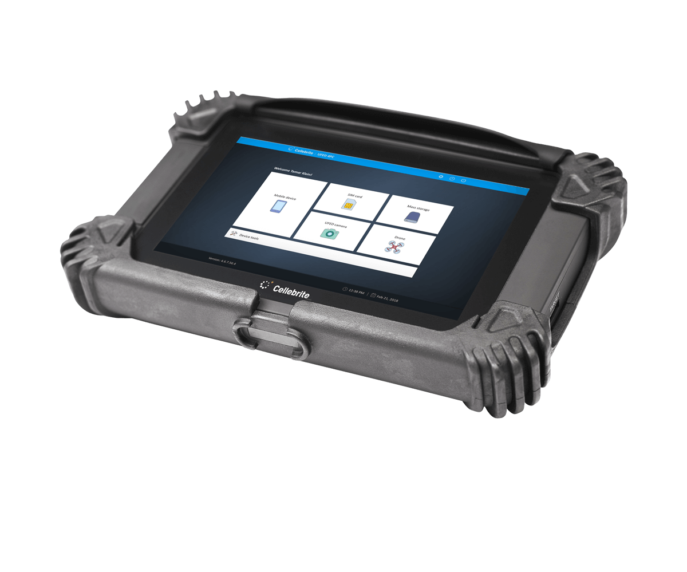

# Google Takeout in Investigations

## Question

If investigators have a person's Gmail account credentials, can they obtain a complete image of the phone without possessing the phone?

## Answer

No.

Google Takeout can provide a large amount of cloud-stored data associated with a Google account, but it is not a complete forensic image of the device.

Having access to a Gmail account allows access to data that has been synchronized with Google's services, but it does not automatically provide access to all information stored on the physical phone.

---

## What Is Google Takeout?

Google Takeout is a service provided by Google that allows users to download copies of data associated with their Google account.

The exported data may include information from many Google services, depending on what the user has enabled and synchronized.

---

## Data Commonly Available Through Google Takeout

- Gmail messages
    
- Contacts
    
- Google Photos
    
- Google Drive files
    
- Calendar entries
    
- Chrome synchronization data
    
- Search history
    
- YouTube activity
    
- Location History (if enabled)
    
- Google account activity logs
    
- Google Keep notes
    
- Maps data and Timeline information (if enabled)
    

---

## Data Usually Not Available Through Google Takeout

- Full device filesystem
    
- Deleted local files
    
- RAM contents
    
- Unsynced application data
    
- Complete WhatsApp databases stored only on the device
    
- Signal message databases
    
- Telegram local storage
    
- Device encryption keys
    
- Physical storage image
    
- Data from applications that do not synchronize with Google
    

---

## What Is Cellebrite UFED?

UFED (Universal Forensic Extraction Device) is a digital forensic tool developed by Cellebrite and widely used by law enforcement, government agencies, and forensic examiners.

Unlike Google Takeout, UFED is designed to extract data directly from a mobile device when investigators have physical access to it.

Depending on the device model, operating system version, security settings, and available forensic methods, UFED may be able to obtain:

- Call logs
    
- Text messages
    
- Contacts
    
- Photos and videos
    
- Application data
    
- Browser history
    
- Device settings
    
- Location information
    
- Deleted data (in some circumstances)
    
- File system extractions
    
- Physical extractions on supported devices
    

The amount of data recovered varies significantly depending on the device and the extraction method used.

---

## Google Takeout vs. Cellebrite UFED

|Google Takeout|Cellebrite UFED|
|---|---|
|Retrieves cloud-synchronized Google account data|Extracts data directly from the device|
|Does not require possession of the phone if account access is available|Usually requires physical access to the device|
|Limited to data stored by Google services|May access a much broader range of device data|
|Cannot create a full forensic image of the phone|May obtain file system or physical extractions on supported devices|
|Depends on what the user synchronized to Google|Depends on device support, security protections, and extraction method|

---

## Investigation Value

Even without the phone, Google Takeout may help investigators reconstruct:

- User activity
    
- Travel history
    
- Search behavior
    
- Communication patterns
    
- Account usage timelines
    

However, a forensic extraction obtained directly from a device using tools such as Cellebrite UFED typically contains significantly more information than a Google Takeout export because it can access data stored locally on the device.

---

## Key Takeaway

Google Takeout provides a cloud-based view of a user's Google ecosystem, not a complete forensic image of the smartphone. The quality and quantity of evidence depend entirely on what data was synchronized to Google's servers.

Cellebrite UFED, by contrast, is a forensic extraction platform used to collect data directly from mobile devices and may provide access to substantially more information when physical access to the device is available.