How to move forward : 
Build core foundation : Python 
Bash PowerShell courses

1. Ai literacy 
2. Data analytics 
3. Risk management

Make AI Cybersecurity tools of your own rather than only going after learning new tools all the time
Create you own tool

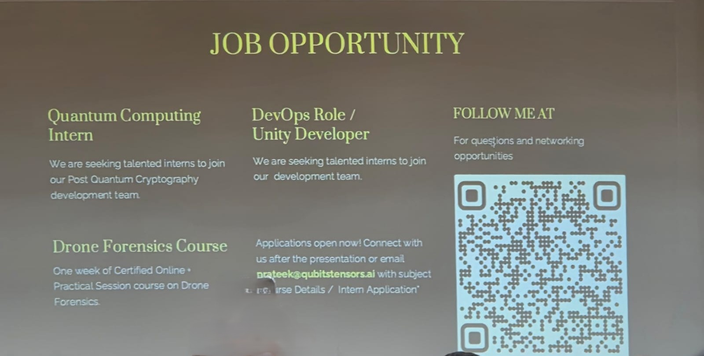

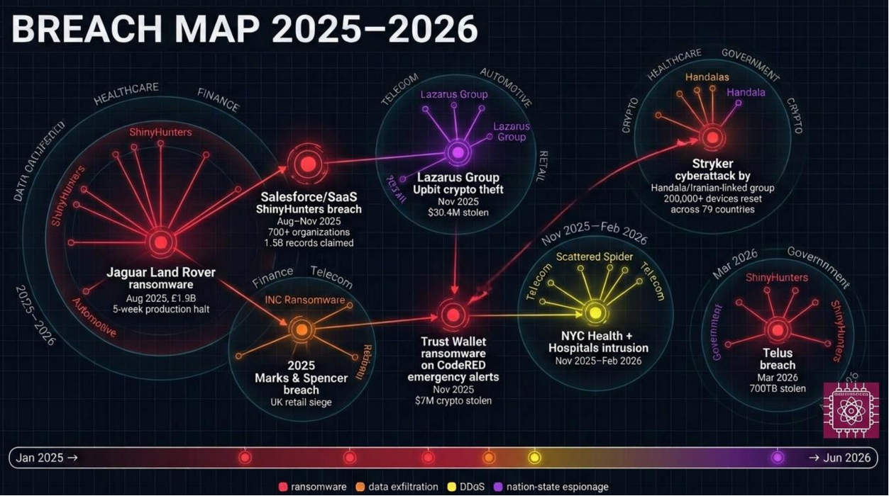

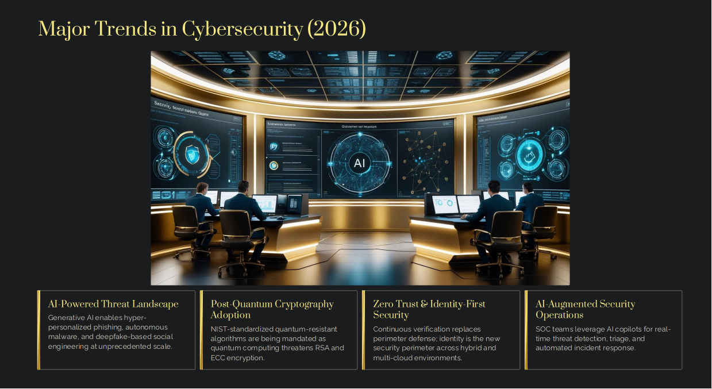

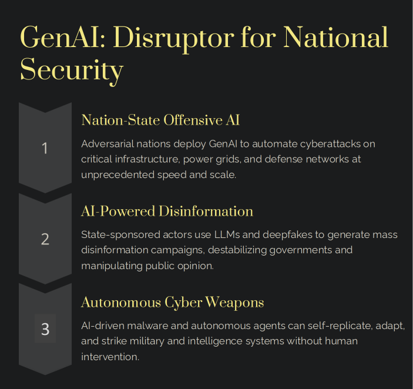

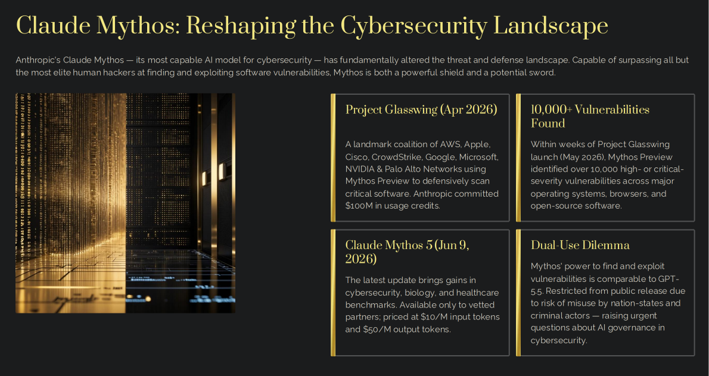

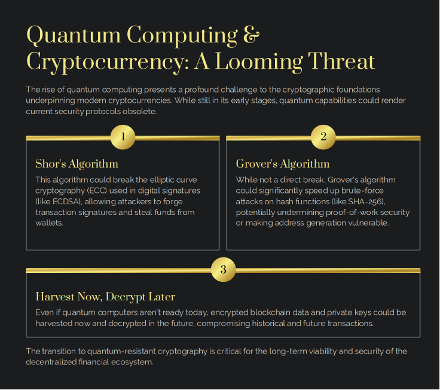

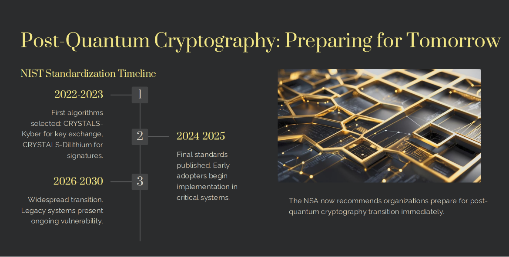

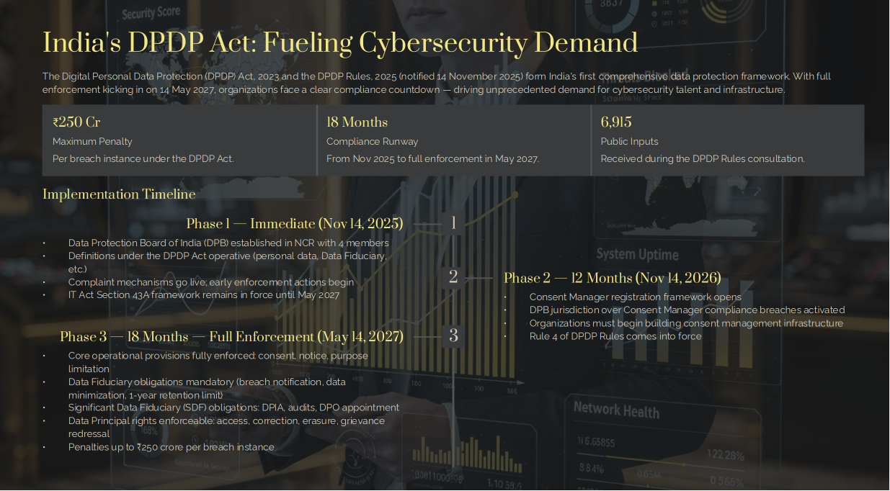

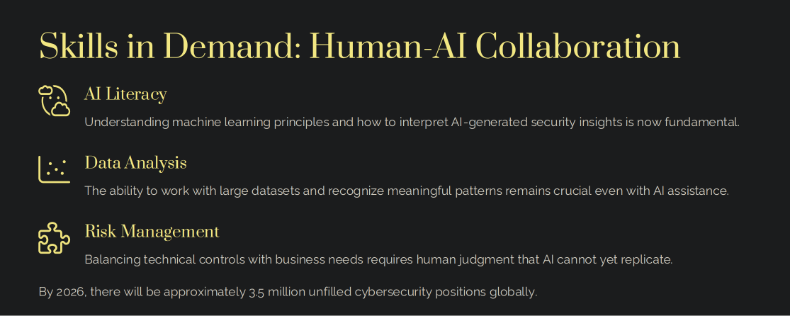

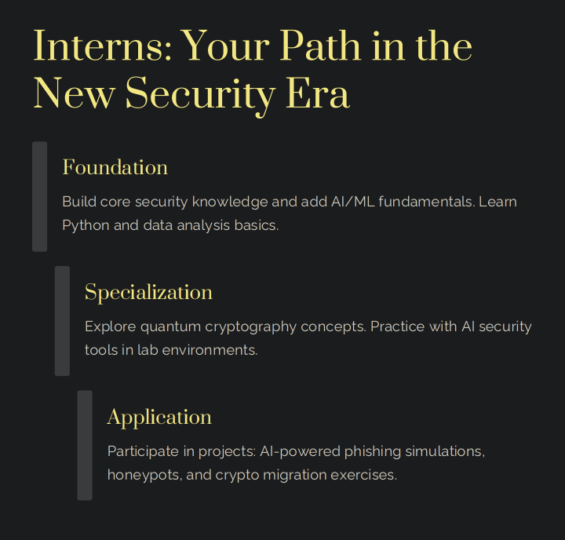

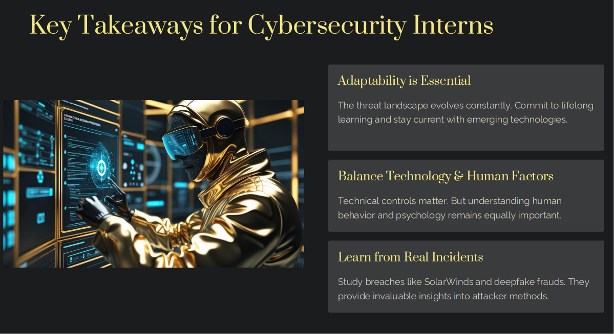

