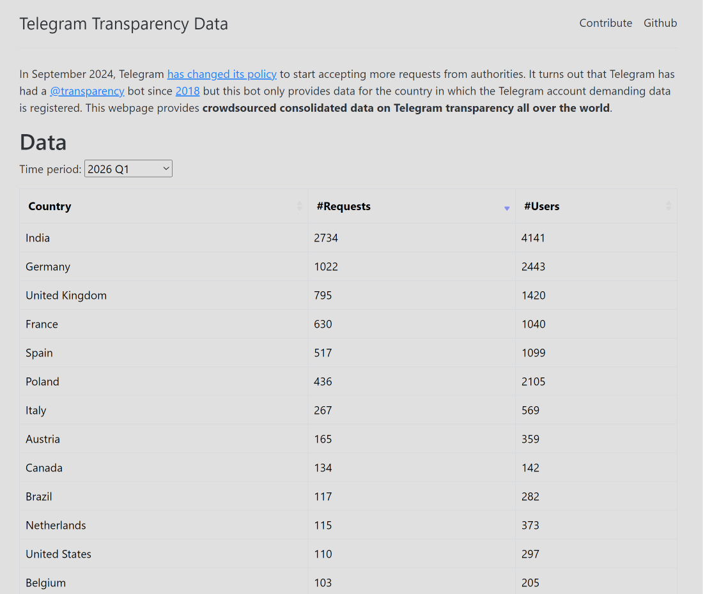

# Telegram Transparency Reports

Telegram Transparency Data
Link - https://te-k.github.io/telegram-transparency/


# 1. What is a Transparency Report?

A **Transparency Report** is a public report published by a technology company that provides statistics about:

- Government requests for user data
    
- Legal requests from law enforcement
    
- Content removal requests
    
- Copyright takedowns
    
- Policy enforcement actions
    

The purpose is to improve transparency about how the platform responds to legal demands.

---

# 2. Telegram Transparency Reports

Telegram publishes transparency information regarding requests received from governments and law enforcement agencies.

The reports generally summarize:

- Number of legal requests received
    
- Jurisdictions making the requests
    
- Types of requests
    
- Actions taken by Telegram
    

These reports are statistical summaries and do not disclose individual user identities.

---

# 3. Types of Requests

Authorities may seek information related to:

- Criminal investigations
    
- Fraud
    
- Child exploitation
    
- Terrorism
    
- Cybercrime
    
- Other lawful investigations
    

Requests are typically expected to follow the applicable legal procedures of the relevant jurisdiction.

---

# 4. Information That May Be Requested

Depending on the circumstances and Telegram's policies, authorities may request information such as:

- Account identifiers
    
- Phone number information
    
- Registration details
    
- Public channel information
    
- IP logs (where available and legally disclosable)
    

Telegram has historically stated that **private chats are protected by encryption**, and **Secret Chats** use end-to-end encryption, meaning Telegram does not possess the keys to decrypt their contents.

---

# 5. Cloud Chats vs Secret Chats

## Cloud Chats

- Stored on Telegram's cloud infrastructure.
    
- Synced across devices.
    
- Protected in transit and at rest by Telegram's architecture.
    
- Not end-to-end encrypted by default.
    

## Secret Chats

- End-to-end encrypted.
    
- Encryption keys remain on participating devices.
    
- Include optional self-destruct timers.
    
- Cannot be accessed from Telegram's cloud by design.
    

---

# 6. Transparency Report Workflow

```text
Government Request
         │
         ▼
Legal Review
         │
         ▼
Telegram Evaluation
         │
         ▼
If Valid Under Applicable Law
         │
         ▼
Respond According to Policy
         │
         ▼
Aggregate Statistics Included in Transparency Report
```

---

# 7. Metadata vs Message Content

A distinction is often made between:

### Metadata

Examples:

- Account creation time
    
- Phone number
    
- IP address (where logged)
    
- Login timestamps
    
- Device information
    

### Content

Examples:

- Messages
    
- Photos
    
- Videos
    
- Documents
    

Availability of either depends on Telegram's technical architecture, the chat type, and applicable legal processes.

---

# 8. Public Channels and Groups

Information in **public channels** and **public groups** is generally visible to participants and may be accessible without special privileges.

Private chats and Secret Chats have different privacy properties.

---

# 9. Use in Digital Investigations

Investigators may analyze:

- Public Telegram channels
    
- Public usernames
    
- Open-source intelligence (OSINT)
    
- Shared links
    
- Cryptocurrency addresses
    
- Public media
    
- Group membership where lawfully accessible
    

Such analysis is often combined with other evidence rather than relied upon in isolation.

---

# 10. Limitations

Transparency reports:

- Provide aggregate statistics, not case details.
    
- Do not reveal the contents of individual investigations.
    
- Do not guarantee that requested data exists or is available.
    
- Reflect the platform's stated handling of legal requests at the time of publication.
    

---

# Key Takeaways

- A **Transparency Report** summarizes how a platform handles government and legal requests for information.
    
- Telegram publishes transparency information about legal requests and its responses.
    
- **Cloud Chats** are synchronized through Telegram's infrastructure, while **Secret Chats** use end-to-end encryption and are designed so that Telegram cannot decrypt their contents.
    
- Transparency reports contain aggregated statistics and policy information rather than details about specific users or investigations.
    
- In digital forensics and cyber investigations, Telegram-related evidence is typically combined with other sources such as device forensics, OSINT, financial records, and network analysis.