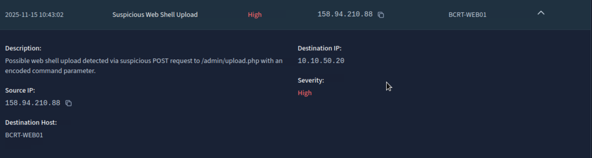
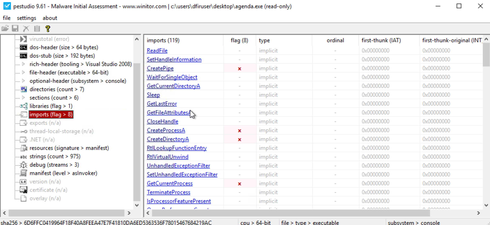
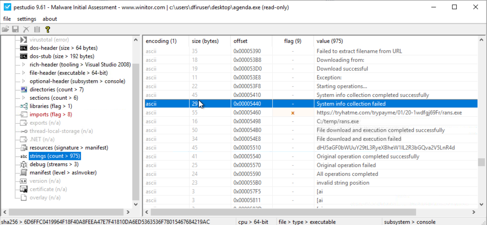
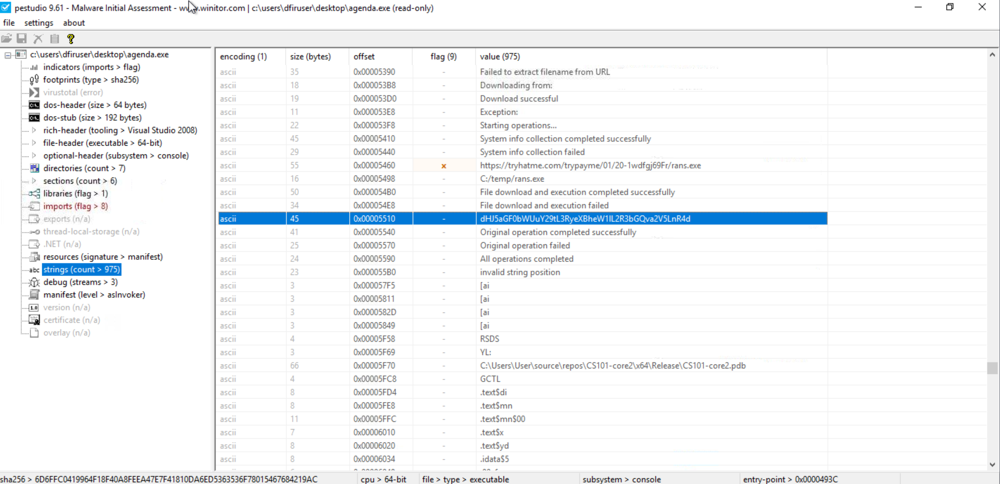
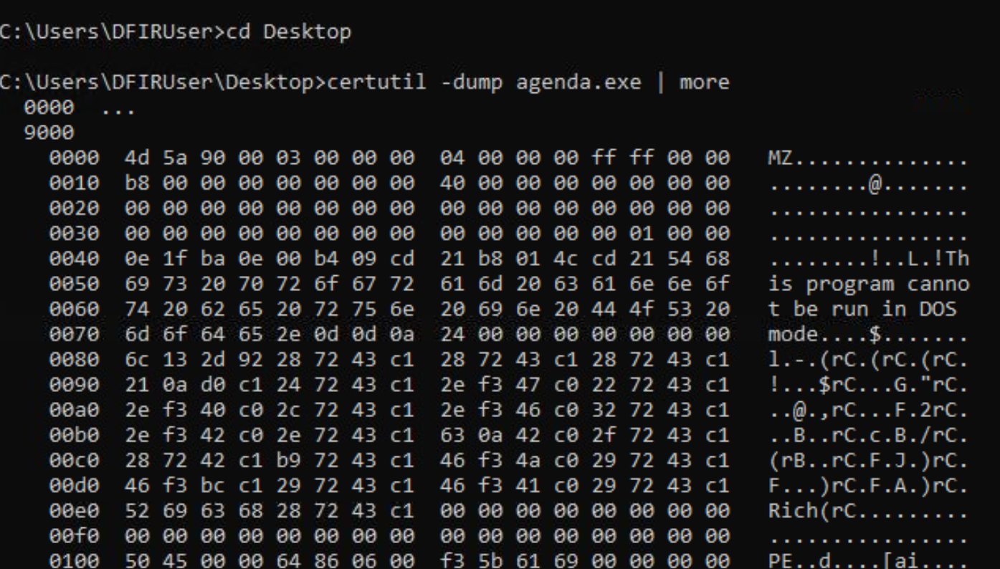
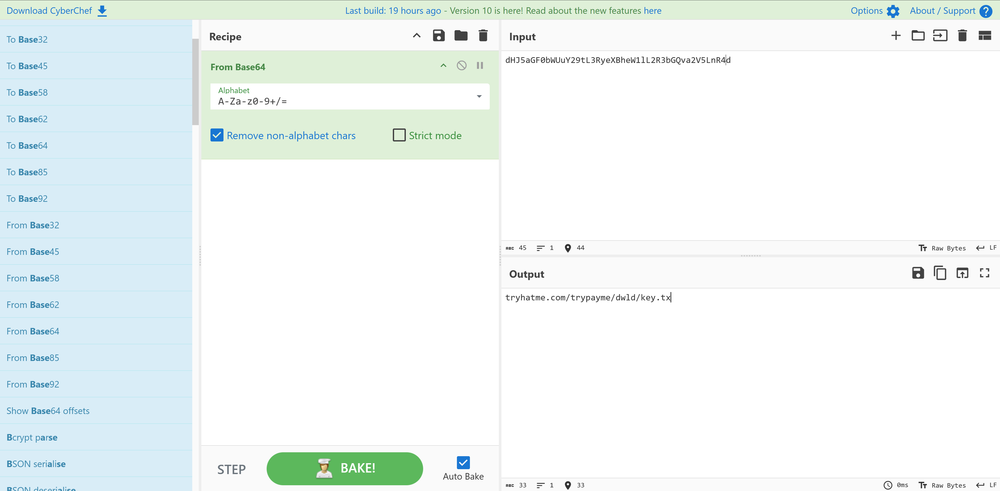

# TryHackMe SEC 1 — Exam Writeup

> [!info] Exam Overview
> **Platform:** TryHackMe · (SEC 1)
> **Contracts:** 7 practical tasks covering Windows CLI, Linux CLI, Nmap, Web App Testing, SOC Investigation, Network + Web Testing, and DFIR / Malware Analysis

> [!abstract] Table of Contents
> 1. [[#Contract 1 — Novacore Financial (Windows CLI)|Novacore Financial (Windows CLI)]]
> 2. [[#Contract 2 — Joy Candy Factory (Linux CLI)|Joy Candy Factory (Linux CLI)]]
> 3. [[#Contract 3 — TryMapMe (Nmap)|TryMapMe (Nmap)]]
> 4. [[#Contract 4 — AstraVault (Web Application Testing)|AstraVault (Web Application Testing)]]
> 5. [[#Contract 5 — BrightCart Retail (SOC Investigation)|BrightCart Retail (SOC Investigation)]]
> 6. [[#Contract 6 — Rute Bay University (Network + Web Testing)|Rute Bay University (Network + Web Testing)]]
> 7. [[#Contract 7 — TryPayMe Solutions (DFIR — Malware Analysis)|TryPayMe Solutions (DFIR — Malware Analysis)]]

---

# Contract 1 — Novacore Financial (Windows CLI)

> **Environment:** Windows machine via CMD

## Q1 — What is the hostname of the system?

**Answer:** `OPS-WKS01`

```cmd
hostname
```

---

## Q2 — What is the account type assigned to alex.reid?

**Answer:** `Standard`

```cmd
net user alex.reid
```

Look for **"Local Group Memberships"** — if `Administrators` is listed → Administrator; otherwise → Standard.

---

## Q3 — Which user account holds Full Control permissions on `system_overview.txt`?

> Other than the `alex.reid` user account and the local groups.

**Answer:** `noah.jones`

```cmd
icacls "C:\Users\alex.reid\Documents\system_overview.txt"
```

**Output:**

```
OPS-WKS01\noah.jones:(F)
OPS-WKS01\alex.reid:(F)
BUILTIN\Administrators:(F)
NT AUTHORITY\SYSTEM:(F)
```

`(F)` = Full Control. Excluding `alex.reid` and local groups → `noah.jones`.

---

## Q4 — Which local group's intended role involves system design?

**Answer:** `Ops-Engineering`

```cmd
net localgroup
```

"System design" aligns with **Engineering** (Architects / Designers / Engineers).

---

## Q5 — Which local group includes both alex.reid and noah.jones as members?

**Answer:** `Ops-Compliance`

From `net user alex.reid`, we know alex.reid belongs to: `Ops-Compliance`, `Ops-Network`, `Users`.

Check each group:

```cmd
net localgroup "Ops-Compliance"
net localgroup "Ops-Network"
```

| Group          | Members              |
| -------------- | -------------------- |
| Ops-Compliance | alex.reid, noah.jones |
| Ops-Network    | alex.reid, emma.clark |

Only **Ops-Compliance** contains both.

---

## Q6 — What is the name of the service (prefix `Ops`) that is currently stopped?

**Answer:** `OpsAuditService`

```cmd
sc query state= all | findstr /I "Ops"
```

**Output:**

```
SERVICE_NAME: CertPropSvc
SERVICE_NAME: OpsAuditService
```

Confirm it is stopped:

```cmd
sc query OpsAuditService
```

---

## Q7 — What is the name of the scheduled task configured for daily operations check?

**Answer:** `Ops_DailyAudit`

```cmd
taskschd.msc
```

Browse Task Scheduler Library. Look for keywords: Daily, Operations, Check.

---

## Q8 — What is the SHA256 hash of `system_overview.txt`?

**Answer:** `114c6042a07df6cd5ce5970f72819bc38dcc4503f4f8e47728286b6a886cda0f`

```cmd
certutil -hashfile "C:\Users\alex.reid\Documents\system_overview.txt" SHA256
```

---

## Q9 — What is the name of the custom shared folder on this system?

**Answer:** `SharedData`

```cmd
net share
```

Ignore default shares (`C$`, `ADMIN$`). Whatever custom name appears is the answer.

---

## Q10 — What is the creation time of the shadow copy for drive C:?

> Format: MM/DD/YYYY HH:MM AM/PM

**Answer:** `11/14/2025 9:57 AM`

```cmd
vssadmin list shadows
```

From output: `creation time: 11/14/2025 9:57:32 AM` — drop the seconds per the required format.

---

# Contract 2 — Joy Candy Factory (Linux CLI)

## Q1 — What is the target machine's operating system's PRETTY_NAME?

**Answer:** `Ubuntu 24.04.1 LTS`

```bash
cat /etc/os-release
```

Look for the `PRETTY_NAME="..."` field.

---

## Q2 — What is the full path of the home directory assigned to ops.audit?

**Answer:** `/home/ops.audit`

```bash
getent passwd ops.audit
```

**Output:**

```
ops.audit:x:1001:1001::/home/ops.audit:/bin/bash
```

---

## Q3 — Which group is assigned as the primary group for ops.audit?

**Answer:** `ops-users`

Primary group = GID `1001`. Convert GID → group name:

```bash
getent group 1001
```

**Output:**

```
ops-users:x:1001:
```

---

## Q4 — Who is the owner of `/home/ops.audit/documents/system_overview.txt`?

**Answer:** `ops.maint`

```bash
sudo ls -l /home/ops.audit/documents/system_overview.txt
```

**Output:**

```
-rwxr-x--- 1 ops.maint ops-users 616 Jan  9 12:54 /home/ops.audit/documents/system_overview.txt
```

---

## Q5 — What are the numeric permissions on `system_overview.txt`?

**Answer:** `750`

```bash
stat -c "%a" /home/ops.audit/documents/system_overview.txt
```

---

## Q6 — How many service accounts (containing `svc`) are in the authorised users file?

**Answer:** `2`

First, read the overview file to find the path:

```bash
sudo cat /home/ops.audit/documents/system_overview.txt
```

The authorised users list is at: `/opt/joycandy/config/authorised_users.list`

```bash
sudo cat /opt/joycandy/config/authorised_users.list | grep svc | wc -l
```

Service accounts found: `svc.monitor`, `svc.patch` → count = **2**.

---

## Q7 — What is the running process owned by ops.audit that is not attached to a terminal?

**Answer:** `/usr/local/ops/ops-report.sh`

```bash
ps -u ops.audit -o pid,tty,cmd
```

**Output:**

```
    PID TT       CMD
    610 ?        /bin/bash /usr/local/ops/ops-report.sh
   1279 ?        sleep 60
```

Look for `?` under TTY (not attached to terminal). The main process is `/usr/local/ops/ops-report.sh` (the `sleep 60` is a child of it).

---

## Q8 — What is the full target path of the symbolic link mentioned in `system_overview.txt`?

**Answer:** `/opt/joycandy/releases/1.0.0`

From `system_overview.txt`, the symbolic link is `/opt/joycandy/live`. Resolve it:

```bash
readlink -f /opt/joycandy/live
```

**Output:**

```
/opt/joycandy/releases/1.0.0
```

---

## Q9 — How many lines does `auth.log.1` have?

**Answer:** `2398`

```bash
wc -l /home/ops.maint/logs/auth/auth.log.1
```

First number in the output is the answer.

---

## Q10 — Which command should be used to view the manual page for `ps`?

**Answer:** `man ps`

---

# Contract 3 — TryMapMe (Nmap)

## Q1 — How many hosts are up in the network 192.168.8.0/24?

**Answer:** `11`

```bash
sudo nmap -sn 192.168.8.0/24
```

---

## Q2 — Which protocol is running on host 192.168.8.10?

**Answer:** `dns`

```bash
sudo nmap -sS -sV -p- 192.168.8.0/24
```

---

## Q3 — What is the name and version of the service on the host with port 8080 open?

**Answer:** `SimpleHTTPServer 0.6 (Python 3.10.12)`

*(From the `-sV` scan output above.)*

---

## Q4 — What is the OS version of host 192.168.8.60?

> Provide the full value of the "OS details" field.

**Answer:** `Linux 4.15 - 5.8`

```bash
sudo nmap -O 192.168.8.60
```

---

## Q5 — How many UDP ports are open on host 192.168.8.91?

**Answer:** `1`

```bash
sudo nmap -sU --min-rate 5000 192.168.8.91
```

Everything else is `closed` or `open|filtered`.

---

## Q6 — How many TCP ports are open on host 192.168.8.50?

**Answer:** `3`

---

## Q7 — What is the MAC address of host 192.168.8.20?

**Answer:** `76:4D:85:6B:98:44`

---

## Q8 — How many well-known TCP ports are open on host 192.168.8.60?

**Answer:** `1`

> [!note]
> Port 8080 is **NOT** a well-known port (well-known = 0–1023). Only ports in range 0–1023 count.

---

## Q9 — On which IP address is the DHCP service active?

**Answer:** `192.168.8.90`

```bash
sudo nmap -sU -p 67 192.168.8.0/24
```

---

## Q10 — What service is running on port 161 on host 192.168.8.50?

**Answer:** `snmp`

```bash
sudo nmap -sU -p 161 192.168.8.50
```

---

# Contract 4 — AstraVault (Web Application Testing)

> **Credentials:** `pentest_user` / `password123`
> **Target:** `http://10.xx.xx.xx/`

## Q1 — What is the email of an employee found in the HTML source?

**Answer:** `james.smith@astravault.com`

Right at the top of the HTML source:

```html
<!-- For banking inquiries, contact james.smith@astravault.com -->
```

---

## Q2 — What is the API key obtained from the loaded JavaScript file?

**Answer:** `av_health_9d2f1cbe12`

At the bottom of the HTML:

```html
<script src="/js/healthcheck.js"></script>
```

Open in browser: `http://10.49.136.36/js/healthcheck.js` — the API key is inside that file.

---

## Q3 — What two additional login portals could be found through directory enumeration?

**Answer:** `/admin, /employee`

```bash
gobuster dir -u http://10.49.136.36 -w /usr/share/wordlists/dirb/common.txt -t 40
```

Ignore `/css`, `/js`, `/includes` — the login-related portals are `/admin` and `/employee`.

---

## Q4 — What is the description of the $1,000.00 deposit in Jane Smith's transactions?

> Exploit the Transactions page to access Jane Smith's transaction details.

**Answer:** `Cheque Deposit`

**Technique:** IDOR — change the `id` parameter:

```
http://10.49.136.36/transactions.php?id=1
```

Change the `id` value (`2`, `3`, etc.) until you land on **Jane Smith**.

---

## Q5 — What is the incident ID when you inject a simple alert dialogue on the Offers page?

**Answer:** `INC-2025-117384`

1. Click **Offers**
2. Find the input field
3. Inject:

```html
<script>alert(1)</script>
```

---

## Q6 — What code must be submitted to bypass the employee password-reset MFA?

**Answer:** `112233`

1. Open the employee portal: `http://10.49.136.36/employee/`
2. Click **Forgot Password**
3. Enter email: `james.smith@astravault.com` → Submit
4. At the MFA prompt, try blank, `000000`, `123456`, etc.

The application leaks the debug code in the error message:

```
Invalid MFA code. ### DEBUG CODE - REMOVE AFTER DEPLOYMENT: 112233 ###
```

---

## Q7 — What diagnostic token is found in CHANGELOG.md v0.7.3 after exploiting command injection in File Search?

### Step 1 — Reset James Smith's password

1. Go to `http://10.49.136.36/employee/` → **Forgot Password**
2. Enter: `james.smith@astravault.com` → Submit
3. Enter MFA code: `112233` (the debug code from Q6)
4. Set a new password (e.g., `Password123!`)

Response:

```
Password has been reset for james.smith@astravault.com. New password: 2bc03844
```

### Step 2 — Login as employee

Login at `http://10.49.136.36/employee/` with:
- **Email:** `james.smith@astravault.com`
- **Password:** (whatever was set/returned)

### Step 3 — Command Injection

In the **File to read** box, enter:

```
offers.txt; cat CHANGELOG.md
```

The server executes both commands — read the CHANGELOG.md output for the v0.7.3 diagnostic token.

---

## Q8 — What is the service token retrieved from the database after exploiting Customer Search?

*(Not completed during exam.)*

---

## Q9 — What message is displayed in the administrator portal upon gaining superuser access?

*(Not completed during exam.)*

---

## Q10 — What is the global token that can be retrieved from the database?

*(Not completed during exam.)*

---

# Contract 5 — BrightCart Retail (SOC Investigation)

> [!tip] Investigation Workflow
> **Dashboard** (identify threat) → **Alerts** (find critical alert) → **Events** (analyse HTTP logs) → **Payloads** (decode attack) → **Firewall** (block attacker) → **Vuln Scan** (identify root cause)

## Q1 — What is the name of the alert rule that detected suspicious activity against BCRT-WEB-01?

**Answer:** `Suspicious Web Shell Upload`

Go to the **Alerts** tab:



---

## Q2 — What is the source IP address of the suspicious activity?

**Answer:** `158.94.210.88`

*(From the alert details expanded in Q1.)*

---

## Q3 — What is the requested URI path used in the suspicious HTTP request?

**Answer:** `/admin/upload.php`

1. Click **Events** tab → **View HTTP Events**
2. Filter by attacker IP: `158.94.210.88`
3. Look for the suspicious **POST** request → `/admin/upload.php`

---

## Q4 — What is the decoded value of the `cmd` parameter?

**Answer:** `nmap -sV 127.0.0.1`

Click the **Payloads** tab. Find the payload for source IP `158.94.210.88` tied to `/admin/upload.php`.

The encoded value:

```
bm1hcCAtc1YgMTI3LjAuMC4x
```

is Base64. Decoded:

```
nmap -sV 127.0.0.1
```

---

## Q5 — What is the state of port 80/tcp after the firewall rule is applied?

**Answer:** `filtered`

Go to the **Firewall** tab → **Add Rule**:

| Field       | Value              |
| ----------- | ------------------ |
| Rule ID     | R5 (or auto)       |
| Name        | Block_Attacker     |
| Description | Block malicious IP |
| Source IP    | `158.94.210.88`    |
| Target IP   | BCRT-WEB01 / `10.10.50.20` |
| Port        | `80`               |
| Action      | Block              |
| Status      | Enabled            |

After applying, the scan result shows:

> **Port 80/tcp is now filtered**

---

## Q6 — What is the CVE number of the highest severity vulnerability?

**Answer:** `CVE-2021-41773`

Go to **Vuln Scan** tab → **Start Scan** → open the **High severity** vulnerability.

---

## Q7 — What type of vulnerability would this be categorised as?

**Answer:** `Path Traversal and Remote Code Execution vulnerability`

---

## Q8 — What is the primary remediation action recommended?

**Answer:** `Upgrade Apache HTTP Server to a patched version`

---

## Q9 — Given that directory listing is enabled, which year was the associated vulnerability published?

**Answer:** `2022`

---

## Q10 — Which directories were confirmed to expose directory listings?

> Answer in alphabetic order: /dir1/, /dir2/, /dir3/

**Answer:** `/backup/, /images/, /uploads/`

Click **Directory Listing Enabled** in the scan report:

- `/images/`
- `/uploads/`
- `/backup/`

Alphabetical order: `/backup/`, `/images/`, `/uploads/`

---

# Contract 6 — Rute Bay University (Network + Web Testing)

## Q1 — What is the name of the FTP server?

**Answer:** `vsftpd`

```bash
sudo nmap -sS -sV -p 1-10000 10.48.132.234
```

From the output:

```
21/tcp   open  ftp   vsftpd 3.0.3
```

---

## Q2 — What is the time returned by the daytime service at TCP port 13?

> Format: HH:MM:SS

**Answer:** `13:38:37`

```bash
nc 10.48.132.234 13
```

---

## Q3 — What is the numeric version number of the listening MongoDB service?

**Answer:** `5.0.8`

> [!warning] MongoDB port out of range
> MongoDB runs on port **27017**, which is outside the initial 1–10000 scan range. Must scan it explicitly:

```bash
sudo nmap -sV -p 27017 10.48.132.234
```

---

## Q4 — What is the path of the hidden login page used by faculty instructors?

> e.g., `http://10.48.132.234:3000/path`

**Answer:** `admin`

```bash
gobuster dir -u http://10.48.132.234:3000 -w /usr/share/wordlists/dirb/common.txt -t 40
```

---

## Q5 — What is the path of the hidden login page used by IT personnel?

**Answer:** `debug`

From the Gobuster results, the restricted IT-style entry point is `/debug`.

---

## Q6 — What is the password of student student009?

*(Not completed during exam.)*

---

## Q7 — What is the grade of student057 in the course QM400?

*(Not completed during exam.)*

---

## Q8 — What is the total amount due in USD from `details-b.txt` inside the encrypted archive?

> Answer should be 3 digits.

After cracking the ZIP password (see Q10), unzip and read:

```bash
unzip details-b.zip
cat details-b.txt
```

Look for: `Total Amount Due: NNN USD` — that 3-digit number is the answer.

---

## Q9 — What is the password for the user peter?

> Found via notes left by IT personnel at `http://10.48.132.234:3000/notes`

**Answer:** `freedom`

The `/notes` page exposes real `/etc/passwd` + `/etc/shadow` entries. The intended path is **offline password cracking**.

Peter's hash (`$6$` = SHA-512 crypt):

```
peter:$6$nSNbeDclzgtYkw5r$Uxu.SkEn4d8vi4P/JpZPPSu7zFSPt39WCBdoEk419uuYLEcuvd8RExeqMibfOhRPoIp4we9vr6bW3Gj/xi2fp0
```

### Cracking Steps

1. Save the hash:

```bash
nano peter.hash
```

Paste the hash line above.

2. Crack with John the Ripper:

```bash
john peter.hash --wordlist=/usr/share/wordlists/rockyou.txt
```

3. Show the result:

```bash
john --show peter.hash
```

Whatever appears after `peter:` is the password → **freedom**.

---

## Q10 — What is the decryption password for `details-m.zip`?

**Answer:** `1q2w3e4r5t`

### Cracking Steps

1. Generate hash from the ZIP:

```bash
zip2john details-b.zip > zip.hash
cat zip.hash
```

2. Crack with rockyou:

```bash
john zip.hash --wordlist=/usr/share/wordlists/rockyou.txt
```

3. Show result:

```bash
john --show zip.hash
```

Output: `details-b.zip:XXXXX` — that password is the answer → **1q2w3e4r5t**.

---

# Contract 7 — TryPayMe Solutions (DFIR — Malware Analysis)

> **Target file:** `agenda.exe` (on Desktop)
> **Tools:** DFIR Tools folder on Desktop (includes PeStudio, CyberChef, etc.)

## Q1 — What is the SHA-256 hash of the file?

**Answer:** `6d6ffc0419964f18f40a8feea47e7f41810da6ed5363536f78015467684219ac`

```cmd
cd Desktop
certutil -hashfile agenda.exe SHA256
```

---

## Q2 — Which operating system was the file designed to run on?

**Answer:** `Windows`

`agenda.exe` is a **Portable Executable (PE)** file (`.exe`), designed for Microsoft Windows.

---

## Q3 — What capability suggests the executable can write on the Windows OS?

**Answer:** `CreateDirectoryA`

1. Open **DFIR Tools → PeStudio**
2. Drag `agenda.exe` into PeStudio
3. Go to **Imports** (left panel)
4. Look for file-writing related APIs

`CreateDirectoryA` explicitly shows the malware can create directories (i.e., write to disk).



---

## Q4 — Can you find a string/URL that points to an executable?

**Answer:** `https://tryhatme.com/trypayme/01/20-1wdfgj69Fr/rans.exe`

From the PeStudio imports, `URLDownloadToFileA` confirms the malware downloads from the internet.

1. In PeStudio, click **Strings** on the left
2. Search for `http` or `.exe`

A full URL ending in `.exe` appears:



---

## Q5 — What MBC Objective is associated with "process creation"?

**Answer:** `Execution`

We see `CreateProcessA` in imports. The Malware Behaviour Catalogue (MBC) maps process creation to the **Execution** objective.

---

## Q6 — What command is the executable trying to execute?

**Answer:** `cmd.exe /c`

Key imports observed:
- `CreateProcessA`
- `ShellExecuteExA`

These APIs are used to spawn new processes / run commands.

In PeStudio **Strings**, search for `cmd`. You'll find the literal string:

```
cmd.exe /c
```

On Windows, `cmd.exe /c <command>` means _"Run this command, then terminate."_ Malware almost always uses this pattern to:
- Launch payloads
- Run downloaded executables
- Execute PowerShell
- Start secondary stages

> [!tip] Full Execution Chain
> The evidence confirms: `download → cmd.exe /c → run rans.exe`
> - `URLDownloadToFileA` → download capability
> - `rans.exe` → the payload
> - `CreateProcessA` + `ShellExecuteExA` → process execution
> - `cmd.exe /c` → the command runner

---

## Q7 — Is there an encoded URL? What is the encoded text?

**Answer:** `dHJ5aGF0bWUuY29tL3RyeXBheW1lL2R3bGQva2V5LnR4d`



---

## Q8 — What are the first two bytes of the executable?

**Answer:** `4D 5A`

Windows PE files always start with `4D 5A` (ASCII: `MZ`).

```cmd
certutil -dump agenda.exe | more
```

At the very top:

```
0000  4d 5a 90 00 ...
```



---

## Q9 — What is the architecture of the executable?

**Answer:** `64-bit`

Bottom bar of PeStudio shows: `cpu > 64-bit`

---

## Q10 — What is the decoded URL within the binary?

> Answer exactly as decoded.

**Answer:** `tryhatme.com/trypayme/dwld/key.tx`

Use **Magic** recipe in CyberChef to decode the Base64 string from Q7.

