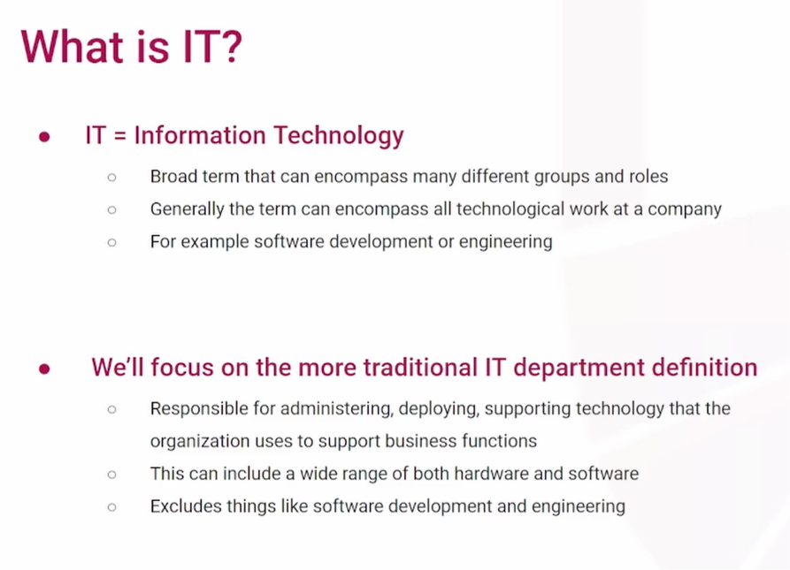
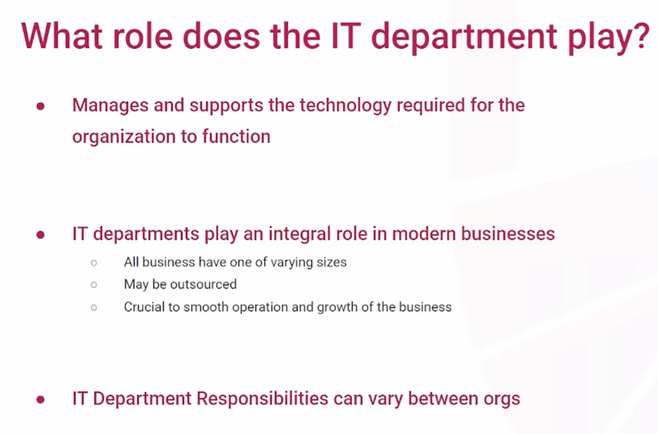
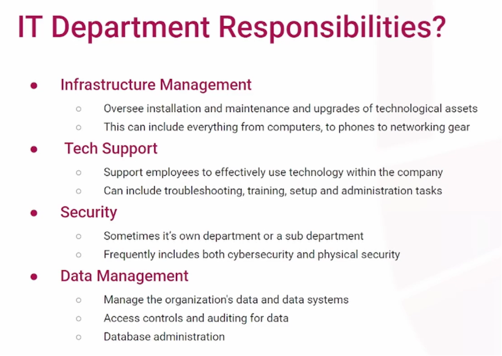
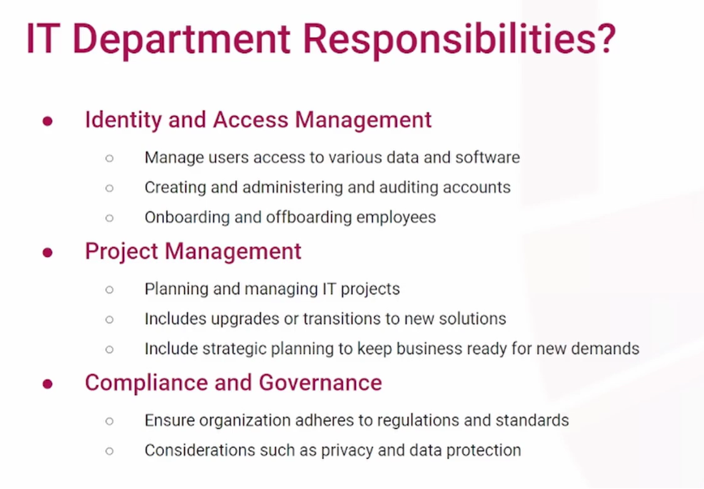

# What is IT?

**Definition and Scope of Information Technology (IT)**

- IT stands for Information Technology, a broad term that can encompass all technological work within a company.
- While highly technical companies might include software engineering under the IT umbrella, a "traditional" IT department is strictly focused on **administrating, deploying, and supporting the technology** used for everyday business operations.
- Traditional IT excludes software development related to the end products a company produces.
- IT is essential for non-technical businesses (e.g., law offices, hospitals, schools, manufacturing facilities, call centers) to keep their computers, phones, servers, and networks functioning.

**Importance and Department Structure**

- IT departments are integral to modern businesses; even minor network or computer outages can grind work to a halt.
- Depending on the organization's size and purpose, IT departments can range from a single part-time employee to thousands of staff members.
- IT functions can also be completely outsourced to local contractors or **Managed Service Providers (MSPs)** who take care of all IT needs for a business.

**Core Responsibilities of an IT Department** The specific duties of an IT department vary greatly between organizations, but generally include the following core responsibilities:

- **Infrastructure Management:** Overseeing the installation, maintenance, and upgrading of technological assets. This includes managing computers, laptops, desk and mobile phones, servers, networking equipment, and cloud infrastructure.
- **Tech Support:** Assisting employees to effectively use company technology. This involves troubleshooting, fixing problems, performing administrative tasks like resetting passwords, and conducting user training.
- **Security:** Keeping the organization secure is often an IT responsibility or handled by a dedicated sub-team. Notably, this involves both cyber security and **physical security** (e.g., installing and maintaining security cameras, door locks, and card readers).
- **Data Management:** Managing how internal and customer data is stored, whether in databases or cloud infrastructure. IT is responsible for setting up and auditing access controls to ensure only authorized personnel view specific data.
- **Identity and Access Management:** Managing user accounts, logins, and passwords for computer access and software services. A major part of this involves **onboarding and offboarding**—ensuring accounts are properly created when an employee joins and promptly deleted or restricted when they leave.
- **Project Management:** Planning and managing large IT projects, such as upgrading an entire fleet of computers or transitioning to new major software systems. IT must also anticipate how the business will grow and ensure technology keeps up with those needs.
- **Compliance and Governance:** Ensuring the organization adheres to privacy and protection regulations and standards. IT departments maintain standard operating procedures to ensure employees use their devices compliantly and properly.

