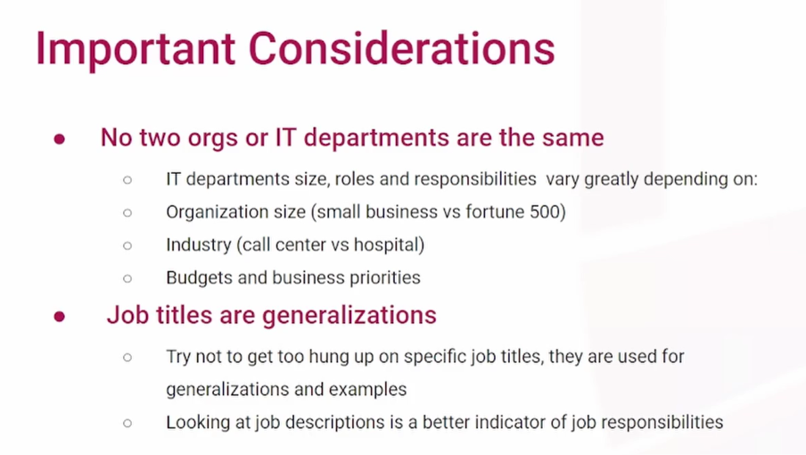
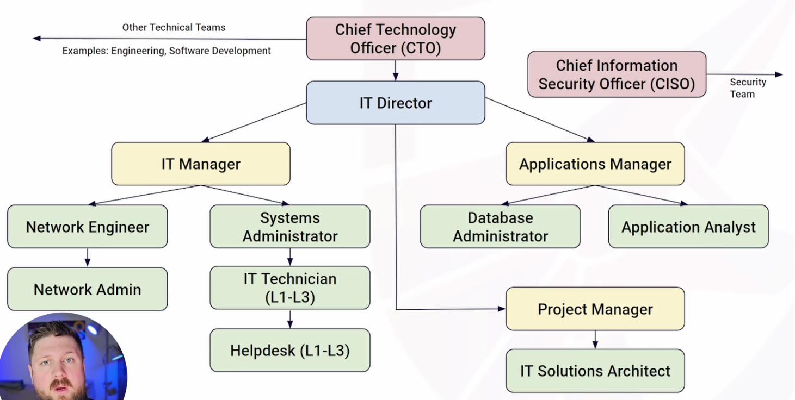

**Understanding Organizational Charts**

- An organizational chart (org chart) is a visual representation of the roles and hierarchy within a department or company.
- The structure flows top-down, typically starting with C-level executives at the top and flowing down to **individual contributors** at the bottom, who perform the hands-on tasks and do not have anyone reporting to them.
- It is generally better to focus on job descriptions rather than job titles when looking for a role, as titles are often used as broad generalizations.

**Variables Influencing IT Department Structure** No two IT departments are exactly the same. Their structures, roles, and responsibilities vary greatly based on several factors:

- **Organization Size:** A small business might have just one or two IT personnel handling everything, whereas a Fortune 500 company will have highly defined roles for specific tasks.
- **Industry:** The technological needs of the business dictate its IT structure (e.g., a hospital will have vastly different needs than a call center).
- **Budget and Priorities:** The amount of money allocated to IT and the business's overarching goals constrain and shape the department's capabilities.

**Example Hierarchy (Medium to Large Business)** In a typical medium to large organization, the IT department might be structured as follows:

- **Chief Technology Officer (CTO):** An executive-level position responsible for high-level strategic planning and oversight. They sit several levels above individual contributors. In companies that build technical products, the software engineering and development teams may also report to the CTO.
- **IT Director:** Reporting to the CTO, this role oversees the specific IT department responsible for the technology that supports everyday business operations (computers, networks, phones), distinct from software product development. They handle strategic planning and manage multiple subordinate managers.
- **IT Manager (Infrastructure):** Reporting to the IT Director, this manager focuses specifically on the physical infrastructure of the company, such as servers, networks, and hardware. Individual technical contributors usually report directly to this manager.
- **Applications Manager:** Also reporting to the IT Director, this team oversees the configuration and maintenance of third-party software and applications (like Salesforce or a Learning Management System) used by the business. Because these applications require specific configuration to meet business needs, they often warrant their own dedicated team.
- **Project Manager:** IT departments often employ project managers to facilitate large-scale initiatives, such as fleet-wide equipment upgrades, software migrations, or managing new hardware.
- **Solution Architect:** Often working closely with or reporting to the Project Manager, the Solution Architect is responsible for creating the high-level designs of the technology being implemented for new projects.

