**Executive and Management Roles**

- **Chief Technical Officer (CTO):** An executive-level role responsible for the high-level technological direction, policy, leadership, and oversight of an organization. They are generally not involved in day-to-day operations, configuration, or installation, but oversee the IT department and potentially other areas like software engineering.
- **IT Director (or VP):** A senior management position reporting to the CTO, responsible for specifically overseeing IT operations and aligning them with business goals. They handle general strategy, infrastructure planning, team leadership, budgeting, resource allocation, and high-level project management.
- **IT Manager:** Manages a team of IT professionals (e.g., acting as a Help Desk Manager) and handles day-to-day IT operations. Responsibilities include direct people management, high-level technical decision making, acting as the ultimate escalation point for difficult technical problems, managing vendor relationships, and handling hiring and training.

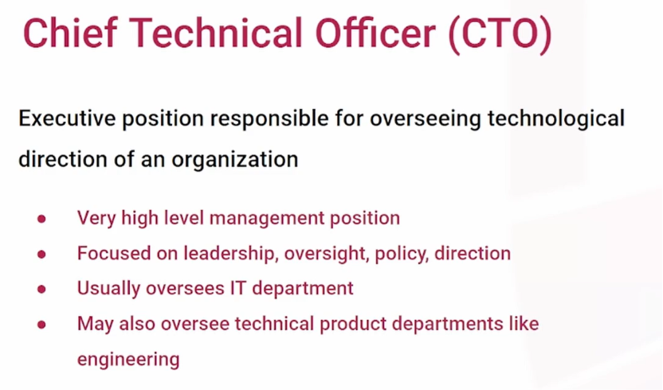

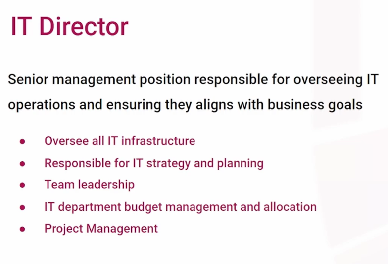

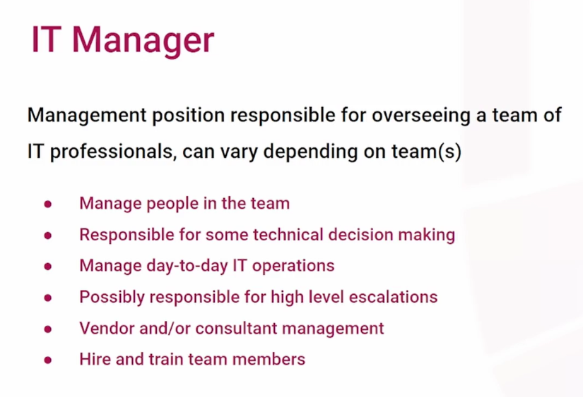

**Infrastructure and Network Roles (Individual Contributors)**

- **Network Engineer:** Responsible for designing, planning, installing, and maintaining the organization's computer networks so devices can communicate. This includes installing network appliances like switches, routers, and cabling, as well as monitoring the network and writing documentation.
- **Network Administrator:** A role generally junior to the Network Engineer. They share similar responsibilities but focus less on network design and implementation, and more on the daily administration, monitoring, and maintenance of the network.
- **System Administrator:** Manages and monitors organizational infrastructure outside of the network, such as servers. They perform system upgrades, patch management, backup and recovery planning, asset management, and provide high-level escalation support for infrastructure issues.
- **IT Technician:** A junior role to the System Administrator focused on supporting, installing, and configuring hardware and software. They provide direct end-user support, perform installations, and manage user accounts for devices and software.

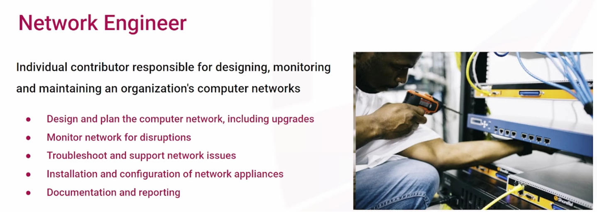

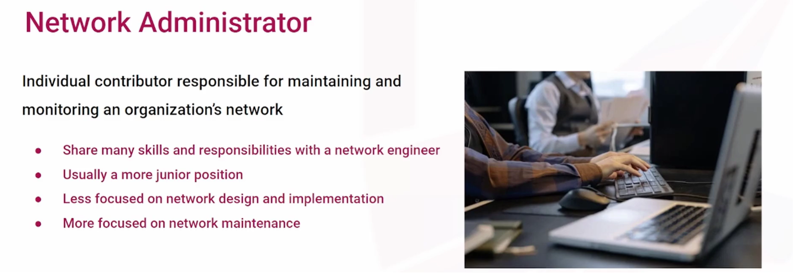

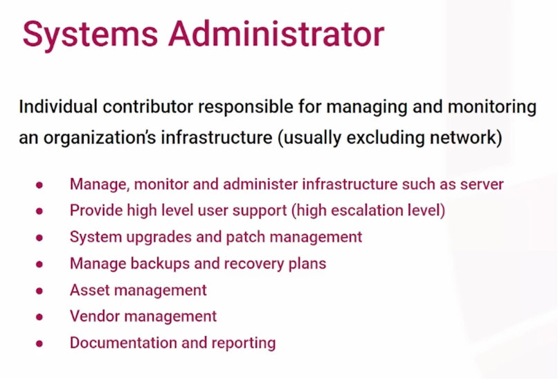

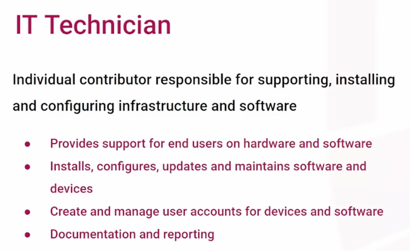

**Application and Database Roles**

- **Applications Manager:** Oversees the configuration, installation, and support of third-party software applications (such as an LMS, ERP, or Salesforce). They manage software vendors and contracts, act as an escalation point for support, and oversee new software projects.
- **Database Administrator (DBA):** Designs, creates, and maintains the data structures needed to support third-party applications. Often reporting to the Applications Manager, they monitor database performance, implement access controls, and integrate databases with the required software.
- **Application Analyst:** Configures and supports specific third-party software. They are often experts in one or two specific applications (like Salesforce), provide end-user support and training, advocate for the software's best use within the company, and write application-specific documentation.

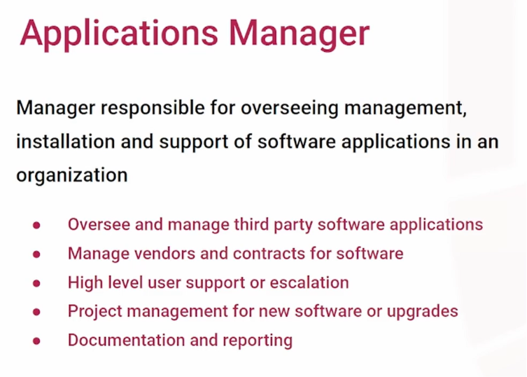

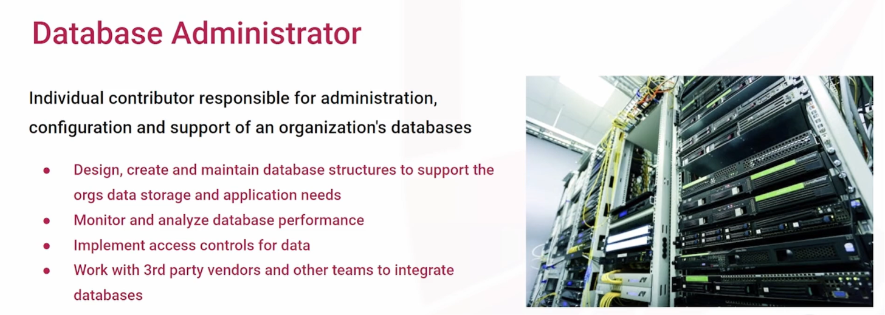

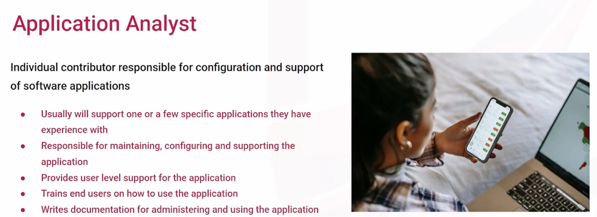

**Project and Architecture Roles**

- **Project Manager:** Plans and oversees large IT initiatives, such as hardware deployments or software migrations. They are responsible for stakeholder management, resource allocation, budgeting, time management, and facilitating communication between different IT teams.
- **Solutions Architect:** Responsible for the high-level design of IT solutions. They analyze business requirements, select the appropriate technology, and design how different systems will integrate, leaving the physical installation and configuration to other technical teams.

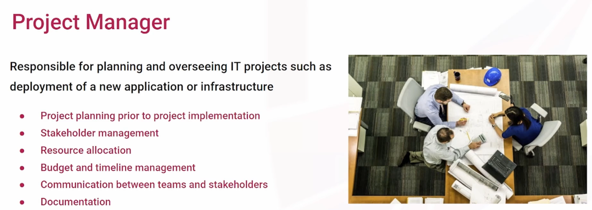

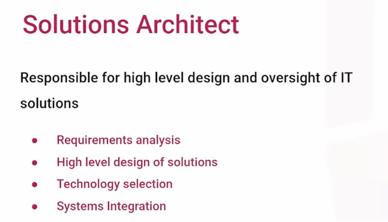

