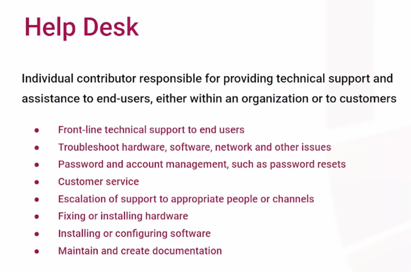
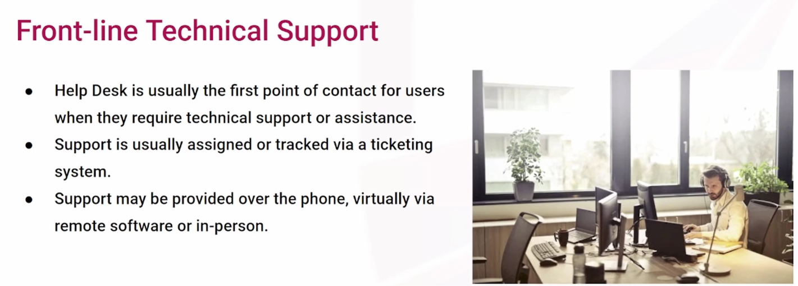
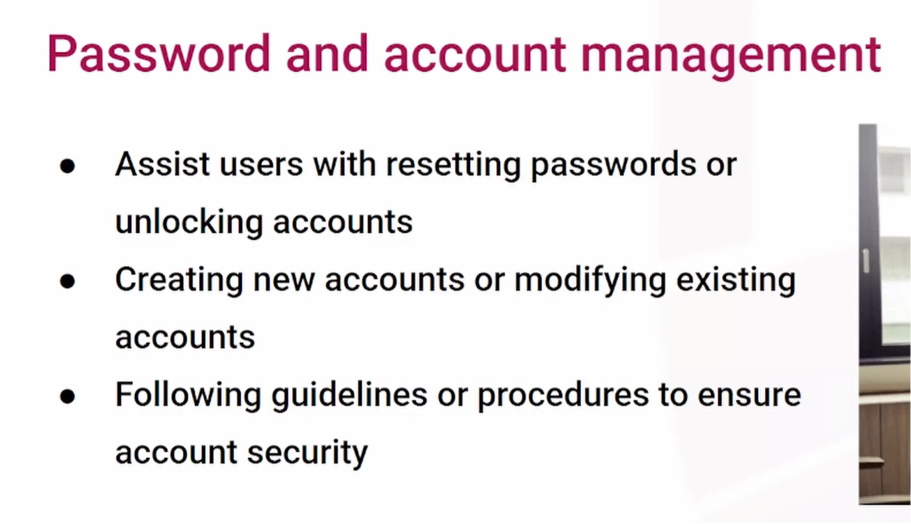
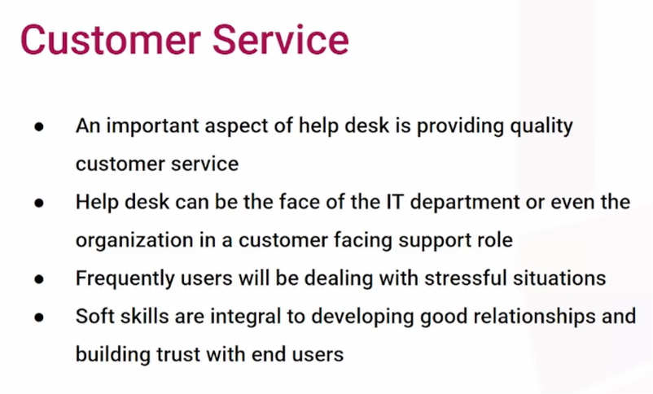
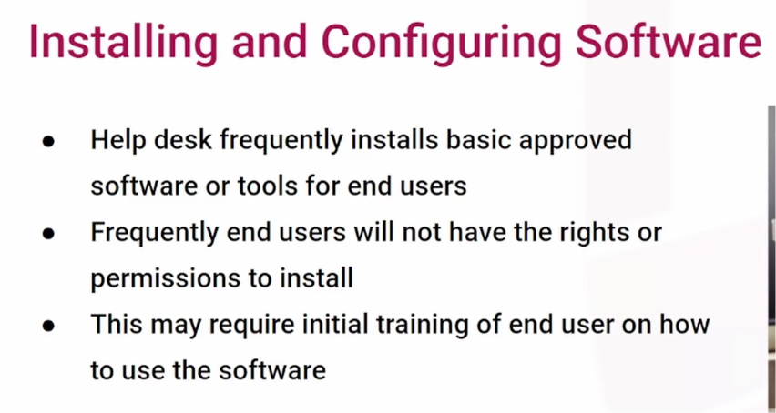
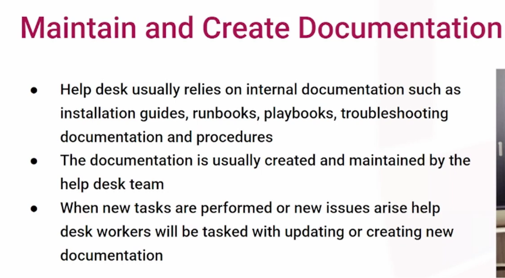

**Core Role and Function**

- The Help Desk Technician (or Analyst) is an **individual contributor** who serves as the **frontline support** for technical issues.
- They act as the initial point of contact when users require assistance, regardless of the issue's overall complexity.
- Support is provided to "customers"—which encompasses both external clients and internal company employees—via phone, email, virtual chat, remote control software, or in-person desk visits.

**Key Responsibilities**

- **Troubleshooting and Triage:** Technicians diagnose and resolve a variety of hardware, software, and networking issues. They are responsible for gathering information, asking the right questions (often guided by pre-existing documentation), and meticulously tracking all interactions using a **ticketing system**.
- **Password and Account Management:** A highly frequent task involves helping locked-out users with password resets, creating new system accounts, and modifying software permissions. Technicians must strictly follow security procedures to ensure they are granting access to the correct individuals.
- **Hardware and Software Configuration:** Because everyday end-users usually lack administrative permissions on their machines, help desk staff are required to install and configure approved software, and they may also provide basic training on how to use it. Depending on whether the role is remote or on-site, they may also physically install or fix hardware. Regardless of location, they must understand **hardware basics** to properly identify and triage hardware-related symptoms.

**Critical Skills and Processes**

- **Customer Service and Soft Skills:** Help desk workers are often the "face of the IT department" or the company itself. They frequently deal with frustrated individuals whose workflows are broken, making it absolutely essential to use soft skills to remain calm, cool, and collected while providing assistance.
- **Escalation of Support:** IT support is generally **tiered** (e.g., Level 1, Level 2, Level 3, or Junior/Senior). Level 1 technicians handle the initial triage and solve the majority of tickets, but they must understand specific organizational guidelines dictating when to escalate complex issues or when they have spent too much time on a single problem. _Note: Because of this escalation process, technicians sometimes will not see an issue resolved from start to finish, which can be a challenging or frustrating aspect of the role._
- **Documentation:** Maintaining accurate records is vital for a functional help desk. Technicians must document all troubleshooting steps in their tickets so higher-level roles do not duplicate work upon escalation. Additionally, during downtime, they are expected to create and update internal **knowledge base articles**, playbooks, and installation guides—especially after successfully solving a novel problem.

