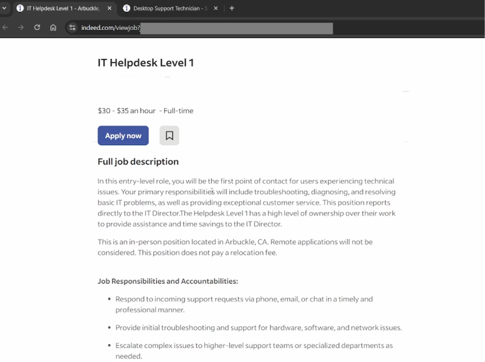
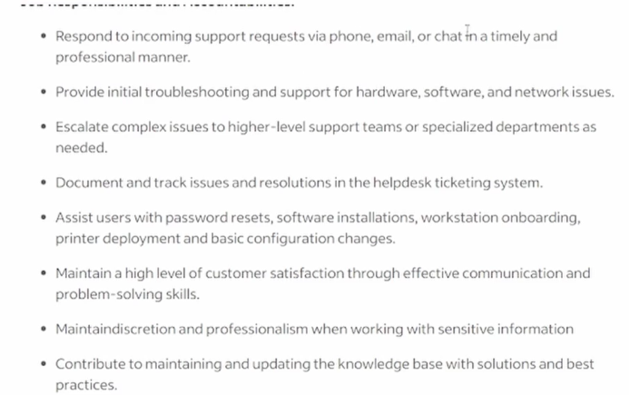
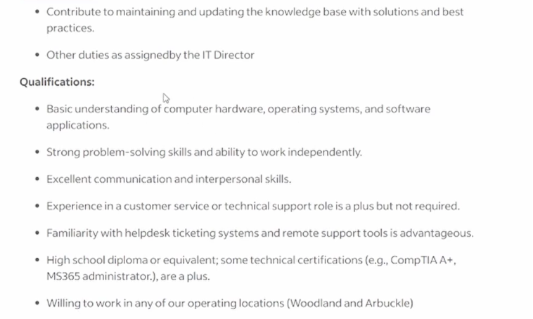
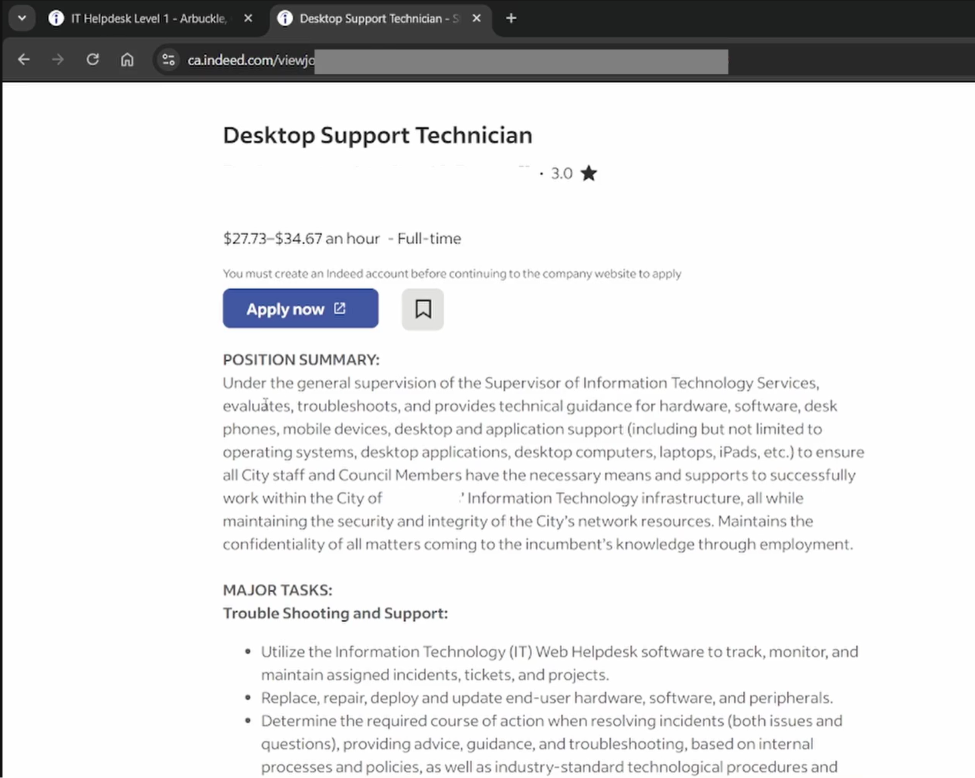
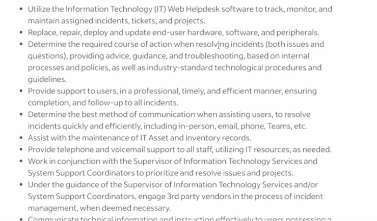
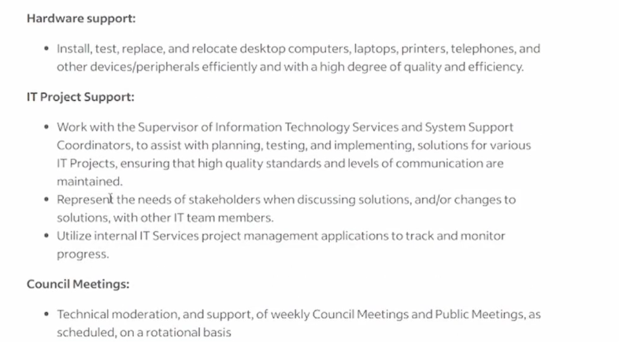

**The Importance of Job Market Research**

- Before pursuing specific certifications or training, it is highly recommended to research entry-level help desk or IT positions in your desired area.
- Reviewing active job postings helps clarify the specific experience and skills employers are looking for, confirming whether the day-to-day responsibilities align with your career goals.
- Researching on platforms like Indeed or LinkedIn also reveals the availability of on-site versus remote roles in your market.

**Common Daily Responsibilities** Based on real-world job descriptions for Level 1 Help Desk and Desktop Support Technician roles, daily tasks generally include:

- **Frontline Support:** Acting as the primary point of contact for users experiencing technical issues, handling incoming requests via phone, email, or chat.
- **Troubleshooting:** Diagnosing and resolving basic hardware, software, network, mobile device, and desk phone problems.
- **Device and Account Administration:** Performing routine tasks such as password resets, software installations, workstation onboarding, deploying hardware and peripherals, and basic configuration changes. This also involves creating and managing user and application accounts.
- **Ticketing:** Meticulously documenting, tracking, and maintaining records of issues and their resolutions within a **help desk ticketing system**.
- **Documentation and Assets:** Contributing to internal **knowledge bases** with solutions and best practices, as well as assisting with the maintenance of IT asset and inventory records.
- **Escalation:** Following a tiered response system, which requires knowing exactly when to escalate complex issues to higher-level support teams.
- **Project Support:** Participating in broader IT project support as needed by the department.

**Key Qualifications and Skills**

- **Technical Foundations:** Most entry-level roles require a basic understanding of computer hardware, operating systems, software applications, and remote support tools. Educational requirements are often accessible, sometimes requiring only a high school diploma or equivalent, alongside relevant technical certifications.
- **Exceptional Soft Skills:** Because the help desk acts as the face of the company or IT department, job postings heavily emphasize **customer service**, effective communication, interpersonal skills, and professionalism.
- **Problem Solving:** Technicians must be able to independently determine the required course of action to resolve incidents in a timely, professional, and efficient manner.

