weaknesses are known as Vulnerabilities. You start repairing the roof to fix this problem and keep your home safe. This process of fixing the vulnerabilities is known as Patching.

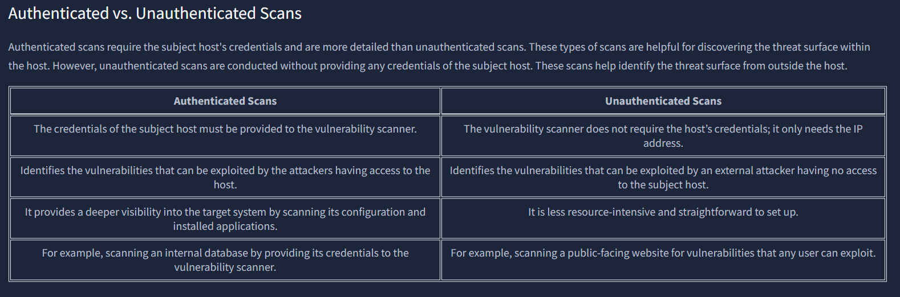

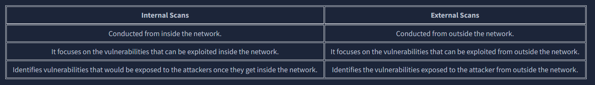

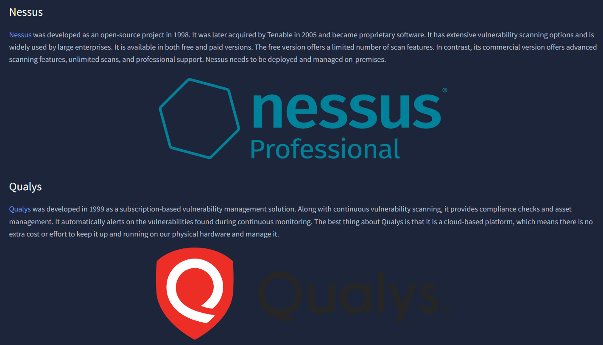

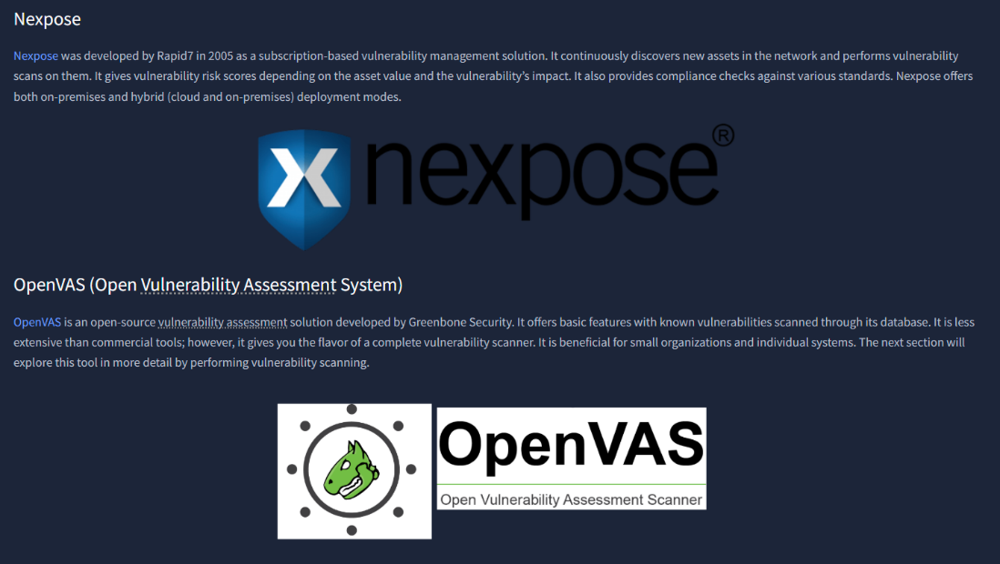

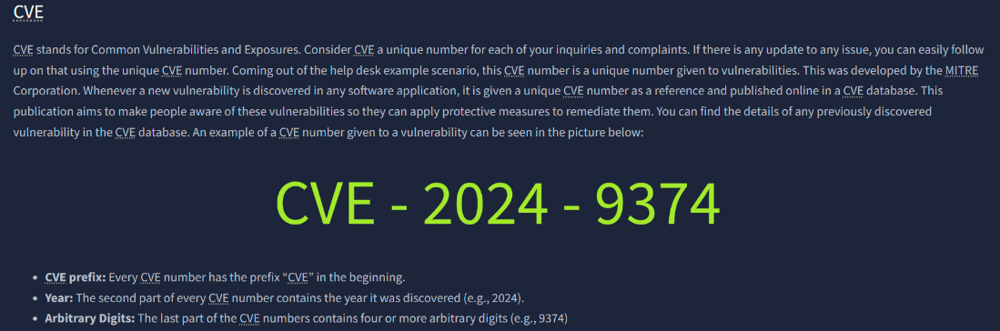

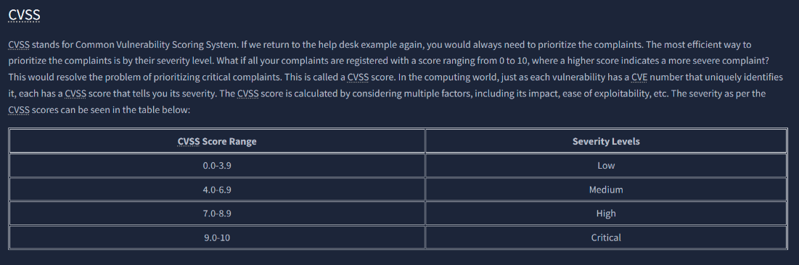

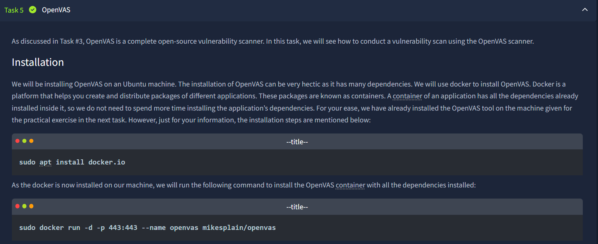

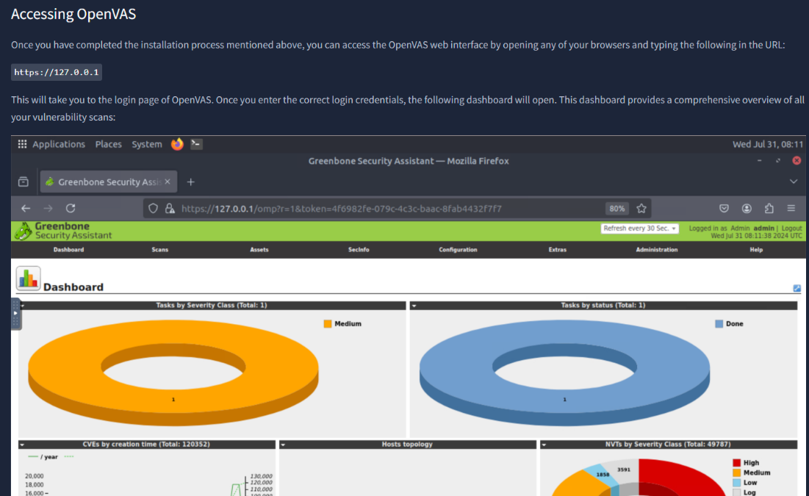

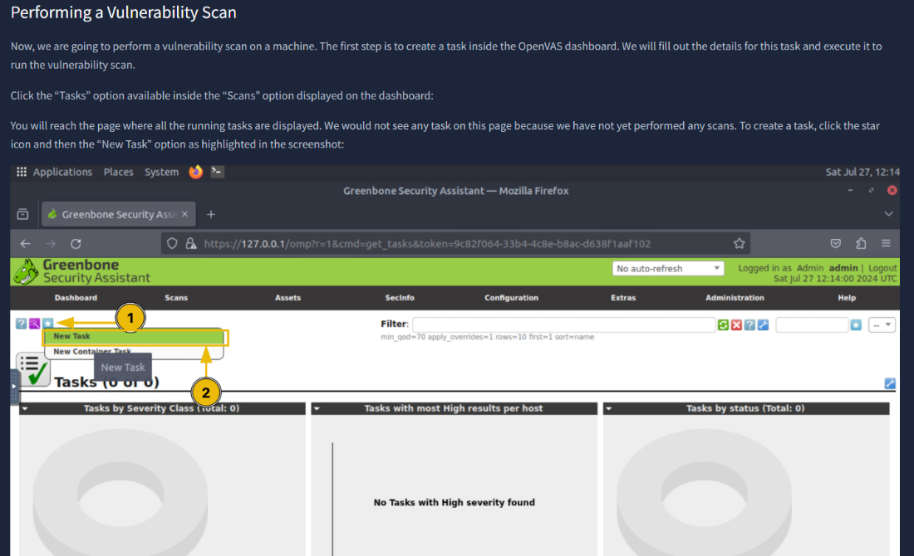

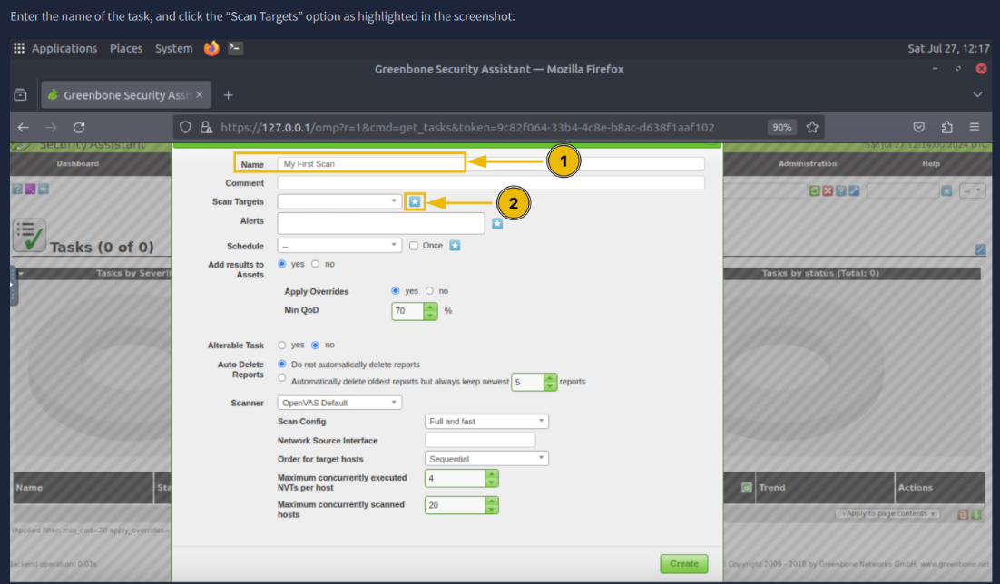

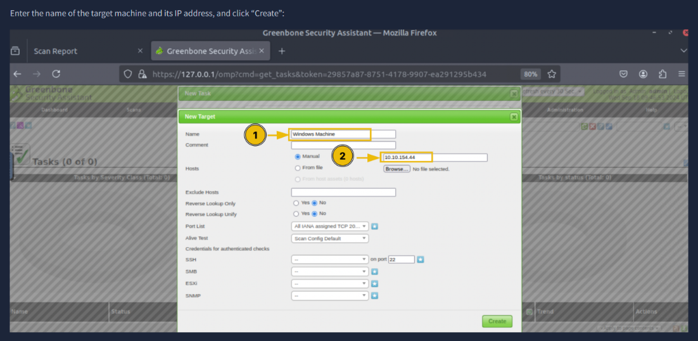

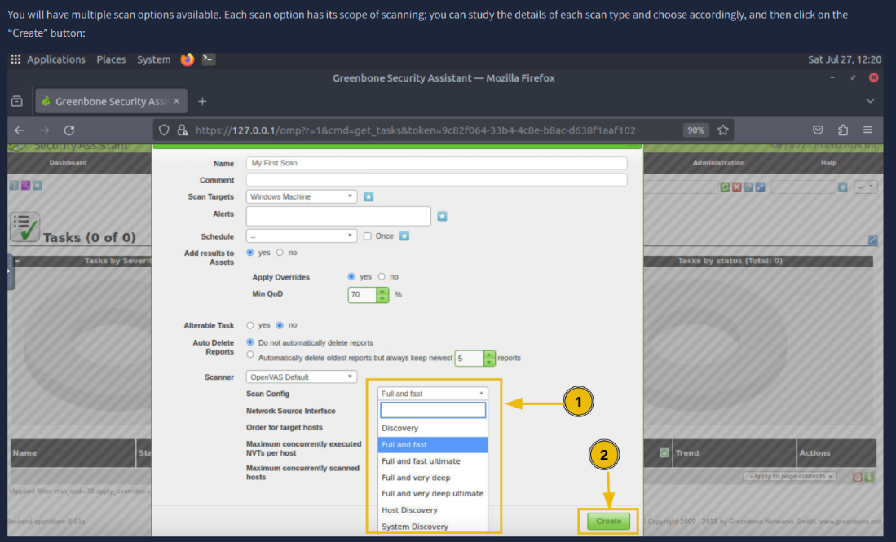

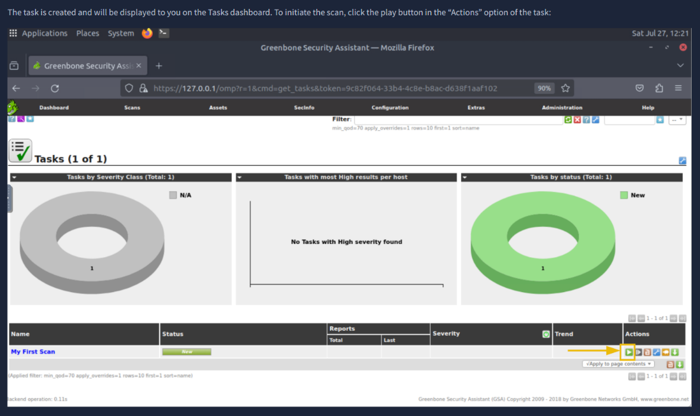

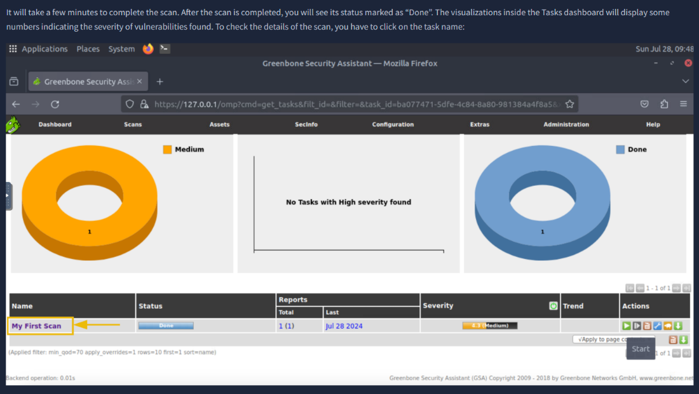

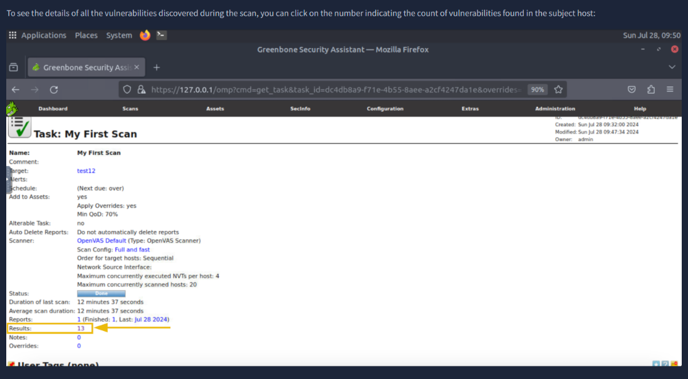

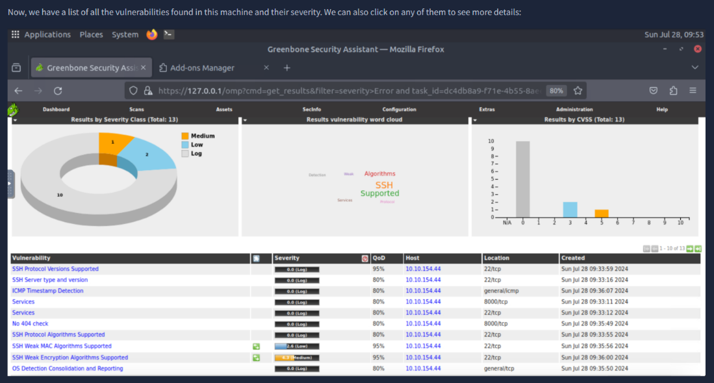
