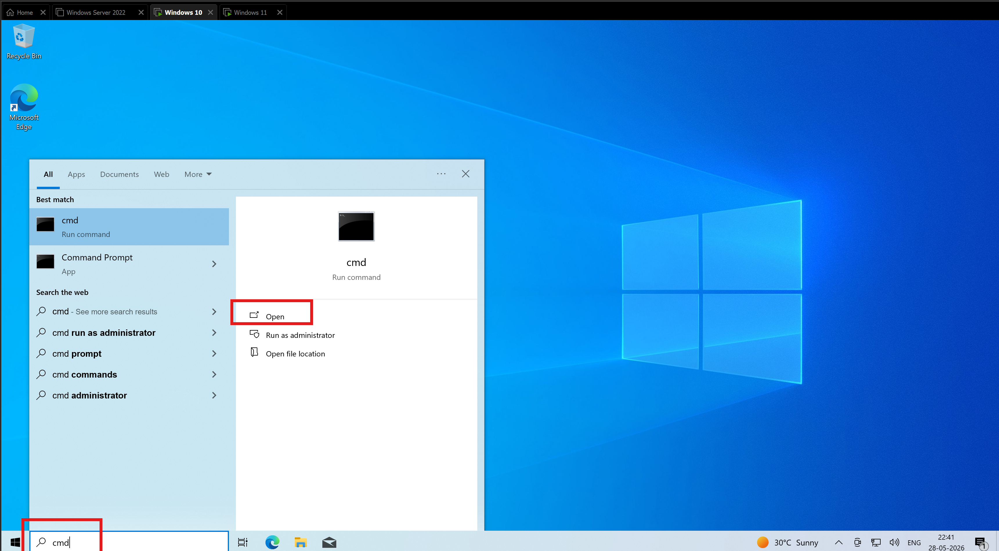
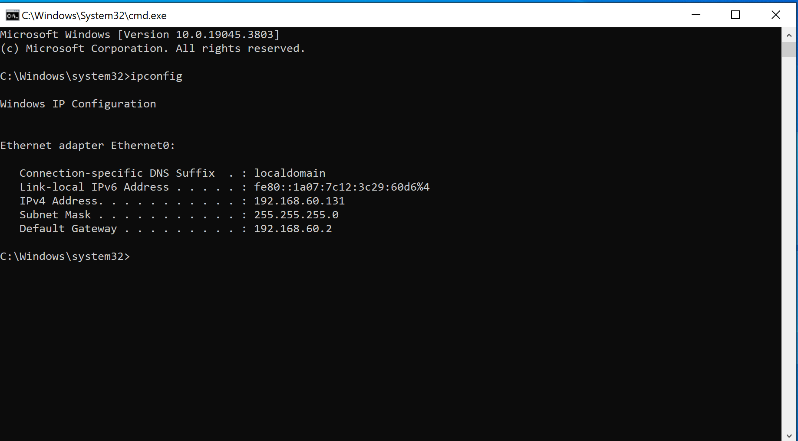

well join our machine now to our domains 

if you have 16 gb of ram 
put the domain server to 2gb 

and other 2 windows to 4 gb each

we check our ip address 
we hard code it 

we change our network setting now 

go to change adapter options 

double click on ethernet0

double click on 1pv4

now i want to utilize a dns server
that is because i want to point this directly at our domain controller

so when we do we should be able to access domain controller since now its our dns server

select use the folowing dns server address
now give it the ip address of your domain controlelr

now same thing on the other machine 
do exact same process

