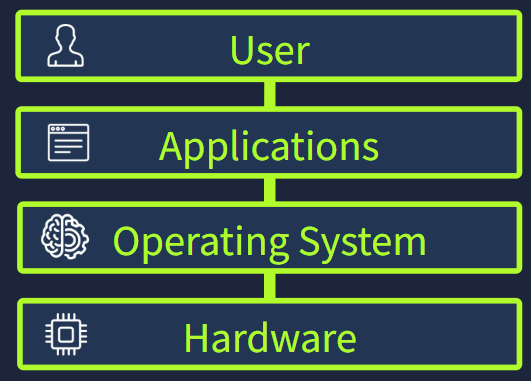

An **operating system** (OS) is the core software that coordinates everything happening on a computer. It sits between the user, applications, and the system’s physical hardware, acting as the invisible manager that keeps the entire machine running as one unified system.

- Your **hardware** (CPU, RAM, storage, connected devices)
- Your **applications** (web browser, game launcher)
- Your **operating system** (Windows, Linux, macOS) directing all of this activity. It schedules resources, manages traffic, resolves conflicts, and ensures safety.

We need an operating system because it provides this all-important job of coordination and structuring that makes modern computing possible. Without an OS, each application would need direct control over the CPU, memory, files, devices, and security. This would quickly cause conflicts, and the OS handles this by acting as the central organizer.
## System Privilege Layers

Inside a modern computer, different parts of the system operate at various permission levels. 
Some components can communicate directly with the hardware, while regular applications run in a safer, restricted environment. This separation is intentional and helps prevent conflicts and security issues.
- **Kernel space**: The privileged, locked-down core of the OS. This is where the kernel, the part of the operating system that directly manages hardware and system resources, runs. It has unrestricted access to the CPU, memory, storage, and all hardware components.
- **User space**: Where all standard applications run. Applications in the user space are deliberately prevented from accessing hardware directly. Whenever they need to open or save a file, play a sound, or connect to Wi-Fi, they must make a system call and request that the kernel act on their behalf.

## Operating System Duties

|OS Responsibility|What the OS Does|Example|
|---|---|---|
|Process Management|Creates, schedules, prioritizes, and terminates running programs. The OS decides how much CPU time each process gets, making multitasking feel seamless|Opening multiple apps, like your browser, music player, and social media, without your computer freezing|
|Memory Management|Allocates RAM to processes, protects the app's memory from other processes, and reclaims memory when apps are closed. When RAM runs low, the OS uses virtual memory to keep your system stable|Opening multiple app at once, the OS allocates RAM to each one and keeps them isolated so they don’t interfere or crash each other|
|File System Management|Organizes files into directories, handles naming, paths, permissions, metadata (name, size, type, timestamps)|Creating a new folder, saving a photo, or setting a file to "read only"|
|User Management|Handles multiple user accounts, authentication, and permissions to determine who can access what|Logging in with your password and keeping your files inaccessible to other user accounts|
|Device Management|Loads drivers and provides a universal interface (hardware abstraction layer), so apps can say “print this” or “play this sound”|Plugging in a new mouse, printer, or external hard drive and having it work immediately|

## Operating System Security

It is important to understand that every OS also acts as a security foundation. Before any antivirus, firewall, or security tool is introduced, the OS is already enforcing protections in the background, some of which we covered above.

At a basic level, your operating system handles
- **Authentication**: Verifies who you are through login passwords and biometrics
- **Permissions**: Controls exactly what each user and app is allowed to read, write, or execute
- **Isolation**: Keeps every process in its own protected box (kernel/user space separation)
- **System Protection**: Safeguards critical system files and settings from unauthorized changes

## Real World Operating Systems

**Embedded and IoT Devices**
- **Embedded Linux**: Specialized OS built into devices with dedicated functions  
    _OpenWrt, Ubuntu Core, Yocto Project_
- **Real-Time OS**: Designed for apps where tasks need guaranteed response times (aircraft controls)  
    _FreeRTOS, VxWorks, QNX_

**Virtual and Cloud**
- **Cloud/VM**: Massive data centers that host websites, apps, and streaming services  
    _Ubuntu LTS, Amazon Linux, Rocky Linux_
- **Container-optimized**: Lightweight alternatives to VMs that package just the app and its dependencies  
    _Alpine Linux, Bottlerocket AWS, Flatcar Linux_

