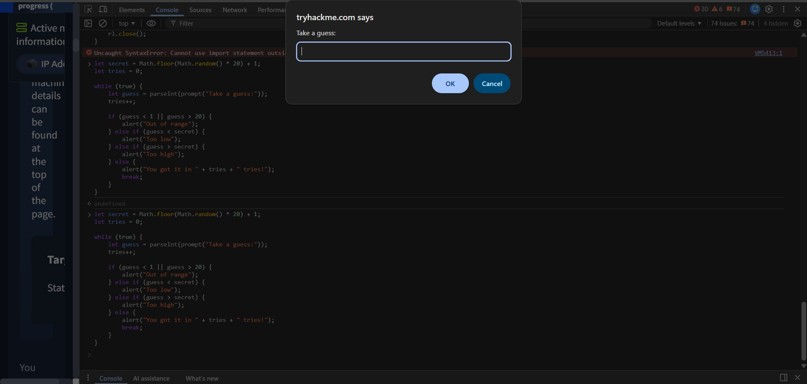

# Basic Questions

> Foundational questions answered while learning JavaScript.

---

## How to Run JavaScript

JavaScript can run in **two environments**:

| Environment | What It Provides                        | Run Command                           |
| ----------- | --------------------------------------- | ------------------------------------- |
| **Browser** | DOM, `window`, `document`, UI rendering | Embed in HTML or use DevTools console |
| **Node.js** | File system, OS access, network, no UI  | `node file.js`                        |

### Browser Environment

The browser is built for **webpages and UI**. It provides:

- **DOM** (Document Object Model) — represents HTML as objects JS can read/change
  ```javascript
  document.getElementById("btn")
  ```
- **`window` object** — global browser object (alerts, timers, browser info)
  ```javascript
  window.alert("Hi")
  ```
- **`document`** — part of DOM, used to interact with HTML
  ```javascript
  document.title = "New Title"
  ```
- **UI rendering** — displays buttons, text, images on screen
- **Events** — click, scroll, keyboard input
  ```javascript
  button.onclick = () => console.log("clicked")
  ```

### Node.js Environment

Node.js is built for **running programs and backend work**. It provides:

- **File system access** — read/write files on your system
  ```javascript
  const fs = require("fs");
  fs.readFileSync("file.txt");
  ```
- **OS interaction** — access system info via `process.platform`
- **Network** — create servers, handle HTTP requests via `require("http")`
- **No UI** — no HTML, no `document`, no screen rendering
- **Direct script execution** — `node file.js` (works like `python file.py`)


- **VS Code is just an editor** — it writes code but doesn't execute it
- When you click "Run" in VS Code, it calls Node.js (or Python, etc.) in the background
- Same concept as Python: `python file.py` uses the Python interpreter; `node file.js` uses Node.js

> "VS Code writes code, an engine runs it."

---

## HTML vs CSS vs JavaScript vs Node.js

| Technology     | Role             | Analogy       |
| -------------- | ---------------- | ------------- |
| **HTML**       | Structure        | Skeleton      |
| **CSS**        | Styling / layout | Clothes       |
| **JavaScript** | Logic / behavior | Brain         |
| **Node.js**    | JS runtime (no browser) | Engine outside the car |

### Can They Work Independently?

| Technology | Alone?  | Notes                                    |
| ---------- | ------- | ---------------------------------------- |
| HTML       | ✅ Yes  | Works but looks plain without CSS        |
| CSS        | ❌ No   | Needs HTML elements to style             |
| JavaScript | ✅ Yes  | Runs in Node.js without HTML; no UI though |

---

## Why HTML Runs Directly but JS Doesn't

- **HTML** = display language → browser reads it and renders a page immediately
- **JavaScript** = execution language → needs a **runtime** (browser engine or Node.js) to interpret and run it
- Double-clicking a `.js` file does nothing because the OS doesn't know what engine to use
- Double-clicking a `.html` file opens the browser, which already understands HTML

### To run JS you need one of:

```html
<!-- Inside HTML (browser runs it) -->
<script>
  console.log("Hello");
</script>
```

```bash
# Via Node.js (terminal)
node file.js
```

---

## JavaScript Does NOT Need HTML

Common misconception: JS depends on HTML because beginners always see `<script>` inside `.html` files.

**Reality:** JavaScript is a standalone language. HTML is only used when you want browser UI.

| Feature        | Browser JS | Node.js |
| -------------- | ---------- | ------- |
| DOM access     | ✅          | ❌       |
| File system    | ❌          | ✅       |
| Runs standalone| ❌ (needs HTML or DevTools) | ✅ |

### Browser-only code (fails in Node):

```javascript
document.title = "Hi";  // ❌ "document is not defined" in Node
```

### Node-only code (fails in browser):

```javascript
const fs = require("fs");  // ❌ Not available in browser
```

---

## JavaScript Engines in Browsers

Every browser ships with a **built-in JS engine** — this is required, not optional:

| Browser         | JS Engine      |
| --------------- | -------------- |
| Google Chrome   | V8             |
| Mozilla Firefox | SpiderMonkey   |
| Safari          | JavaScriptCore |
| Microsoft Edge  | V8 (Chromium)  |

- Node.js uses **Chrome's V8 engine** — same core, different environment
- Browsers only include engines for **web standard languages** (HTML, CSS, JS)
- They don't include Python, Java, etc. — that would bloat browsers and add security risks

> JS was created in 1995 specifically for browsers. It became the official web scripting language, so every browser must support it.

---

## Security: Browser JS vs Node.js Attacks

| Attack | Environment | How It Works | Impact |
| ------ | ----------- | ------------ | ------ |
| **XSS** (Cross-Site Scripting) | Browser | Inject `<script>` into a webpage | Steal cookies, hijack sessions |
| **RCE** (Remote Code Execution) | Node.js (server) | Unsafe `eval(user_input)` | Full system compromise |

- Browser JS attacks → **client-side** (affect the user)
- Node.js attacks → **server-side** (affect the entire system)

### Running JS in the Browser Console

Open **DevTools** (`F12`) → **Console** tab → type JavaScript directly.



### How VS Code Runs JS Files

When you click **"Run"** in VS Code (or use Code Runner extension), VS Code internally executes:

```bash
node "c:\path\to\your\file.js"
```

- VS Code opens its built-in terminal and runs `node file.js` for you
- `node` doesn't appear "magically" — VS Code (or an extension) types the command automatically
- If the program asks for input (e.g., `readline`), the terminal will pause and wait — just type your answer and press Enter

> VS Code is the editor, `node` is the engine. Clicking "Run" just bridges the two.